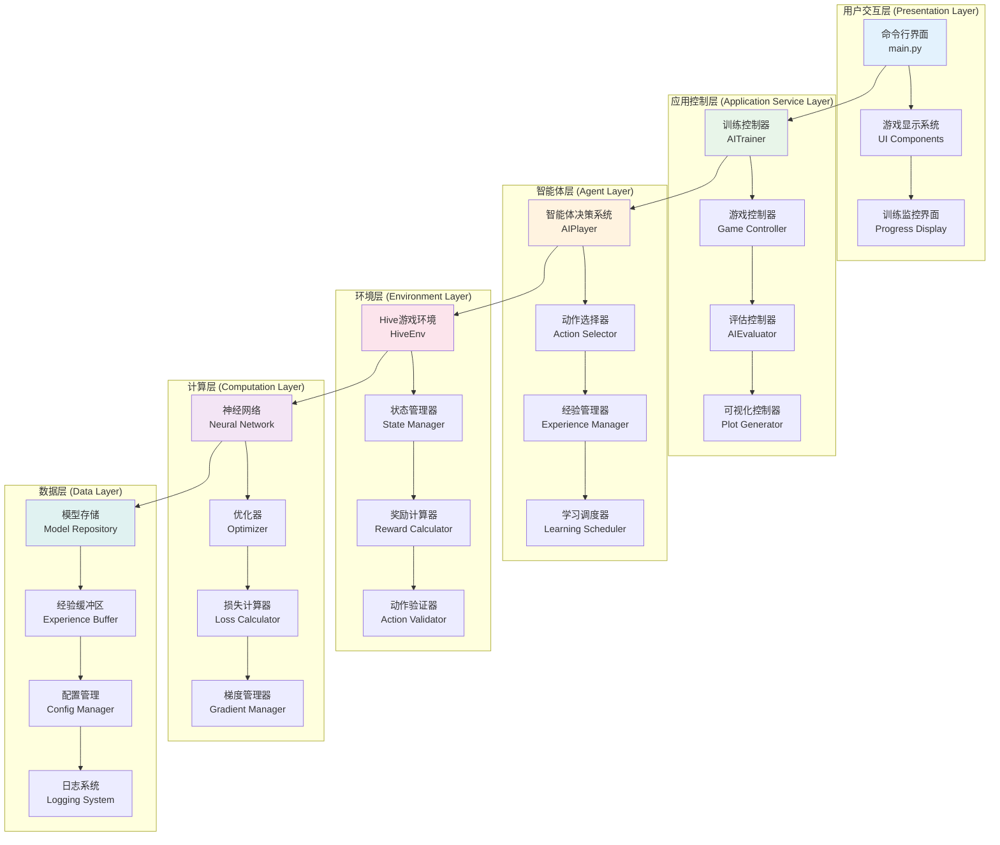
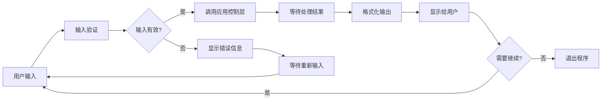

# 第5章 系统架构

## 5.1 架构设计哲学与理论基础

Hive-RL项目的系统架构设计基于现代软件工程的最佳实践和强化学习系统的特殊需求。在深入了解具体的架构设计之前，我们需要理解为什么需要良好的架构设计，以及它如何影响整个系统的性能、可维护性和扩展性。

### 5.1.1 为什么强化学习系统需要特殊的架构考虑

强化学习系统与传统的软件系统在几个关键方面存在显著差异，这些差异直接影响了架构设计的决策：

**复杂的数据流动模式**：在强化学习中，数据不是简单的输入-处理-输出流程。智能体需要与环境进行持续的交互，产生状态-动作-奖励的循环。这种循环性的数据流动要求系统架构能够有效地管理状态转换和经验存储。

**实时性与批处理的平衡**：强化学习训练过程中既需要实时的环境交互（用于收集经验），又需要批处理的神经网络训练（用于学习策略）。架构必须能够优雅地处理这两种不同的计算模式。

**探索与利用的动态平衡**：智能体的行为策略在训练过程中不断变化，从随机探索逐渐转向利用已学知识。这要求架构具有足够的灵活性来支持策略的动态调整。

**长期依赖关系**：强化学习中的奖励信号往往具有延迟性，一个动作的效果可能在很多步骤之后才显现。这要求系统能够有效地处理和存储长序列的经验数据。

### 5.1.2 Hive-RL架构概览

让我们通过一个整体架构图来理解Hive-RL的系统设计：



这个架构图展示了Hive-RL系统的六个主要层次，每个层次都有其特定的职责和功能。从上到下，数据和控制流呈现出清晰的层次结构，同时每个层次内部的组件又相互协作完成复杂的功能。

### 5.1.3 设计原则的深度解析

Hive-RL的架构设计遵循几个核心的软件工程原则，这些原则确保了系统的健壮性和可维护性。

#### 单一职责原则的应用实例

在强化学习系统中，单一职责原则特别重要，因为系统涉及多个复杂的概念：环境状态、动作空间、奖励函数、策略网络等。每个组件都应该专注于一个明确的功能。

```python
class HiveEnvironment:
    """
    专门负责Hive游戏环境的管理
    
    职责范围：
    - 游戏规则执行
    - 状态转换管理  
    - 奖励计算
    - 游戏结束检测
    
    不包含的职责：
    - 智能体决策逻辑
    - 神经网络训练
    - 数据存储管理
    """
    def __init__(self):
        self.board = Board()           # 棋盘状态管理
        self.current_player = 0        # 当前玩家跟踪
        self.game_state = GameState()  # 游戏状态封装
        
    def step(self, action):
        """
        执行一个动作并返回新状态
        
        这个方法体现了环境的核心职责：
        1. 验证动作合法性
        2. 执行动作
        3. 计算奖励
        4. 检查游戏结束
        """
        # 验证动作合法性
        if not self._is_valid_action(action):
            return self._get_current_state(), -1, True, {"error": "invalid_action"}
        
        # 执行动作改变环境状态
        self._execute_action(action)
        
        # 计算本次行动的奖励
        reward = self._calculate_reward()
        
        # 检查游戏是否结束
        done = self._is_game_over()
        
        # 返回新状态和相关信息
        return self._get_current_state(), reward, done, self._get_info()
```

在上面的代码中，`HiveEnvironment`类严格遵循单一职责原则。它专注于游戏环境的管理，包括状态转换、规则执行和奖励计算，但不涉及智能体的决策逻辑或神经网络的训练过程。这种明确的职责划分使得：

1. **代码更易理解**：开发者可以快速理解每个类的功能
2. **测试更简单**：可以独立测试环境逻辑，不需要依赖其他组件
3. **修改更安全**：修改环境逻辑不会影响智能体或训练系统
4. **重用更容易**：环境可以被不同的强化学习算法使用

#### 开闭原则在扩展性中的体现

开闭原则要求软件实体对扩展开放，对修改封闭。在Hive-RL中，这个原则在棋子系统的设计中得到了很好的体现：

```python
from abc import ABC, abstractmethod

class Piece(ABC):
    """
    抽象棋子类 - 定义稳定的接口（封闭部分）
    
    这个接口一旦确定，就不会轻易修改，
    因为任何修改都会影响所有的棋子实现
    """
    def __init__(self, x, y, player):
        self.x = x
        self.y = y  
        self.player = player
        self.has_moved = False
    
    @abstractmethod
    def get_name(self) -> str:
        """获取棋子名称"""
        pass
    
    @abstractmethod
    def get_possible_moves(self, board) -> list:
        """获取所有可能的移动位置"""
        pass
    
    @abstractmethod
    def can_move_to(self, board, target_x, target_y) -> bool:
        """检查是否可以移动到指定位置"""
        pass

class QueenBee(Piece):
    """
    蜂后的具体实现 - 扩展部分
    
    这是对抽象接口的具体实现，
    可以根据游戏规则灵活定义蜂后的行为
    """
    def get_name(self) -> str:
        return "Queen Bee"
    
    def get_possible_moves(self, board) -> list:
        """
        蜂后的移动规则：
        1. 只能移动一格
        2. 移动后不能分割蜂群
        3. 必须沿着蜂群边缘移动
        """
        possible_moves = []
        
        # 检查六个方向的相邻位置
        directions = [(0, 1), (1, 0), (0, -1), (-1, 0), (1, -1), (-1, 1)]
        
        for dx, dy in directions:
            new_x, new_y = self.x + dx, self.y + dy
            if self.can_move_to(board, new_x, new_y):
                possible_moves.append((new_x, new_y))
        
        return possible_moves
    
    def can_move_to(self, board, target_x, target_y) -> bool:
        """
        详细的移动合法性检查
        体现了蜂后特有的移动限制
        """
        # 检查目标位置是否为空
        if board.get_piece_at(target_x, target_y) is not None:
            return False
        
        # 检查是否只移动一格
        if abs(target_x - self.x) > 1 or abs(target_y - self.y) > 1:
            return False
        
        # 检查移动是否会分割蜂群（一虫法则）
        if board.would_split_hive(self, target_x, target_y):
            return False
        
        # 检查是否有足够的滑动空间
        return board.has_sliding_space(self.x, self.y, target_x, target_y)
```

当Hive游戏发布新的DLC棋子时，我们可以轻松地添加新的棋子类型，而无需修改任何现有代码：

```python
class Pillbug(Piece):
    """
    药丸虫 - DLC棋子
    
    这是一个新的扩展，展示了开闭原则的威力：
    - 添加新功能（扩展开放）
    - 不修改现有代码（修改封闭）
    """
    def get_name(self) -> str:
        return "Pillbug"
    
    def get_possible_moves(self, board) -> list:
        """
        药丸虫的特殊能力：
        1. 可以像其他棋子一样移动
        2. 可以推动相邻的棋子到新位置
        """
        moves = []
        
        # 普通移动
        moves.extend(self._get_normal_moves(board))
        
        # 特殊能力：推动其他棋子
        moves.extend(self._get_throw_moves(board))
        
        return moves
    
    def can_move_to(self, board, target_x, target_y) -> bool:
        """药丸虫的移动判断逻辑"""
        return (self._can_normal_move_to(board, target_x, target_y) or 
                self._can_throw_to(board, target_x, target_y))
    
    def _get_throw_moves(self, board) -> list:
        """
        获取推动动作的可能目标
        这是药丸虫独有的特殊能力
        """
        throw_moves = []
        
        # 找到相邻的可推动棋子
        adjacent_pieces = board.get_adjacent_pieces(self.x, self.y)
        
        for piece in adjacent_pieces:
            if piece.player != self.player:  # 只能推动对手的棋子
                # 计算推动后的目标位置
                throw_targets = self._calculate_throw_targets(board, piece)
                throw_moves.extend(throw_targets)
        
        return throw_moves
```

这种设计的优势在于：

1. **零修改扩展**：添加新棋子不需要修改游戏引擎
2. **向后兼容**：新棋子不会影响现有棋子的功能
3. **独立测试**：每种棋子可以独立开发和测试
4. **灵活配置**：可以通过配置选择启用哪些棋子

通过这样的设计原则应用，Hive-RL项目建立了一个既稳定又灵活的架构基础，为后续的功能扩展和维护工作提供了有力支撑。

## 5.2 分层架构的详细设计

Hive-RL采用经典的分层架构模式，将整个系统分为六个主要层次。每个层次都有明确的职责和接口定义，层与层之间通过标准化的接口进行通信。这种设计确保了系统的高内聚、低耦合特性。

### 5.2.1 用户交互层 (Presentation Layer)

用户交互层是系统与外界交互的窗口，负责处理所有的用户输入和输出显示。在强化学习系统中，这一层的设计特别重要，因为用户需要能够监控训练过程、调整参数、查看结果等。

**设计理念**：用户交互层应该提供直观、友好的界面，让用户能够轻松地控制系统的各种功能。同时，这一层应该与业务逻辑完全分离，这样可以在不修改核心逻辑的情况下改变用户界面。

```python
# main.py - 用户交互层的核心实现
import os
import sys
from typing import Optional
from colorama import init, Fore, Back, Style

class UserInterface:
    """
    用户界面管理器
    
    这个类封装了所有的用户交互逻辑，包括：
    - 菜单显示和选择处理
    - 训练进度可视化
    - 错误信息展示
    - 用户输入验证
    """
    
    def __init__(self):
        # 初始化颜色支持
        init(autoreset=True)
        
        self.current_screen = "main_menu"
        self.color_support = self._check_color_support()
        self.screen_width = self._get_terminal_width()
        
        print("用户界面系统初始化完成")
    
    def display_main_menu(self) -> str:
        """
        显示主菜单并获取用户选择
        
        这个方法展示了如何设计一个友好的命令行界面：
        1. 清屏并显示标题
        2. 格式化菜单选项
        3. 处理用户输入
        4. 验证选择的有效性
        
        返回值：用户选择的选项编号
        """
        
        # 清屏并显示欢迎信息
        self._clear_screen()
        self._display_welcome_banner()
        
        # 定义菜单选项
        menu_options = [
            ("1", "Human vs Human", "两个人类玩家进行对战", "👥"),
            ("2", "Human vs AI", "人类玩家与AI智能体对战", "🤖"),
            ("3", "AI Training", "训练AI智能体", "🎯"),
            ("4", "Evaluate AI & Plots", "评估AI性能并生成图表", "📊"),
            ("5", "Exit Game", "退出游戏", "🚪")
        ]
        
        # 显示菜单标题
        print(self._create_section_header("🎮 游戏模式选择"))
        print()
        
        # 显示每个菜单选项
        for option_id, title, description, icon in menu_options:
            formatted_option = self._format_menu_option(option_id, title, description, icon)
            print(formatted_option)
            print()  # 选项间的空行
        
        # 获取用户选择
        print(self._create_separator())
        valid_choices = [opt[0] for opt in menu_options]
        return self._get_user_choice("请输入您的选择: ", valid_choices)
    
    def _display_welcome_banner(self):
        """
        显示欢迎横幅
        
        使用ASCII艺术和颜色来创建吸引人的标题显示
        这种视觉设计大大提升了用户体验
        """
        
        banner = """
╔═══════════════════════════════════════════════════════════════╗
║                         HIVE-RL GAME                         ║
║                  强化学习驱动的蜂巢游戏                       ║
║                                                               ║
║        基于深度Q网络(DQN)的智能体训练和对战平台              ║
║                                                               ║
║  🐛 支持完整的Hive游戏规则  🧠 先进的AI算法  📈 性能分析     ║
╚═══════════════════════════════════════════════════════════════╝
        """
        
        if self.color_support:
            # 使用渐变色彩显示横幅
            print(Fore.CYAN + Style.BRIGHT + banner)
        else:
            print(banner)
    
    def _format_menu_option(self, option_id: str, title: str, 
                           description: str, icon: str) -> str:
        """
        格式化单个菜单选项
        
        这个方法创建了一致且美观的菜单项格式：
        - 选项编号用特殊颜色高亮
        - 标题使用粗体显示
        - 描述使用较淡的颜色
        - 添加图标增加视觉吸引力
        """
        
        if self.color_support:
            # 彩色格式化
            option_line = f"  {icon} {Fore.YELLOW + Style.BRIGHT}[{option_id}]{Style.RESET_ALL} "
            option_line += f"{Fore.WHITE + Style.BRIGHT}{title}{Style.RESET_ALL}"
            option_line += f"\n      {Fore.LIGHTBLACK_EX}{description}{Style.RESET_ALL}"
        else:
            # 纯文本格式化
            option_line = f"  {icon} [{option_id}] {title}\n      {description}"
        
        return option_line
    
    def display_training_progress(self, episode: int, total_episodes: int,
                                current_reward: float, avg_reward: float,
                                epsilon: float, loss: Optional[float],
                                win_rate: Optional[float] = None):
        """
        显示训练进度信息
        
        这个方法是用户交互层的关键功能之一，它需要：
        1. 实时更新训练信息
        2. 用直观的方式展示进度
        3. 提供足够的细节帮助用户了解训练状态
        4. 保持界面的美观和可读性
        """
        
        # 计算进度百分比
        progress_percent = (episode / total_episodes) * 100
        
        # 创建进度条
        progress_bar = self._create_progress_bar(progress_percent, width=50)
        
        # 清屏并显示训练标题
        self._clear_screen()
        print(self._create_section_header("🎯 AI智能体训练进行中"))
        print()
        
        # 训练进度信息
        progress_info = [
            ("训练进度", f"{progress_percent:.1f}% {progress_bar}"),
            ("当前轮次", f"{episode:,} / {total_episodes:,}"),
            ("当前奖励", f"{current_reward:.3f}"),
            ("平均奖励", f"{avg_reward:.3f}"),
            ("探索率 (ε)", f"{epsilon:.3f}")
        ]
        
        # 添加可选信息
        if loss is not None:
            progress_info.append(("训练损失", f"{loss:.6f}"))
        
        if win_rate is not None:
            progress_info.append(("胜率", f"{win_rate:.1%}"))
        
        # 显示信息表格
        self._display_info_table(progress_info)
        
        # 显示控制提示
        print()
        print(f"{Fore.YELLOW}💡 提示: 按 Ctrl+C 可以随时停止训练{Style.RESET_ALL}")
        print(f"{Fore.CYAN}📊 训练数据将自动保存到 models/ 目录{Style.RESET_ALL}")
    
    def _create_progress_bar(self, percent: float, width: int = 50) -> str:
        """
        创建可视化的进度条
        
        这个方法生成ASCII字符的进度条，提供直观的进度反馈
        """
        
        filled_width = int(width * percent / 100)
        bar = "█" * filled_width + "░" * (width - filled_width)
        
        if self.color_support:
            # 根据进度使用不同颜色
            if percent < 30:
                color = Fore.RED
            elif percent < 70:
                color = Fore.YELLOW
            else:
                color = Fore.GREEN
            
            return f"{color}{bar}{Style.RESET_ALL}"
        else:
            return bar
    
    def _display_info_table(self, info_list: list):
        """
        以表格形式显示信息
        
        创建对齐良好的信息表格，提高可读性
        """
        
        # 计算最大标签长度用于对齐
        max_label_length = max(len(label) for label, _ in info_list)
        
        for label, value in info_list:
            # 创建对齐的标签
            padded_label = label.ljust(max_label_length)
            
            if self.color_support:
                print(f"  {Fore.LIGHTBLUE_EX}{padded_label}{Style.RESET_ALL}: {Fore.WHITE}{value}{Style.RESET_ALL}")
            else:
                print(f"  {padded_label}: {value}")
    
    def display_error_message(self, title: str, message: str, 
                            suggestions: list = None):
        """
        显示错误信息
        
        提供清晰的错误信息显示，帮助用户理解和解决问题
        """
        
        print()
        print(self._create_section_header(f"❌ {title}", color=Fore.RED))
        print()
        
        # 显示错误消息
        if self.color_support:
            print(f"  {Fore.LIGHTRED_EX}{message}{Style.RESET_ALL}")
        else:
            print(f"  {message}")
        
        # 显示建议（如果有）
        if suggestions:
            print()
            print(f"  {Fore.YELLOW}💡 建议:{Style.RESET_ALL}")
            for suggestion in suggestions:
                print(f"    • {suggestion}")
        
        print()
        input("按 Enter 键继续...")
    
    def display_game_result(self, winner: str, game_stats: dict):
        """
        显示游戏结果
        
        以美观的方式展示游戏结束后的统计信息
        """
        
        print()
        print(self._create_section_header(f"🏆 游戏结束"))
        print()
        
        # 显示获胜者
        if winner:
            winner_text = f"🎉 恭喜 {winner} 获胜！"
            if self.color_support:
                print(f"  {Fore.GREEN + Style.BRIGHT}{winner_text}{Style.RESET_ALL}")
            else:
                print(f"  {winner_text}")
        else:
            draw_text = "🤝 游戏平局！"
            if self.color_support:
                print(f"  {Fore.YELLOW + Style.BRIGHT}{draw_text}{Style.RESET_ALL}")
            else:
                print(f"  {draw_text}")
        
        print()
        
        # 显示游戏统计
        if game_stats:
            print(f"  {Fore.CYAN}📊 游戏统计:{Style.RESET_ALL}")
            stats_info = [
                ("游戏回合数", str(game_stats.get('turns', 'N/A'))),
                ("游戏时长", f"{game_stats.get('duration', 0):.1f} 秒"),
                ("玩家1棋子数", str(game_stats.get('player1_pieces', 'N/A'))),
                ("玩家2棋子数", str(game_stats.get('player2_pieces', 'N/A')))
            ]
            
            self._display_info_table(stats_info)
        
        print()
        input("按 Enter 键返回主菜单...")
    
    # 辅助方法
    def _check_color_support(self) -> bool:
        """检查终端是否支持颜色"""
        return hasattr(sys.stdout, 'isatty') and sys.stdout.isatty()
    
    def _get_terminal_width(self) -> int:
        """获取终端宽度"""
        try:
            return os.get_terminal_size().columns
        except:
            return 80  # 默认宽度
    
    def _clear_screen(self):
        """清空屏幕"""
        os.system('cls' if os.name == 'nt' else 'clear')
    
    def _create_section_header(self, title: str, color=Fore.CYAN) -> str:
        """创建段落标题"""
        if self.color_support:
            return f"{color + Style.BRIGHT}{title}{Style.RESET_ALL}"
        else:
            return title
    
    def _create_separator(self) -> str:
        """创建分隔线"""
        separator = "─" * min(self.screen_width - 4, 60)
        if self.color_support:
            return f"  {Fore.LIGHTBLACK_EX}{separator}{Style.RESET_ALL}"
        else:
            return f"  {separator}"
    
    def _get_user_choice(self, prompt: str, valid_choices: list) -> str:
        """
        获取并验证用户输入
        
        这个方法确保用户输入的有效性，并提供友好的错误处理
        """
        
        while True:
            try:
                if self.color_support:
                    choice = input(f"  {Fore.YELLOW}{prompt}{Style.RESET_ALL}").strip()
                else:
                    choice = input(f"  {prompt}").strip()
                
                if choice in valid_choices:
                    return choice
                else:
                    print(f"  {Fore.RED}❌ 无效选择，请输入 {'/'.join(valid_choices)} 中的一个{Style.RESET_ALL}")
                    print()
            
            except KeyboardInterrupt:
                print(f"\n  {Fore.YELLOW}👋 感谢使用 Hive-RL！{Style.RESET_ALL}")
                sys.exit(0)
            except EOFError:
                sys.exit(0)
```

**用户交互层的核心特性分析**：

1. **响应式设计**：界面会根据终端的大小和颜色支持能力自动调整显示效果。`_check_color_support()`和`_get_terminal_width()`方法确保了在不同环境下的兼容性。

2. **清晰的信息层次**：通过使用颜色、图标、缩进和分隔符，创建了清晰的视觉层次结构。每个信息层级都有其特定的视觉标识。

3. **实时反馈**：`display_training_progress()`方法提供了丰富的训练进度信息，包括进度条、统计数据和实时指标，让用户能够清楚地了解训练状态。

4. **优雅的错误处理**：`display_error_message()`方法不仅显示错误信息，还提供解决建议，帮助用户快速解决问题。

5. **用户体验优化**：通过ASCII艺术、颜色渐变、图标等视觉元素，即使在命令行环境下也能提供良好的用户体验。

用户交互层的数据流可以用以下图表来理解：



这种设计确保了用户交互层既能提供友好的用户体验，又能保持与底层业务逻辑的完全分离，为整个系统提供了稳定可靠的用户界面基础。
