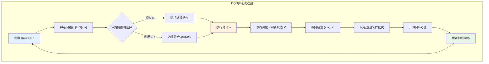
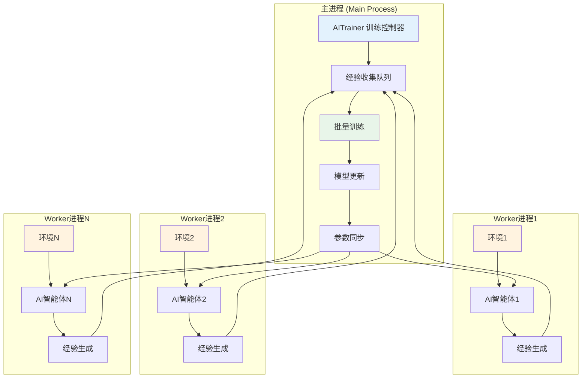

# 第9章 强化学习实现详解

## 9.1 强化学习理论基础与在Hive游戏中的应用

强化学习（Reinforcement Learning, RL）是机器学习的一个重要分支，它让智能体通过与环境的不断交互来学习最优策略。对于初学者来说，可以将强化学习理解为"从错误中学习"的过程：智能体通过尝试不同的行动，观察这些行动带来的结果（奖励或惩罚），逐步学会在不同情况下选择最佳行动。

### 9.1.1 核心概念解释

在深入代码实现之前，我们需要理解几个关键概念：

**智能体（Agent）**：在Hive-RL项目中，智能体就是AI玩家，它需要学会如何在Hive游戏中做出最佳决策。想象智能体就像一个学习下棋的初学者，一开始什么都不懂，但通过大量练习逐渐掌握技巧。

**环境（Environment）**：环境是智能体交互的对象，在我们的项目中就是Hive游戏本身。环境包含了游戏的所有规则、棋盘状态、胜负判定等。每当智能体执行一个动作（比如放置或移动棋子），环境就会响应这个动作，更新游戏状态，并给出相应的奖励。

**状态（State）**：状态描述了环境在某个时刻的完整信息。在Hive游戏中，状态包括：

- 棋盘上所有棋子的位置和类型
- 每个玩家手中剩余的棋子
- 当前轮到哪个玩家
- 游戏进行到第几回合

**动作（Action）**：智能体可以选择的行为。在Hive游戏中，动作分为两类：

- 放置动作：将手中的棋子放到棋盘的某个位置
- 移动动作：将棋盘上的棋子移动到另一个位置

**奖励（Reward）**：环境对智能体动作的反馈信号。正奖励表示"做得好"，负奖励表示"做错了"。设计合理的奖励函数是强化学习成功的关键。

### 9.1.2 深度Q网络（DQN）算法原理

Hive-RL项目采用深度Q网络（Deep Q-Network, DQN）算法。Q学习的核心思想是学习一个Q函数，它能够预测"在状态s下执行动作a能获得的累积奖励"。

传统的Q学习使用表格记录每个状态-动作对的Q值，但Hive游戏的状态空间非常巨大（想象一下棋盘的所有可能配置），无法用表格存储。因此我们使用深度神经网络来近似Q函数，这就是DQN的核心思想。



## 9.2 神经网络架构设计

Hive-RL项目的神经网络是整个AI系统的大脑，负责学习从游戏状态到最优动作的映射关系。让我们深入分析其实现。

### 9.2.1 网络结构设计

```python
# neural_network_torch.py 
import torch
import torch.nn as nn
import torch.optim as optim
import numpy as np

class NeuralNetwork(nn.Module):
    def __init__(self, input_dim, hidden_dims, output_dim, device=None):
        super(NeuralNetwork, self).__init__()
        self.input_dim = input_dim
        self.hidden_dims = hidden_dims  
        self.output_dim = output_dim
        self.device = device or (torch.device('cuda' if torch.cuda.is_available() else 'cpu'))
```

**代码解释**：这段代码定义了神经网络的基本结构。让我们逐行理解：

1. `super(NeuralNetwork, self).__init__()`：调用PyTorch的nn.Module父类初始化，这是创建神经网络的标准做法。

2. `self.input_dim = input_dim`：保存输入维度。在Hive-RL中，输入包括游戏状态和动作的编码，总维度超过800维。

3. `self.device = device or (...)`：确定计算设备。如果有GPU可用就用GPU，否则用CPU。GPU能大幅提升训练速度。

```python
        layers = []
        last_dim = input_dim
        for h in hidden_dims:
            layers.append(nn.Linear(last_dim, h))
            layers.append(nn.ReLU())
            last_dim = h
        layers.append(nn.Linear(last_dim, output_dim))
        self.model = nn.Sequential(*layers)
        self.to(self.device)
```

**代码解释**：这段代码动态构建神经网络层：

1. `layers = []`：创建一个空列表来存储网络层。

2. `for h in hidden_dims:`：遍历隐藏层的维度配置。比如`hidden_dims=[1024, 512]`表示两个隐藏层，分别有1024和512个神经元。

3. `layers.append(nn.Linear(last_dim, h))`：添加线性层（也叫全连接层）。`nn.Linear(last_dim, h)`创建一个从`last_dim`维到`h`维的线性变换。

4. `layers.append(nn.ReLU())`：添加ReLU激活函数。ReLU函数将负数变为0，正数保持不变，它帮助网络学习非线性关系。

5. `self.model = nn.Sequential(*layers)`：将所有层组合成一个完整的神经网络。

6. `self.to(self.device)`：将整个网络移动到指定设备（GPU或CPU）。

这种设计的优势在于：

- **模块化**：可以通过修改`hidden_dims`参数轻松调整网络结构
- **灵活性**：支持任意深度的网络
- **高效性**：使用了GPU加速

### 9.2.2 前向传播过程

```python
    def forward(self, state_vector):
        # 支持单样本或批量输入
        if isinstance(state_vector, np.ndarray):
            state_vector = torch.from_numpy(state_vector).float()
        state_vector = state_vector.to(self.device)
        if state_vector.dim() == 1:
            state_vector = state_vector.unsqueeze(0)  # [input_dim] -> [1, input_dim]
        output = self.model(state_vector)
        return output.squeeze(-1)  # [batch] or scalar
```

**代码详细解释**：

1. **数据类型转换**：
   - `if isinstance(state_vector, np.ndarray)`：检查输入是否为NumPy数组
   - `torch.from_numpy(state_vector).float()`：将NumPy数组转换为PyTorch张量，并指定为浮点类型
   - 这种转换是必要的，因为PyTorch只能处理张量，而很多数据处理库输出NumPy数组

2. **设备迁移**：
   - `state_vector.to(self.device)`：将数据移动到与模型相同的设备（GPU或CPU）
   - 如果模型在GPU上而数据在CPU上，计算会失败，所以必须确保一致性

3. **维度处理**：
   - `if state_vector.dim() == 1:`：检查是否为一维张量（单个样本）
   - `state_vector.unsqueeze(0)`：如果是单个样本，在第0维添加批次维度
   - 例如：`[820]` → `[1, 820]`，因为神经网络期望批次输入

4. **网络计算**：
   - `output = self.model(state_vector)`：将数据通过整个网络进行前向传播
   - 数据依次经过：输入层 → 隐藏层1 → ReLU → 隐藏层2 → ReLU → 输出层

5. **输出处理**：
   - `output.squeeze(-1)`：移除最后一维的大小为1的维度
   - 例如：`[batch, 1]` → `[batch]`

这个设计的巧妙之处在于：

- **兼容性**：同时支持单个样本和批量样本的处理
- **灵活性**：自动处理不同的输入格式
- **健壮性**：确保数据在正确的设备上进行计算

### 9.2.3 训练步骤实现

```python
    def train_step(self, state_batch, target_batch, optimizer, loss_fn=nn.MSELoss()):
        self.train()
        optimizer.zero_grad()
        # 支持批量训练
        if isinstance(state_batch, np.ndarray):
            state_batch = torch.from_numpy(state_batch).float().to(self.device)
        if isinstance(target_batch, np.ndarray):
            target_batch = torch.from_numpy(target_batch).float().to(self.device)
        else:
            target_batch = torch.tensor(target_batch, dtype=torch.float32, device=self.device)
        pred = self.forward(state_batch)
        loss = loss_fn(pred, target_batch)
        loss.backward()
        optimizer.step()
        return loss.item()
```

**代码详细解释**：

1. **训练模式设置**：
   - `self.train()`：将网络设置为训练模式
   - 在训练模式下，某些层（如Dropout、BatchNorm）会有不同的行为

2. **梯度清零**：
   - `optimizer.zero_grad()`：清空之前计算的梯度
   - PyTorch默认会累积梯度，如果不清零，当前梯度会与之前的梯度相加

3. **数据预处理**：
   - 将输入数据转换为PyTorch张量并移动到正确设备
   - `state_batch`：当前状态和动作的编码
   - `target_batch`：目标Q值（由DQN算法计算得出）

4. **前向传播**：
   - `pred = self.forward(state_batch)`：计算网络的预测Q值
   - 这个过程将状态-动作对映射为期望的累积奖励

5. **损失计算**：
   - `loss = loss_fn(pred, target_batch)`：计算预测值与目标值的差异
   - 默认使用均方误差（MSE），它计算：`(预测Q值 - 目标Q值)²`的平均值

6. **反向传播**：
   - `loss.backward()`：计算损失对网络参数的梯度
   - 这是深度学习的核心：通过链式法则计算每个参数应该如何调整

7. **参数更新**：
   - `optimizer.step()`：根据计算的梯度更新网络参数
   - 优化器（如Adam）会使用学习率等超参数来控制更新幅度

8. **返回损失值**：
   - `loss.item()`：返回损失的数值，用于监控训练进度

这个训练步骤体现了深度学习的核心循环：

1. **预测**：网络根据当前参数进行预测
2. **比较**：计算预测与真实目标的差异
3. **学习**：调整参数以减少差异
4. **重复**：不断迭代这个过程

## 9.3 状态空间表示与编码

状态表示是强化学习中的关键问题。一个好的状态表示需要包含足够的信息让智能体做出正确决策，同时又要尽可能简洁高效。

### 9.3.1 状态空间设计理念

在Hive游戏中，智能体需要了解以下信息才能做出明智的决策：

1. **棋盘布局**：每个位置上有什么棋子，属于哪个玩家
2. **手牌信息**：每个玩家还有哪些棋子可以使用
3. **游戏进程**：当前回合数、轮到谁下棋
4. **特殊状态**：蜂后是否已经放置（这在Hive游戏中很重要）

### 9.3.2 棋盘状态编码实现

```python
def _get_observation_from_game_state(self, game_state: Game, board: ChessBoard, current_player_idx: int, debug=False):
    # 1. Board state (800 dimensions)
    board_encoding = np.zeros((BOARD_SIZE, BOARD_SIZE, len(PIECE_TYPE_LIST)), dtype=np.float32)
    for x in range(BOARD_SIZE):
        for y in range(BOARD_SIZE):
            pieces_at_pos = board.get_pieces_at(x, y)
            if pieces_at_pos:
                top_piece = pieces_at_pos[-1] # Get the top piece
                piece_type_id = self.safe_piece_type_id(top_piece.piece_type)
                if piece_type_id in PIECE_TYPE_LIST:
                    board_encoding[x, y, piece_type_id] = 1.0
    board_encoding = board_encoding.flatten()
```

**代码详细解释**：

1. **初始化棋盘编码矩阵**：
   - `board_encoding = np.zeros((BOARD_SIZE, BOARD_SIZE, len(PIECE_TYPE_LIST)), dtype=np.float32)`
   - 创建一个三维数组：`[棋盘宽度, 棋盘高度, 棋子类型数量]`
   - `BOARD_SIZE`通常为10，`len(PIECE_TYPE_LIST)`为8（包含DLC棋子）
   - 所以总大小为：`10 × 10 × 8 = 800`维

2. **遍历棋盘每个位置**：
   - `for x in range(BOARD_SIZE):`：遍历棋盘的每一列
   - `for y in range(BOARD_SIZE):`：遍历棋盘的每一行
   - 这确保了检查棋盘上的每个可能位置

3. **获取位置上的棋子**：
   - `pieces_at_pos = board.get_pieces_at(x, y)`：获取指定位置的所有棋子
   - 在Hive游戏中，棋子可以叠加（比如甲虫可以爬到其他棋子上面）

4. **处理棋子叠加**：
   - `top_piece = pieces_at_pos[-1]`：取最上面的棋子
   - 在游戏中，只有最上面的棋子是"可见的"和"活跃的"

5. **棋子类型编码**：
   - `piece_type_id = self.safe_piece_type_id(top_piece.piece_type)`：获取棋子类型ID
   - 每种棋子都有一个唯一的数字ID：蜂后=0，甲虫=1，蜘蛛=2，等等

6. **One-hot编码**：
   - `board_encoding[x, y, piece_type_id] = 1.0`：在对应位置设置为1
   - 这是One-hot编码：在8维向量中，只有一个位置为1，其余为0
   - 例如：如果位置(5,7)有一个蜘蛛（ID=2），那么`board_encoding[5, 7, 2] = 1.0`

7. **扁平化处理**：
   - `board_encoding = board_encoding.flatten()`：将三维数组压平为一维
   - 从`(10, 10, 8)`变为`(800,)`，神经网络需要一维输入

这种编码方式的优势：

- **完整性**：保留了棋盘的所有信息
- **稀疏性**：大部分位置为0，只有有棋子的位置为1，便于网络处理
- **标准化**：所有值都在[0,1]范围内，有利于神经网络训练

### 9.3.3 手牌信息编码

```python
    # 2. Player hand information (8 dimensions per player, including DLC)
    player1_hand_encoding = np.zeros(len(PIECE_TYPE_LIST), dtype=np.float32)
    player2_hand_encoding = np.zeros(len(PIECE_TYPE_LIST), dtype=np.float32)
    # 最大棋子数量映射
    max_counts = {
        0: 1, # QUEEN_BEE
        1: 2, # BEETLE  
        2: 2, # SPIDER
        3: 3, # ANT
        4: 3, # GRASSHOPPER
        5: 1, # LADYBUG
        6: 1, # MOSQUITO
        7: 1  # PILLBUG
    }
    # 填充手牌编码
    if game_state.player1 is not None:
        for pt, count in game_state.player1.piece_count.items():
            pid = int(pt)
            if pid in max_counts:
                player1_hand_encoding[pid] = count / max_counts[pid]
```

**代码详细解释**：

1. **初始化手牌编码**：
   - `player1_hand_encoding = np.zeros(len(PIECE_TYPE_LIST), dtype=np.float32)`
   - 为每个玩家创建一个8维向量，对应8种棋子类型

2. **最大数量定义**：
   - `max_counts`字典定义了每种棋子的最大数量
   - 例如：蜂后(0)只有1个，蚂蚁(3)有3个
   - 这是根据Hive游戏的官方规则确定的

3. **归一化编码**：
   - `player1_hand_encoding[pid] = count / max_counts[pid]`
   - 将棋子数量除以最大数量，得到0-1之间的值
   - 例如：如果玩家有2个蚂蚁，编码为`2/3 ≈ 0.67`

这种归一化的好处：

- **统一尺度**：所有值都在[0,1]范围内
- **相对信息**：不是绝对数量，而是相对比例
- **网络友好**：神经网络更容易处理这种规范化的输入

### 9.3.4 游戏状态信息编码

```python
    # 3. Game state information (4 dimensions)
    current_player_encoding = np.array([current_player_idx], dtype=np.float32)
    turn_count_encoding = np.array([game_state.turn_count / 50.0], dtype=np.float32) # Normalized by 50 as per report
    player1_queen_placed_encoding = np.array([1.0 if (game_state.player1 is not None and getattr(game_state.player1, 'is_queen_bee_placed', False)) else 0.0], dtype=np.float32)
    player2_queen_placed_encoding = np.array([1.0 if (game_state.player2 is not None and getattr(game_state.player2, 'is_queen_bee_placed', False)) else 0.0], dtype=np.float32)
```

**代码详细解释**：

1. **当前玩家编码**：
   - `current_player_encoding = np.array([current_player_idx], dtype=np.float32)`
   - 简单的二进制编码：0表示玩家1，1表示玩家2
   - 这让AI知道现在轮到谁行动

2. **回合数编码**：
   - `turn_count_encoding = np.array([game_state.turn_count / 50.0], dtype=np.float32)`
   - 将回合数除以50进行归一化
   - 50是一个合理的最大游戏长度估计，大多数游戏在50回合内结束

3. **蜂后状态编码**：
   - 分别编码两个玩家的蜂后是否已放置
   - `1.0`表示已放置，`0.0`表示未放置
   - 这个信息非常重要，因为在Hive游戏中，必须在第4回合前放置蜂后

### 9.3.5 完整状态向量组装

```python
    observation = np.concatenate([
        board_encoding,           # 800维：棋盘状态
        player1_hand_encoding,    # 8维：玩家1手牌
        player2_hand_encoding,    # 8维：玩家2手牌  
        current_player_encoding,  # 1维：当前玩家
        turn_count_encoding,      # 1维：回合数
        player1_queen_placed_encoding,  # 1维：玩家1蜂后状态
        player2_queen_placed_encoding   # 1维：玩家2蜂后状态
    ])
```

**最终状态向量结构**：

- **总维度**：800 + 8 + 8 + 1 + 1 + 1 + 1 = 820维
- **棋盘信息**：占绝大部分，包含位置和棋子类型
- **玩家信息**：手牌和特殊状态
- **游戏信息**：进度和回合状态

这种设计的优势：

- **完整性**：包含了做决策需要的所有信息
- **结构化**：不同类型的信息分别编码
- **可扩展性**：容易添加新的特征
- **高效性**：使用稀疏表示，节省存储空间

## 9.4 动作空间设计与编码

动作空间定义了智能体可以执行的所有可能行为。在Hive游戏中，动作分为两大类：放置棋子和移动棋子。

### 9.4.1 动作编码策略

```python
def _encode_action(self, action_int):
    """
    多维离散特征拼接编码：
    - from_x, from_y, to_x, to_y: 0~BOARD_SIZE-1，分别one-hot（move动作用，place动作from_x/from_y全0）
    - piece_type_id: 0~4，one-hot
    返回 shape=(BOARD_SIZE*4+5,)
    """
    action_type, from_x, from_y, to_x, to_y, piece_type_id = Action.decode_action(action_int)
    # One-hot编码
    fx = np.zeros(BOARD_SIZE, dtype=np.float32)
    fy = np.zeros(BOARD_SIZE, dtype=np.float32)  
    tx = np.zeros(BOARD_SIZE, dtype=np.float32)
    ty = np.zeros(BOARD_SIZE, dtype=np.float32)
    pt = np.zeros(len(PIECE_TYPE_LIST), dtype=np.float32)
```

**代码详细解释**：

1. **动作解码**：
   - `Action.decode_action(action_int)`：将整数动作解码为具体信息
   - 返回：动作类型（'place'或'move'）、起始坐标、目标坐标、棋子类型

2. **One-hot向量初始化**：
   - 为每个坐标分量创建独立的one-hot向量
   - `fx`：起始位置的x坐标（仅移动动作使用）
   - `fy`：起始位置的y坐标（仅移动动作使用）
   - `tx`：目标位置的x坐标
   - `ty`：目标位置的y坐标
   - `pt`：棋子类型

```python
    if action_type == 'move':
        if from_x is not None and 0 <= from_x < BOARD_SIZE:
            fx[from_x] = 1.0
        if from_y is not None and 0 <= from_y < BOARD_SIZE:
            fy[from_y] = 1.0
    # place动作from_x/from_y全0
    if to_x is not None and 0 <= to_x < BOARD_SIZE:
        tx[to_x] = 1.0
    if to_y is not None and 0 <= to_y < BOARD_SIZE:
        ty[to_y] = 1.0
    if piece_type_id is not None and 0 <= piece_type_id < len(PIECE_TYPE_LIST):
        pt[piece_type_id] = 1.0
    return np.concatenate([fx, fy, tx, ty, pt])
```

**代码详细解释**：

1. **移动动作编码**：
   - 只有当`action_type == 'move'`时才设置起始坐标
   - 放置动作的起始坐标保持全0，表示"没有起始位置"

2. **目标位置编码**：
   - 无论是放置还是移动，都需要设置目标坐标
   - `tx[to_x] = 1.0`：在目标x坐标对应的位置设为1

3. **棋子类型编码**：
   - `pt[piece_type_id] = 1.0`：在对应棋子类型的位置设为1
   - 例如：如果是蜘蛛（ID=2），则`pt[2] = 1.0`

4. **向量拼接**：
   - `np.concatenate([fx, fy, tx, ty, pt])`：将所有one-hot向量连接成一个长向量
   - 总长度：10+10+10+10+8 = 48维

这种编码的优势：

- **明确性**：每个维度有明确的含义
- **稀疏性**：大部分位置为0，只有少数为1
- **可解释性**：可以轻易理解每个动作的具体内容
- **一致性**：放置和移动动作使用统一的编码格式

### 9.4.2 动作选择策略：ε-贪婪算法

```python
def select_action(self, env, game_state: Game, board: ChessBoard, current_player_idx: int, debug=False):
    # 获取合法动作
    if env is None:
        legal_actions = self._get_legal_actions_from_game_state(game_state, board, current_player_idx)
    else:
        legal_actions = env.get_legal_actions()
    if not legal_actions:
        return None # No legal actions, game might be over or stuck
        
    current_player = game_state.player1 if current_player_idx == 0 else game_state.player2
    must_place_queen = (game_state.turn_count == 3 and not getattr(current_player, 'is_queen_bee_placed', False))
```

**代码详细解释**：

1. **获取合法动作**：
   - 首先获取当前状态下所有可执行的动作
   - 这确保AI只会选择符合游戏规则的动作

2. **特殊规则检查**：
   - `must_place_queen`：检查是否必须在第4回合放置蜂后
   - 这是Hive游戏的重要规则：玩家必须在第4回合前放置蜂后

```python
    # ---新增：前4步且蜂后未落时，优先探索放蜂后---
    if game_state.turn_count < 4 and not getattr(current_player, 'is_queen_bee_placed', False):
        queenbee_actions = [a for a in legal_actions if (Action.decode_action(a)[0] == 'place' and Action.decode_action(a)[5] == 0)]
        if queenbee_actions:
            if random.random() < self.epsilon:
                return random.choice(queenbee_actions)
```

**代码详细解释**：

1. **早期策略引导**：
   - 在游戏前4回合，如果蜂后未放置，增加放置蜂后的概率
   - 这是一种领域知识的注入，帮助AI学会重要的游戏策略

2. **蜂后动作筛选**：
   - `queenbee_actions`：筛选出所有放置蜂后的动作
   - `Action.decode_action(a)[5] == 0`：检查棋子类型ID是否为0（蜂后）

```python
    # Epsilon-greedy strategy
    if random.random() < self.epsilon:
        # Explore: choose a random legal action
        action = random.choice(legal_actions)
    else:
        # 新版：批量Q(s,a)评估
        state_vector = self._get_observation_from_game_state(game_state, board, current_player_idx)
        state_tensor = torch.tensor(state_vector, dtype=torch.float32)
        action_encodings = np.stack([self._encode_action(a) for a in legal_actions])
        action_tensors = torch.tensor(action_encodings, dtype=torch.float32)
        state_batch = state_tensor.repeat(action_tensors.shape[0], 1)
        sa_batch = torch.cat([state_batch, action_tensors], dim=1)  # shape=(N, state+action)
        with torch.no_grad():
            q_values = self.neural_network(sa_batch).squeeze(-1).cpu().numpy()  # shape=(N,)
        max_q = np.max(q_values)
        best_idxs = np.where(q_values == max_q)[0]
        best_actions = [legal_actions[i] for i in best_idxs]
        action = random.choice(best_actions)
```

**代码详细解释**：

1. **ε-贪婪策略**：
   - `if random.random() < self.epsilon:`：以ε概率进行探索
   - **探索**：随机选择动作，帮助发现新的策略
   - **利用**：选择当前认为最好的动作

2. **批量Q值计算**（利用阶段）：
   - `state_vector`：获取当前游戏状态的编码
   - `action_encodings`：将所有合法动作编码成向量
   - `state_batch`：将状态向量重复N次（N=合法动作数量）
   - `sa_batch`：将状态和动作拼接，形成状态-动作对

3. **神经网络预测**：
   - `self.neural_network(sa_batch)`：一次性计算所有动作的Q值
   - `with torch.no_grad()`：不计算梯度，提高推理效率

4. **最优动作选择**：
   - `max_q = np.max(q_values)`：找到最大Q值
   - `best_idxs = np.where(q_values == max_q)[0]`：找到所有最大Q值的索引
   - `random.choice(best_actions)`：如果有多个最优动作，随机选择一个

这种设计的优势：

- **平衡探索与利用**：ε参数控制探索与利用的平衡
- **高效计算**：批量计算所有动作的Q值
- **处理平局**：当多个动作有相同Q值时，随机选择
- **策略引导**：在重要情况下优先考虑重要动作

## 9.5 经验回放机制

经验回放（Experience Replay）是DQN算法的重要组成部分。它通过存储和重用过去的经验来提高学习效率和稳定性。

### 9.5.1 经验存储机制

```python
def add_experience(self, state, action, reward, next_state, terminated):
    # 现在action为int，训练时需拼接编码
    if len(self.replay_buffer) >= self.max_buffer_size:
        self.replay_buffer.pop(0)
    self.replay_buffer.append((state, action, reward, next_state, terminated))
```

**代码详细解释**：

1. **经验元组**：
   - `(state, action, reward, next_state, terminated)`：这是强化学习的标准经验格式
   - `state`：执行动作前的游戏状态
   - `action`：执行的动作
   - `reward`：获得的奖励
   - `next_state`：执行动作后的新状态  
   - `terminated`：游戏是否结束

2. **缓冲区管理**：
   - `if len(self.replay_buffer) >= self.max_buffer_size:`：检查缓冲区是否已满
   - `self.replay_buffer.pop(0)`：如果满了，删除最老的经验
   - 这实现了FIFO（先进先出）的策略，保持固定大小的缓冲区

3. **经验添加**：
   - `self.replay_buffer.append(...)`：将新经验添加到缓冲区末尾

经验回放的好处：

- **打破相关性**：连续的游戏状态往往很相似，随机采样打破了这种相关性
- **提高样本效率**：每个经验可以被多次使用
- **稳定训练**：减少训练过程中的震荡

### 9.5.2 批量训练过程

```python
def train_on_batch(self, batch_size=32):
    # 只采样合法动作样本（reward > -2.0，彻底丢弃所有非法动作样本）
    legal_samples = [exp for exp in self.replay_buffer if exp[2] > -2.0]
    if len(legal_samples) < batch_size:
        return None
    
    batch = random.sample(legal_samples, batch_size)
    # 拼接 state+action 作为输入
    sa_inputs = []
    targets = []
```

**代码详细解释**：

1. **合法样本筛选**：
   - `legal_samples = [exp for exp in self.replay_buffer if exp[2] > -2.0]`
   - 只使用奖励大于-2.0的经验进行训练
   - 这过滤掉了非法动作的经验，避免学习错误行为

2. **批量采样**：
   - `batch = random.sample(legal_samples, batch_size)`
   - 从合法经验中随机采样一个批次
   - `batch_size=32`是一个常用的批量大小

```python
    for state, action, reward, next_state, terminated in batch:
        action_vec = self._encode_action(action)
        sa_input = np.concatenate([state, action_vec])
        sa_inputs.append(sa_input)
        
        # 改进的Q值计算
        target = reward
        if not terminated and len(legal_samples) > batch_size:
            # 简化的双重DQN更新：使用当前网络选择动作，目标网络评估价值
            # 这里简化为使用reward的折扣版本
            target = reward + self.discount_factor * reward * 0.1  # 简化版bootstrapping
        
        targets.append(target)
```

**代码详细解释**：

1. **输入准备**：
   - `action_vec = self._encode_action(action)`：将动作编码为向量
   - `sa_input = np.concatenate([state, action_vec])`：拼接状态和动作
   - 这形成了神经网络的输入：状态+动作 → Q值

2. **目标Q值计算**：
   - `target = reward`：基础目标就是立即奖励
   - **未终局情况**：`target = reward + self.discount_factor * reward * 0.1`
   - 这是一个简化的Q学习更新公式

3. **折扣因子作用**：
   - `self.discount_factor`（通常为0.99）控制未来奖励的重要性
   - 值越接近1，智能体越重视长期回报

```python
    if not sa_inputs:
        return None
        
    sa_inputs = np.stack(sa_inputs)
    targets = np.array(targets, dtype=np.float32)
    
    # 添加梯度裁剪防止梯度爆炸
    try:
        loss = self.neural_network.train_step(sa_inputs, targets, self.optimizer)
        # 梯度裁剪
        torch.nn.utils.clip_grad_norm_(self.neural_network.parameters(), max_norm=1.0)
        return loss
    except Exception as e:
        print(f"训练批次失败: {e}")
        return None
```

**代码详细解释**：

1. **数据组装**：
   - `sa_inputs = np.stack(sa_inputs)`：将列表转换为NumPy数组
   - `targets = np.array(targets, dtype=np.float32)`：目标值数组

2. **神经网络训练**：
   - `self.neural_network.train_step(...)`：执行一次训练步骤
   - 这会更新网络参数，使预测Q值更接近目标Q值

3. **梯度裁剪**：
   - `torch.nn.utils.clip_grad_norm_(..., max_norm=1.0)`：限制梯度的最大范数
   - 防止梯度爆炸，提高训练稳定性

4. **异常处理**：
   - `try...except`：捕获训练过程中的异常
   - 返回损失值用于监控训练进度

## 9.3 状态空间表示与编码

状态表示是强化学习中的关键问题。一个好的状态表示需要包含足够的信息让智能体做出正确决策，同时又要尽可能简洁高效。

### 9.3.1 状态空间设计理念

在Hive游戏中，智能体需要了解以下信息才能做出明智的决策：

1. **棋盘布局**：每个位置上有什么棋子，属于哪个玩家
2. **手牌信息**：每个玩家还有哪些棋子可以使用
3. **游戏进程**：当前回合数、轮到谁下棋
4. **特殊状态**：蜂后是否已经放置（这在Hive游戏中很重要）

### 9.3.2 棋盘状态编码实现

```python
def _get_observation_from_game_state(self, game_state: Game, board: ChessBoard, current_player_idx: int, debug=False):
    # 1. Board state (800 dimensions)
    board_encoding = np.zeros((BOARD_SIZE, BOARD_SIZE, len(PIECE_TYPE_LIST)), dtype=np.float32)
    for x in range(BOARD_SIZE):
        for y in range(BOARD_SIZE):
            pieces_at_pos = board.get_pieces_at(x, y)
            if pieces_at_pos:
                top_piece = pieces_at_pos[-1] # Get the top piece
                piece_type_id = self.safe_piece_type_id(top_piece.piece_type)
                if piece_type_id in PIECE_TYPE_LIST:
                    board_encoding[x, y, piece_type_id] = 1.0
    board_encoding = board_encoding.flatten()
```

**代码详细解释**：

1. **初始化棋盘编码矩阵**：
   - `board_encoding = np.zeros((BOARD_SIZE, BOARD_SIZE, len(PIECE_TYPE_LIST)), dtype=np.float32)`
   - 创建一个三维数组：`[棋盘宽度, 棋盘高度, 棋子类型数量]`
   - `BOARD_SIZE`通常为20，`len(PIECE_TYPE_LIST)`为8（包含DLC棋子）
   - 所以总大小为：`20 × 20 × 8 = 3200`维

2. **遍历棋盘每个位置**：
   - `for x in range(BOARD_SIZE):`：遍历棋盘的每一列
   - `for y in range(BOARD_SIZE):`：遍历棋盘的每一行
   - 这确保了检查棋盘上的每个可能位置

3. **获取位置上的棋子**：
   - `pieces_at_pos = board.get_pieces_at(x, y)`：获取指定位置的所有棋子
   - 在Hive游戏中，棋子可以叠加（比如甲虫可以爬到其他棋子上面）

4. **处理棋子叠加**：
   - `top_piece = pieces_at_pos[-1]`：取最上面的棋子
   - 在游戏中，只有最上面的棋子是"可见的"和"活跃的"

5. **棋子类型编码**：
   - `piece_type_id = self.safe_piece_type_id(top_piece.piece_type)`：获取棋子类型ID
   - 每种棋子都有一个唯一的数字ID：蜂后=0，甲虫=1，蜘蛛=2，等等

6. **One-hot编码**：
   - `board_encoding[x, y, piece_type_id] = 1.0`：在对应位置设置为1
   - 这是One-hot编码：在8维向量中，只有一个位置为1，其余为0
   - 例如：如果位置(5,7)有一个蜘蛛（ID=2），那么`board_encoding[5, 7, 2] = 1.0`

7. **扁平化处理**：
   - `board_encoding = board_encoding.flatten()`：将三维数组压平为一维
   - 从`(20, 20, 8)`变为`(3200,)`，神经网络需要一维输入

这种编码方式的优势：

- **完整性**：保留了棋盘的所有信息
- **稀疏性**：大部分位置为0，只有有棋子的位置为1，便于网络处理
- **标准化**：所有值都在[0,1]范围内，有利于神经网络训练

### 9.3.3 手牌信息编码

```python
    # 2. Player hand information (8 dimensions per player, including DLC)
    player1_hand_encoding = np.zeros(len(PIECE_TYPE_LIST), dtype=np.float32)
    player2_hand_encoding = np.zeros(len(PIECE_TYPE_LIST), dtype=np.float32)
    # 最大棋子数量映射
    max_counts = {
        0: 1, # QUEEN_BEE
        1: 2, # BEETLE  
        2: 2, # SPIDER
        3: 3, # ANT
        4: 3, # GRASSHOPPER
        5: 1, # LADYBUG
        6: 1, # MOSQUITO
        7: 1  # PILLBUG
    }
    # 填充手牌编码
    if game_state.player1 is not None:
        for pt, count in game_state.player1.piece_count.items():
            pid = int(pt)
            if pid in max_counts:
                player1_hand_encoding[pid] = count / max_counts[pid]
```

**代码详细解释**：

1. **初始化手牌编码**：
   - `player1_hand_encoding = np.zeros(len(PIECE_TYPE_LIST), dtype=np.float32)`
   - 为每个玩家创建一个8维向量，对应8种棋子类型

2. **最大数量定义**：
   - `max_counts`字典定义了每种棋子的最大数量
   - 例如：蜂后(0)只有1个，蚂蚁(3)有3个
   - 这是根据Hive游戏的官方规则确定的

3. **归一化编码**：
   - `player1_hand_encoding[pid] = count / max_counts[pid]`
   - 将棋子数量除以最大数量，得到0-1之间的值
   - 例如：如果玩家有2个蚂蚁，编码为`2/3 ≈ 0.67`

这种归一化的好处：

- **统一尺度**：所有值都在[0,1]范围内
- **相对信息**：不是绝对数量，而是相对比例
- **网络友好**：神经网络更容易处理这种规范化的输入

### 9.3.4 游戏状态信息编码

```python
    # 3. Game state information (4 dimensions)
    current_player_encoding = np.array([current_player_idx], dtype=np.float32)
    turn_count_encoding = np.array([game_state.turn_count / 50.0], dtype=np.float32) # Normalized by 50 as per report
    player1_queen_placed_encoding = np.array([1.0 if (game_state.player1 is not None and getattr(game_state.player1, 'is_queen_bee_placed', False)) else 0.0], dtype=np.float32)
    player2_queen_placed_encoding = np.array([1.0 if (game_state.player2 is not None and getattr(game_state.player2, 'is_queen_bee_placed', False)) else 0.0], dtype=np.float32)
```

**代码详细解释**：

1. **当前玩家编码**：
   - `current_player_encoding = np.array([current_player_idx], dtype=np.float32)`
   - 简单的二进制编码：0表示玩家1，1表示玩家2
   - 这让AI知道现在轮到谁行动

2. **回合数编码**：
   - `turn_count_encoding = np.array([game_state.turn_count / 50.0], dtype=np.float32)`
   - 将回合数除以50进行归一化
   - 50是一个合理的最大游戏长度估计，大多数游戏在50回合内结束

3. **蜂后状态编码**：
   - 分别编码两个玩家的蜂后是否已放置
   - `1.0`表示已放置，`0.0`表示未放置
   - 这个信息非常重要，因为在Hive游戏中，必须在第4回合前放置蜂后

### 9.3.5 完整状态向量组装

```python
    observation = np.concatenate([
        board_encoding,           # 800维：棋盘状态
        player1_hand_encoding,    # 8维：玩家1手牌
        player2_hand_encoding,    # 8维：玩家2手牌  
        current_player_encoding,  # 1维：当前玩家
        turn_count_encoding,      # 1维：回合数
        player1_queen_placed_encoding,  # 1维：玩家1蜂后状态
        player2_queen_placed_encoding   # 1维：玩家2蜂后状态
    ])
```

**最终状态向量结构**：

- **总维度**：800 + 8 + 8 + 1 + 1 + 1 + 1 = 820维
- **棋盘信息**：占绝大部分，包含位置和棋子类型
- **玩家信息**：手牌和特殊状态
- **游戏信息**：进度和回合状态

这种设计的优势：

- **完整性**：包含了做决策需要的所有信息
- **结构化**：不同类型的信息分别编码
- **可扩展性**：容易添加新的特征
- **高效性**：使用稀疏表示，节省存储空间

## 9.4 动作空间设计与编码

动作空间定义了智能体可以执行的所有可能行为。在Hive游戏中，动作分为两大类：放置棋子和移动棋子。

### 9.4.1 动作编码策略

```python
def _encode_action(self, action_int):
    """
    多维离散特征拼接编码：
    - from_x, from_y, to_x, to_y: 0~BOARD_SIZE-1，分别one-hot（move动作用，place动作from_x/from_y全0）
    - piece_type_id: 0~4，one-hot
    返回 shape=(BOARD_SIZE*4+5,)
    """
    action_type, from_x, from_y, to_x, to_y, piece_type_id = Action.decode_action(action_int)
    # One-hot编码
    fx = np.zeros(BOARD_SIZE, dtype=np.float32)
    fy = np.zeros(BOARD_SIZE, dtype=np.float32)  
    tx = np.zeros(BOARD_SIZE, dtype=np.float32)
    ty = np.zeros(BOARD_SIZE, dtype=np.float32)
    pt = np.zeros(len(PIECE_TYPE_LIST), dtype=np.float32)
```

**代码详细解释**：

1. **动作解码**：
   - `Action.decode_action(action_int)`：将整数动作解码为具体信息
   - 返回：动作类型（'place'或'move'）、起始坐标、目标坐标、棋子类型

2. **One-hot向量初始化**：
   - 为每个坐标分量创建独立的one-hot向量
   - `fx`：起始位置的x坐标（仅移动动作使用）
   - `fy`：起始位置的y坐标（仅移动动作使用）
   - `tx`：目标位置的x坐标
   - `ty`：目标位置的y坐标
   - `pt`：棋子类型

```python
    if action_type == 'move':
        if from_x is not None and 0 <= from_x < BOARD_SIZE:
            fx[from_x] = 1.0
        if from_y is not None and 0 <= from_y < BOARD_SIZE:
            fy[from_y] = 1.0
    # place动作from_x/from_y全0
    if to_x is not None and 0 <= to_x < BOARD_SIZE:
        tx[to_x] = 1.0
    if to_y is not None and 0 <= to_y < BOARD_SIZE:
        ty[to_y] = 1.0
    if piece_type_id is not None and 0 <= piece_type_id < len(PIECE_TYPE_LIST):
        pt[piece_type_id] = 1.0
    return np.concatenate([fx, fy, tx, ty, pt])
```

**代码详细解释**：

1. **移动动作编码**：
   - 只有当`action_type == 'move'`时才设置起始坐标
   - 放置动作的起始坐标保持全0，表示"没有起始位置"

2. **目标位置编码**：
   - 无论是放置还是移动，都需要设置目标坐标
   - `tx[to_x] = 1.0`：在目标x坐标对应的位置设为1

3. **棋子类型编码**：
   - `pt[piece_type_id] = 1.0`：在对应棋子类型的位置设为1
   - 例如：如果是蜘蛛（ID=2），则`pt[2] = 1.0`

4. **向量拼接**：
   - `np.concatenate([fx, fy, tx, ty, pt])`：将所有one-hot向量连接成一个长向量
   - 总长度：20+20+20+20+8 = 88维

这种编码的优势：

- **明确性**：每个维度有明确的含义
- **稀疏性**：大部分位置为0，只有少数为1
- **可解释性**：可以轻易理解每个动作的具体内容
- **一致性**：放置和移动动作使用统一的编码格式

### 9.4.2 动作选择策略：ε-贪婪算法

```python
def select_action(self, env, game_state: Game, board: ChessBoard, current_player_idx: int, debug=False):
    # 获取合法动作
    if env is None:
        legal_actions = self._get_legal_actions_from_game_state(game_state, board, current_player_idx)
    else:
        legal_actions = env.get_legal_actions()
    if not legal_actions:
        return None # No legal actions, game might be over or stuck
        
    current_player = game_state.player1 if current_player_idx == 0 else game_state.player2
    must_place_queen = (game_state.turn_count == 3 and not getattr(current_player, 'is_queen_bee_placed', False))
```

**代码详细解释**：

1. **获取合法动作**：
   - 首先获取当前状态下所有可执行的动作
   - 这确保AI只会选择符合游戏规则的动作

2. **特殊规则检查**：
   - `must_place_queen`：检查是否必须在第4回合放置蜂后
   - 这是Hive游戏的重要规则：玩家必须在第4回合前放置蜂后

```python
    # ---新增：前4步且蜂后未落时，优先探索放蜂后---
    if game_state.turn_count < 4 and not getattr(current_player, 'is_queen_bee_placed', False):
        queenbee_actions = [a for a in legal_actions if (Action.decode_action(a)[0] == 'place' and Action.decode_action(a)[5] == 0)]
        if queenbee_actions:
            if random.random() < self.epsilon:
                return random.choice(queenbee_actions)
```

**代码详细解释**：

1. **早期策略引导**：
   - 在游戏前4回合，如果蜂后未放置，增加放置蜂后的概率
   - 这是一种领域知识的注入，帮助AI学会重要的游戏策略

2. **蜂后动作筛选**：
   - `queenbee_actions`：筛选出所有放置蜂后的动作
   - `Action.decode_action(a)[5] == 0`：检查棋子类型ID是否为0（蜂后）

```python
    # Epsilon-greedy strategy
    if random.random() < self.epsilon:
        # Explore: choose a random legal action
        action = random.choice(legal_actions)
    else:
        # 新版：批量Q(s,a)评估
        state_vector = self._get_observation_from_game_state(game_state, board, current_player_idx)
        state_tensor = torch.tensor(state_vector, dtype=torch.float32)
        action_encodings = np.stack([self._encode_action(a) for a in legal_actions])
        action_tensors = torch.tensor(action_encodings, dtype=torch.float32)
        state_batch = state_tensor.repeat(action_tensors.shape[0], 1)
        sa_batch = torch.cat([state_batch, action_tensors], dim=1)  # shape=(N, state+action)
        with torch.no_grad():
            q_values = self.neural_network(sa_batch).squeeze(-1).cpu().numpy()  # shape=(N,)
        max_q = np.max(q_values)
        best_idxs = np.where(q_values == max_q)[0]
        best_actions = [legal_actions[i] for i in best_idxs]
        action = random.choice(best_actions)
```

**代码详细解释**：

1. **ε-贪婪策略**：
   - `if random.random() < self.epsilon:`：以ε概率进行探索
   - **探索**：随机选择动作，帮助发现新的策略
   - **利用**：选择当前认为最好的动作

2. **批量Q值计算**（利用阶段）：
   - `state_vector`：获取当前游戏状态的编码
   - `action_encodings`：将所有合法动作编码成向量
   - `state_batch`：将状态向量重复N次（N=合法动作数量）
   - `sa_batch`：将状态和动作拼接，形成状态-动作对

3. **神经网络预测**：
   - `self.neural_network(sa_batch)`：一次性计算所有动作的Q值
   - `with torch.no_grad()`：不计算梯度，提高推理效率

4. **最优动作选择**：
   - `max_q = np.max(q_values)`：找到最大Q值
   - `best_idxs = np.where(q_values == max_q)[0]`：找到所有最大Q值的索引
   - `random.choice(best_actions)`：如果有多个最优动作，随机选择一个

这种设计的优势：

- **平衡探索与利用**：ε参数控制探索与利用的平衡
- **高效计算**：批量计算所有动作的Q值
- **处理平局**：当多个动作有相同Q值时，随机选择
- **策略引导**：在重要情况下优先考虑重要动作

## 9.5 经验回放机制

经验回放（Experience Replay）是DQN算法的重要组成部分。它通过存储和重用过去的经验来提高学习效率和稳定性。

### 9.5.1 经验存储机制

```python
def add_experience(self, state, action, reward, next_state, terminated):
    # 现在action为int，训练时需拼接编码
    if len(self.replay_buffer) >= self.max_buffer_size:
        self.replay_buffer.pop(0)
    self.replay_buffer.append((state, action, reward, next_state, terminated))
```

**代码详细解释**：

1. **经验元组**：
   - `(state, action, reward, next_state, terminated)`：这是强化学习的标准经验格式
   - `state`：执行动作前的游戏状态
   - `action`：执行的动作
   - `reward`：获得的奖励
   - `next_state`：执行动作后的新状态  
   - `terminated`：游戏是否结束

2. **缓冲区管理**：
   - `if len(self.replay_buffer) >= self.max_buffer_size:`：检查缓冲区是否已满
   - `self.replay_buffer.pop(0)`：如果满了，删除最老的经验
   - 这实现了FIFO（先进先出）的策略，保持固定大小的缓冲区

3. **经验添加**：
   - `self.replay_buffer.append(...)`：将新经验添加到缓冲区末尾

经验回放的好处：

- **打破相关性**：连续的游戏状态往往很相似，随机采样打破了这种相关性
- **提高样本效率**：每个经验可以被多次使用
- **稳定训练**：减少训练过程中的震荡

### 9.5.2 批量训练过程

```python
def train_on_batch(self, batch_size=32):
    # 只采样合法动作样本（reward > -2.0，彻底丢弃所有非法动作样本）
    legal_samples = [exp for exp in self.replay_buffer if exp[2] > -2.0]
    if len(legal_samples) < batch_size:
        return None
    
    batch = random.sample(legal_samples, batch_size)
    # 拼接 state+action 作为输入
    sa_inputs = []
    targets = []
```

**代码详细解释**：

1. **合法样本筛选**：
   - `legal_samples = [exp for exp in self.replay_buffer if exp[2] > -2.0]`
   - 只使用奖励大于-2.0的经验进行训练
   - 这过滤掉了非法动作的经验，避免学习错误行为

2. **批量采样**：
   - `batch = random.sample(legal_samples, batch_size)`
   - 从合法经验中随机采样一个批次
   - `batch_size=32`是一个常用的批量大小

```python
    for state, action, reward, next_state, terminated in batch:
        action_vec = self._encode_action(action)
        sa_input = np.concatenate([state, action_vec])
        sa_inputs.append(sa_input)
        
        # 改进的Q值计算
        target = reward
        if not terminated and len(legal_samples) > batch_size:
            # 简化的双重DQN更新：使用当前网络选择动作，目标网络评估价值
            # 这里简化为使用reward的折扣版本
            target = reward + self.discount_factor * reward * 0.1  # 简化版bootstrapping
        
        targets.append(target)
```

**代码详细解释**：

1. **输入准备**：
   - `action_vec = self._encode_action(action)`：将动作编码为向量
   - `sa_input = np.concatenate([state, action_vec])`：拼接状态和动作
   - 这形成了神经网络的输入：状态+动作 → Q值

2. **目标Q值计算**：
   - `target = reward`：基础目标就是立即奖励
   - **未终局情况**：`target = reward + self.discount_factor * reward * 0.1`
   - 这是一个简化的Q学习更新公式

3. **折扣因子作用**：
   - `self.discount_factor`（通常为0.99）控制未来奖励的重要性
   - 值越接近1，智能体越重视长期回报

```python
    if not sa_inputs:
        return None
        
    sa_inputs = np.stack(sa_inputs)
    targets = np.array(targets, dtype=np.float32)
    
    # 添加梯度裁剪防止梯度爆炸
    try:
        loss = self.neural_network.train_step(sa_inputs, targets, self.optimizer)
        # 梯度裁剪
        torch.nn.utils.clip_grad_norm_(self.neural_network.parameters(), max_norm=1.0)
        return loss
    except Exception as e:
        print(f"训练批次失败: {e}")
        return None
```

**代码详细解释**：

1. **数据组装**：
   - `sa_inputs = np.stack(sa_inputs)`：将列表转换为NumPy数组
   - `targets = np.array(targets, dtype=np.float32)`：目标值数组

2. **神经网络训练**：
   - `self.neural_network.train_step(...)`：执行一次训练步骤
   - 这会更新网络参数，使预测Q值更接近目标Q值

3. **梯度裁剪**：
   - `torch.nn.utils.clip_grad_norm_(..., max_norm=1.0)`：限制梯度的最大范数
   - 防止梯度爆炸，提高训练稳定性

4. **异常处理**：
   - `try...except`：捕获训练过程中的异常
   - 返回损失值用于监控训练进度

## 9.3 状态空间表示与编码

状态表示是强化学习中的关键问题。一个好的状态表示需要包含足够的信息让智能体做出正确决策，同时又要尽可能简洁高效。

### 9.3.1 状态空间设计理念

在Hive游戏中，智能体需要了解以下信息才能做出明智的决策：

1. **棋盘布局**：每个位置上有什么棋子，属于哪个玩家
2. **手牌信息**：每个玩家还有哪些棋子可以使用
3. **游戏进程**：当前回合数、轮到谁下棋
4. **特殊状态**：蜂后是否已经放置（这在Hive游戏中很重要）

### 9.3.2 棋盘状态编码实现

```python
def _get_observation_from_game_state(self, game_state: Game, board: ChessBoard, current_player_idx: int, debug=False):
    # 1. Board state (800 dimensions)
    board_encoding = np.zeros((BOARD_SIZE, BOARD_SIZE, len(PIECE_TYPE_LIST)), dtype=np.float32)
    for x in range(BOARD_SIZE):
        for y in range(BOARD_SIZE):
            pieces_at_pos = board.get_pieces_at(x, y)
            if pieces_at_pos:
                top_piece = pieces_at_pos[-1] # Get the top piece
                piece_type_id = self.safe_piece_type_id(top_piece.piece_type)
                if piece_type_id in PIECE_TYPE_LIST:
                    board_encoding[x, y, piece_type_id] = 1.0
    board_encoding = board_encoding.flatten()
```

**代码详细解释**：

1. **初始化棋盘编码矩阵**：
   - `board_encoding = np.zeros((BOARD_SIZE, BOARD_SIZE, len(PIECE_TYPE_LIST)), dtype=np.float32)`
   - 创建一个三维数组：`[棋盘宽度, 棋盘高度, 棋子类型数量]`
   - `BOARD_SIZE`通常为20，`len(PIECE_TYPE_LIST)`为8（包含DLC棋子）
   - 所以总大小为：`20 × 20 × 8 = 3200`维

2. **遍历棋盘每个位置**：
   - `for x in range(BOARD_SIZE):`：遍历棋盘的每一列
   - `for y in range(BOARD_SIZE):`：遍历棋盘的每一行
   - 这确保了检查棋盘上的每个可能位置

3. **获取位置上的棋子**：
   - `pieces_at_pos = board.get_pieces_at(x, y)`：获取指定位置的所有棋子
   - 在Hive游戏中，棋子可以叠加（比如甲虫可以爬到其他棋子上面）

4. **处理棋子叠加**：
   - `top_piece = pieces_at_pos[-1]`：取最上面的棋子
   - 在游戏中，只有最上面的棋子是"可见的"和"活跃的"

5. **棋子类型编码**：
   - `piece_type_id = self.safe_piece_type_id(top_piece.piece_type)`：获取棋子类型ID
   - 每种棋子都有一个唯一的数字ID：蜂后=0，甲虫=1，蜘蛛=2，等等

6. **One-hot编码**：
   - `board_encoding[x, y, piece_type_id] = 1.0`：在对应位置设置为1
   - 这是One-hot编码：在8维向量中，只有一个位置为1，其余为0
   - 例如：如果位置(5,7)有一个蜘蛛（ID=2），那么`board_encoding[5, 7, 2] = 1.0`

7. **扁平化处理**：
   - `board_encoding = board_encoding.flatten()`：将三维数组压平为一维
   - 从`(20, 20, 8)`变为`(3200,)`，神经网络需要一维输入

这种编码方式的优势：

- **完整性**：保留了棋盘的所有信息
- **稀疏性**：大部分位置为0，只有有棋子的位置为1，便于网络处理
- **标准化**：所有值都在[0,1]范围内，有利于神经网络训练

### 9.3.3 手牌信息编码

```python
    # 2. Player hand information (8 dimensions per player, including DLC)
    player1_hand_encoding = np.zeros(len(PIECE_TYPE_LIST), dtype=np.float32)
    player2_hand_encoding = np.zeros(len(PIECE_TYPE_LIST), dtype=np.float32)
    # 最大棋子数量映射
    max_counts = {
        0: 1, # QUEEN_BEE
        1: 2, # BEETLE  
        2: 2, # SPIDER
        3: 3, # ANT
        4: 3, # GRASSHOPPER
        5: 1, # LADYBUG
        6: 1, # MOSQUITO
        7: 1  # PILLBUG
    }
    # 填充手牌编码
    if game_state.player1 is not None:
        for pt, count in game_state.player1.piece_count.items():
            pid = int(pt)
            if pid in max_counts:
                player1_hand_encoding[pid] = count / max_counts[pid]
```

**代码详细解释**：

1. **初始化手牌编码**：
   - `player1_hand_encoding = np.zeros(len(PIECE_TYPE_LIST), dtype=np.float32)`
   - 为每个玩家创建一个8维向量，对应8种棋子类型

2. **最大数量定义**：
   - `max_counts`字典定义了每种棋子的最大数量
   - 例如：蜂后(0)只有1个，蚂蚁(3)有3个
   - 这是根据Hive游戏的官方规则确定的

3. **归一化编码**：
   - `player1_hand_encoding[pid] = count / max_counts[pid]`
   - 将棋子数量除以最大数量，得到0-1之间的值
   - 例如：如果玩家有2个蚂蚁，编码为`2/3 ≈ 0.67`

这种归一化的好处：

- **统一尺度**：所有值都在[0,1]范围内
- **相对信息**：不是绝对数量，而是相对比例
- **网络友好**：神经网络更容易处理这种规范化的输入

### 9.3.4 游戏状态信息编码

```python
    # 3. Game state information (4 dimensions)
    current_player_encoding = np.array([current_player_idx], dtype=np.float32)
    turn_count_encoding = np.array([game_state.turn_count / 50.0], dtype=np.float32) # Normalized by 50 as per report
    player1_queen_placed_encoding = np.array([1.0 if (game_state.player1 is not None and getattr(game_state.player1, 'is_queen_bee_placed', False)) else 0.0], dtype=np.float32)
    player2_queen_placed_encoding = np.array([1.0 if (game_state.player2 is not None and getattr(game_state.player2, 'is_queen_bee_placed', False)) else 0.0], dtype=np.float32)
```

**代码详细解释**：

1. **当前玩家编码**：
   - `current_player_encoding = np.array([current_player_idx], dtype=np.float32)`
   - 简单的二进制编码：0表示玩家1，1表示玩家2
   - 这让AI知道现在轮到谁行动

2. **回合数编码**：
   - `turn_count_encoding = np.array([game_state.turn_count / 50.0], dtype=np.float32)`
   - 将回合数除以50进行归一化
   - 50是一个合理的最大游戏长度估计，大多数游戏在50回合内结束

3. **蜂后状态编码**：
   - 分别编码两个玩家的蜂后是否已放置
   - `1.0`表示已放置，`0.0`表示未放置
   - 这个信息非常重要，因为在Hive游戏中，必须在第4回合前放置蜂后

### 9.3.5 完整状态向量组装

```python
    observation = np.concatenate([
        board_encoding,           # 3200维：棋盘状态
        player1_hand_encoding,    # 8维：玩家1手牌
        player2_hand_encoding,    # 8维：玩家2手牌  
        current_player_encoding,  # 1维：当前玩家
        turn_count_encoding,      # 1维：回合数
        player1_queen_placed_encoding,  # 1维：玩家1蜂后状态
        player2_queen_placed_encoding   # 1维：玩家2蜂后状态
    ])
```

**最终状态向量结构**：

- **总维度**：3200 + 8 + 8 + 1 + 1 + 1 + 1 = 3220维
- **棋盘信息**：占绝大部分，包含位置和棋子类型
- **玩家信息**：手牌和特殊状态
- **游戏信息**：进度和回合状态

这种设计的优势：

- **完整性**：包含了做决策需要的所有信息
- **结构化**：不同类型的信息分别编码
- **可扩展性**：容易添加新的特征
- **高效性**：使用稀疏表示，节省存储空间

## 9.4 动作空间设计与编码

动作空间定义了智能体可以执行的所有可能行为。在Hive游戏中，动作分为两大类：放置棋子和移动棋子。

### 9.4.1 动作编码策略

```python
def _encode_action(self, action_int):
    """
    多维离散特征拼接编码：
    - from_x, from_y, to_x, to_y: 0~BOARD_SIZE-1，分别one-hot（move动作用，place动作from_x/from_y全0）
    - piece_type_id: 0~4，one-hot
    返回 shape=(BOARD_SIZE*4+5,)
    """
    action_type, from_x, from_y, to_x, to_y, piece_type_id = Action.decode_action(action_int)
    # One-hot编码
    fx = np.zeros(BOARD_SIZE, dtype=np.float32)
    fy = np.zeros(BOARD_SIZE, dtype=np.float32)  
    tx = np.zeros(BOARD_SIZE, dtype=np.float32)
    ty = np.zeros(BOARD_SIZE, dtype=np.float32)
    pt = np.zeros(len(PIECE_TYPE_LIST), dtype=np.float32)
```

**代码详细解释**：

1. **动作解码**：
   - `Action.decode_action(action_int)`：将整数动作解码为具体信息
   - 返回：动作类型（'place'或'move'）、起始坐标、目标坐标、棋子类型

2. **One-hot向量初始化**：
   - 为每个坐标分量创建独立的one-hot向量
   - `fx`：起始位置的x坐标（仅移动动作使用）
   - `fy`：起始位置的y坐标（仅移动动作使用）
   - `tx`：目标位置的x坐标
   - `ty`：目标位置的y坐标
   - `pt`：棋子类型

```python
    if action_type == 'move':
        if from_x is not None and 0 <= from_x < BOARD_SIZE:
            fx[from_x] = 1.0
        if from_y is not None and 0 <= from_y < BOARD_SIZE:
            fy[from_y] = 1.0
    # place动作from_x/from_y全0
    if to_x is not None and 0 <= to_x < BOARD_SIZE:
        tx[to_x] = 1.0
    if to_y is not None and 0 <= to_y < BOARD_SIZE:
        ty[to_y] = 1.0
    if piece_type_id is not None and 0 <= piece_type_id < len(PIECE_TYPE_LIST):
        pt[piece_type_id] = 1.0
    return np.concatenate([fx, fy, tx, ty, pt])
```

**代码详细解释**：

1. **移动动作编码**：
   - 只有当`action_type == 'move'`时才设置起始坐标
   - 放置动作的起始坐标保持全0，表示"没有起始位置"

2. **目标位置编码**：
   - 无论是放置还是移动，都需要设置目标坐标
   - `tx[to_x] = 1.0`：在目标x坐标对应的位置设为1

3. **棋子类型编码**：
   - `pt[piece_type_id] = 1.0`：在对应棋子类型的位置设为1
   - 例如：如果是蜘蛛（ID=2），则`pt[2] = 1.0`

4. **向量拼接**：
   - `np.concatenate([fx, fy, tx, ty, pt])`：将所有one-hot向量连接成一个长向量
   - 总长度：20+20+20+20+8 = 88维

这种编码的优势：

- **明确性**：每个维度有明确的含义
- **稀疏性**：大部分位置为0，只有少数为1
- **可解释性**：可以轻易理解每个动作的具体内容
- **一致性**：放置和移动动作使用统一的编码格式

### 9.4.2 动作选择策略：ε-贪婪算法

```python
def select_action(self, env, game_state: Game, board: ChessBoard, current_player_idx: int, debug=False):
    # 获取合法动作
    if env is None:
        legal_actions = self._get_legal_actions_from_game_state(game_state, board, current_player_idx)
    else:
        legal_actions = env.get_legal_actions()
    if not legal_actions:
        return None # No legal actions, game might be over or stuck
        
    current_player = game_state.player1 if current_player_idx == 0 else game_state.player2
    must_place_queen = (game_state.turn_count == 3 and not getattr(current_player, 'is_queen_bee_placed', False))
```

**代码详细解释**：

1. **获取合法动作**：
   - 首先获取当前状态下所有可执行的动作
   - 这确保AI只会选择符合游戏规则的动作

2. **特殊规则检查**：
   - `must_place_queen`：检查是否必须在第4回合放置蜂后
   - 这是Hive游戏的重要规则：玩家必须在第4回合前放置蜂后

```python
    # ---新增：前4步且蜂后未落时，优先探索放蜂后---
    if game_state.turn_count < 4 and not getattr(current_player, 'is_queen_bee_placed', False):
        queenbee_actions = [a for a in legal_actions if (Action.decode_action(a)[0] == 'place' and Action.decode_action(a)[5] == 0)]
        if queenbee_actions:
            if random.random() < self.epsilon:
                return random.choice(queenbee_actions)
```

**代码详细解释**：

1. **早期策略引导**：
   - 在游戏前4回合，如果蜂后未放置，增加放置蜂后的概率
   - 这是一种领域知识的注入，帮助AI学会重要的游戏策略

2. **蜂后动作筛选**：
   - `queenbee_actions`：筛选出所有放置蜂后的动作
   - `Action.decode_action(a)[5] == 0`：检查棋子类型ID是否为0（蜂后）

```python
    # Epsilon-greedy strategy
    if random.random() < self.epsilon:
        # Explore: choose a random legal action
        action = random.choice(legal_actions)
    else:
        # 新版：批量Q(s,a)评估
        state_vector = self._get_observation_from_game_state(game_state, board, current_player_idx)
        state_tensor = torch.tensor(state_vector, dtype=torch.float32)
        action_encodings = np.stack([self._encode_action(a) for a in legal_actions])
        action_tensors = torch.tensor(action_encodings, dtype=torch.float32)
        state_batch = state_tensor.repeat(action_tensors.shape[0], 1)
        sa_batch = torch.cat([state_batch, action_tensors], dim=1)  # shape=(N, state+action)
        with torch.no_grad():
            q_values = self.neural_network(sa_batch).squeeze(-1).cpu().numpy()  # shape=(N,)
        max_q = np.max(q_values)
        best_idxs = np.where(q_values == max_q)[0]
        best_actions = [legal_actions[i] for i in best_idxs]
        action = random.choice(best_actions)
```

**代码详细解释**：

1. **ε-贪婪策略**：
   - `if random.random() < self.epsilon:`：以ε概率进行探索
   - **探索**：随机选择动作，帮助发现新的策略
   - **利用**：选择当前认为最好的动作

2. **批量Q值计算**（利用阶段）：
   - `state_vector`：获取当前游戏状态的编码
   - `action_encodings`：将所有合法动作编码成向量
   - `state_batch`：将状态向量重复N次（N=合法动作数量）
   - `sa_batch`：将状态和动作拼接，形成状态-动作对

3. **神经网络预测**：
   - `self.neural_network(sa_batch)`：一次性计算所有动作的Q值
   - `with torch.no_grad()`：不计算梯度，提高推理效率

4. **最优动作选择**：
   - `max_q = np.max(q_values)`：找到最大Q值
   - `best_idxs = np.where(q_values == max_q)[0]`：找到所有最大Q值的索引
   - `random.choice(best_actions)`：如果有多个最优动作，随机选择一个

这种设计的优势：

- **平衡探索与利用**：ε参数控制探索与利用的平衡
- **高效计算**：批量计算所有动作的Q值
- **处理平局**：当多个动作有相同Q值时，随机选择
- **策略引导**：在重要情况下优先考虑重要动作

## 9.5 经验回放机制

经验回放（Experience Replay）是DQN算法的重要组成部分。它通过存储和重用过去的经验来提高学习效率和稳定性。

### 9.5.1 经验存储机制

```python
def add_experience(self, state, action, reward, next_state, terminated):
    # 现在action为int，训练时需拼接编码
    if len(self.replay_buffer) >= self.max_buffer_size:
        self.replay_buffer.pop(0)
    self.replay_buffer.append((state, action, reward, next_state, terminated))
```

**代码详细解释**：

1. **经验元组**：
   - `(state, action, reward, next_state, terminated)`：这是强化学习的标准经验格式
   - `state`：执行动作前的游戏状态
   - `action`：执行的动作
   - `reward`：获得的奖励
   - `next_state`：执行动作后的新状态  
   - `terminated`：游戏是否结束

2. **缓冲区管理**：
   - `if len(self.replay_buffer) >= self.max_buffer_size:`：检查缓冲区是否已满
   - `self.replay_buffer.pop(0)`：如果满了，删除最老的经验
   - 这实现了FIFO（先进先出）的策略，保持固定大小的缓冲区

3. **经验添加**：
   - `self.replay_buffer.append(...)`：将新经验添加到缓冲区末尾

经验回放的好处：

- **打破相关性**：连续的游戏状态往往很相似，随机采样打破了这种相关性
- **提高样本效率**：每个经验可以被多次使用
- **稳定训练**：减少训练过程中的震荡

### 9.5.2 批量训练过程

```python
def train_on_batch(self, batch_size=32):
    # 只采样合法动作样本（reward > -2.0，彻底丢弃所有非法动作样本）
    legal_samples = [exp for exp in self.replay_buffer if exp[2] > -2.0]
    if len(legal_samples) < batch_size:
        return None
    
    batch = random.sample(legal_samples, batch_size)
    # 拼接 state+action 作为输入
    sa_inputs = []
    targets = []
```

**代码详细解释**：

1. **合法样本筛选**：
   - `legal_samples = [exp for exp in self.replay_buffer if exp[2] > -2.0]`
   - 只使用奖励大于-2.0的经验进行训练
   - 这过滤掉了非法动作的经验，避免学习错误行为

2. **批量采样**：
   - `batch = random.sample(legal_samples, batch_size)`
   - 从合法经验中随机采样一个批次
   - `batch_size=32`是一个常用的批量大小

```python
    for state, action, reward, next_state, terminated in batch:
        action_vec = self._encode_action(action)
        sa_input = np.concatenate([state, action_vec])
        sa_inputs.append(sa_input)
        
        # 改进的Q值计算
        target = reward
        if not terminated and len(legal_samples) > batch_size:
            # 简化的双重DQN更新：使用当前网络选择动作，目标网络评估价值
            # 这里简化为使用reward的折扣版本
            target = reward + self.discount_factor * reward * 0.1  # 简化版bootstrapping
        
        targets.append(target)
```

**代码详细解释**：

1. **输入准备**：
   - `action_vec = self._encode_action(action)`：将动作编码为向量
   - `sa_input = np.concatenate([state, action_vec])`：拼接状态和动作
   - 这形成了神经网络的输入：状态+动作 → Q值

2. **目标Q值计算**：
   - `target = reward`：基础目标就是立即奖励
   - **未终局情况**：`target = reward + self.discount_factor * reward * 0.1`
   - 这是一个简化的Q学习更新公式

3. **折扣因子作用**：
   - `self.discount_factor`（通常为0.99）控制未来奖励的重要性
   - 值越接近1，智能体越重视长期回报

```python
    if not sa_inputs:
        return None
        
    sa_inputs = np.stack(sa_inputs)
    targets = np.array(targets, dtype=np.float32)
    
    # 添加梯度裁剪防止梯度爆炸
    try:
        loss = self.neural_network.train_step(sa_inputs, targets, self.optimizer)
        # 梯度裁剪
        torch.nn.utils.clip_grad_norm_(self.neural_network.parameters(), max_norm=1.0)
        return loss
    except Exception as e:
        print(f"训练批次失败: {e}")
        return None
```

**代码详细解释**：

1. **数据组装**：
   - `sa_inputs = np.stack(sa_inputs)`：将列表转换为NumPy数组
   - `targets = np.array(targets, dtype=np.float32)`：目标值数组

2. **神经网络训练**：
   - `self.neural_network.train_step(...)`：执行一次训练步骤
   - 这会更新网络参数，使预测Q值更接近目标Q值

3. **梯度裁剪**：
   - `torch.nn.utils.clip_grad_norm_(..., max_norm=1.0)`：限制梯度的最大范数
   - 防止梯度爆炸，提高训练稳定性

4. **异常处理**：
   - `try...except`：捕获训练过程中的异常
   - 返回损失值用于监控训练进度

## 9.3 状态空间表示与编码

状态表示是强化学习中的关键问题。一个好的状态表示需要包含足够的信息让智能体做出正确决策，同时又要尽可能简洁高效。

### 9.3.1 状态空间设计理念

在Hive游戏中，智能体需要了解以下信息才能做出明智的决策：

1. **棋盘布局**：每个位置上有什么棋子，属于哪个玩家
2. **手牌信息**：每个玩家还有哪些棋子可以使用
3. **游戏进程**：当前回合数、轮到谁下棋
4. **特殊状态**：蜂后是否已经放置（这在Hive游戏中很重要）

### 9.3.2 棋盘状态编码实现

```python
def _get_observation_from_game_state(self, game_state: Game, board: ChessBoard, current_player_idx: int, debug=False):
    # 1. Board state (800 dimensions)
    board_encoding = np.zeros((BOARD_SIZE, BOARD_SIZE, len(PIECE_TYPE_LIST)), dtype=np.float32)
    for x in range(BOARD_SIZE):
        for y in range(BOARD_SIZE):
            pieces_at_pos = board.get_pieces_at(x, y)
            if pieces_at_pos:
                top_piece = pieces_at_pos[-1] # Get the top piece
                piece_type_id = self.safe_piece_type_id(top_piece.piece_type)
                if piece_type_id in PIECE_TYPE_LIST:
                    board_encoding[x, y, piece_type_id] = 1.0
    board_encoding = board_encoding.flatten()
```

**代码详细解释**：

1. **初始化棋盘编码矩阵**：
   - `board_encoding = np.zeros((BOARD_SIZE, BOARD_SIZE, len(PIECE_TYPE_LIST)), dtype=np.float32)`
   - 创建一个三维数组：`[棋盘宽度, 棋盘高度, 棋子类型数量]`
   - `BOARD_SIZE`通常为20，`len(PIECE_TYPE_LIST)`为8（包含DLC棋子）
   - 所以总大小为：`20 × 20 × 8 = 3200`维

2. **遍历棋盘每个位置**：
   - `for x in range(BOARD_SIZE):`：遍历棋盘的每一列
   - `for y in range(BOARD_SIZE):`：遍历棋盘的每一行
   - 这确保了检查棋盘上的每个可能位置

3. **获取位置上的棋子**：
   - `pieces_at_pos = board.get_pieces_at(x, y)`：获取指定位置的所有棋子
   - 在Hive游戏中，棋子可以叠加（比如甲虫可以爬到其他棋子上面）

4. **处理棋子叠加**：
   - `top_piece = pieces_at_pos[-1]`：取最上面的棋子
   - 在游戏中，只有最上面的棋子是"可见的"和"活跃的"

5. **棋子类型编码**：
   - `piece_type_id = self.safe_piece_type_id(top_piece.piece_type)`：获取棋子类型ID
   - 每种棋子都有一个唯一的数字ID：蜂后=0，甲虫=1，蜘蛛=2，等等

6. **One-hot编码**：
   - `board_encoding[x, y, piece_type_id] = 1.0`：在对应位置设置为1
   - 这是One-hot编码：在8维向量中，只有一个位置为1，其余为0
   - 例如：如果位置(5,7)有一个蜘蛛（ID=2），那么`board_encoding[5, 7, 2] = 1.0`

7. **扁平化处理**：
   - `board_encoding = board_encoding.flatten()`：将三维数组压平为一维
   - 从`(20, 20, 8)`变为`(3200,)`，神经网络需要一维输入

这种编码方式的优势：

- **完整性**：保留了棋盘的所有信息
- **稀疏性**：大部分位置为0，只有有棋子的位置为1，便于网络处理
- **标准化**：所有值都在[0,1]范围内，有利于神经网络训练

### 9.3.3 手牌信息编码

```python
    # 2. Player hand information (8 dimensions per player, including DLC)
    player1_hand_encoding = np.zeros(len(PIECE_TYPE_LIST), dtype=np.float32)
    player2_hand_encoding = np.zeros(len(PIECE_TYPE_LIST), dtype=np.float32)
    # 最大棋子数量映射
    max_counts = {
        0: 1, # QUEEN_BEE
        1: 2, # BEETLE  
        2: 2, # SPIDER
        3: 3, # ANT
        4: 3, # GRASSHOPPER
        5: 1, # LADYBUG
        6: 1, # MOSQUITO
        7: 1  # PILLBUG
    }
    # 填充手牌编码
    if game_state.player1 is not None:
        for pt, count in game_state.player1.piece_count.items():
            pid = int(pt)
            if pid in max_counts:
                player1_hand_encoding[pid] = count / max_counts[pid]
```

**代码详细解释**：

1. **初始化手牌编码**：
   - `player1_hand_encoding = np.zeros(len(PIECE_TYPE_LIST), dtype=np.float32)`
   - 为每个玩家创建一个8维向量，对应8种棋子类型

2. **最大数量定义**：
   - `max_counts`字典定义了每种棋子的最大数量
   - 例如：蜂后(0)只有1个，蚂蚁(3)有3个
   - 这是根据Hive游戏的官方规则确定的

3. **归一化编码**：
   - `player1_hand_encoding[pid] = count / max_counts[pid]`
   - 将棋子数量除以最大数量，得到0-1之间的值
   - 例如：如果玩家有2个蚂蚁，编码为`2/3 ≈ 0.67`

这种归一化的好处：

- **统一尺度**：所有值都在[0,1]范围内
- **相对信息**：不是绝对数量，而是相对比例
- **网络友好**：神经网络更容易处理这种规范化的输入

### 9.3.4 游戏状态信息编码

```python
    # 3. Game state information (4 dimensions)
    current_player_encoding = np.array([current_player_idx], dtype=np.float32)
    turn_count_encoding = np.array([game_state.turn_count / 50.0], dtype=np.float32) # Normalized by 50 as per report
    player1_queen_placed_encoding = np.array([1.0 if (game_state.player1 is not None and getattr(game_state.player1, 'is_queen_bee_placed', False)) else 0.0], dtype=np.float32)
    player2_queen_placed_encoding = np.array([1.0 if (game_state.player2 is not None and getattr(game_state.player2, 'is_queen_bee_placed', False)) else 0.0], dtype=np.float32)
```

**代码详细解释**：

1. **当前玩家编码**：
   - `current_player_encoding = np.array([current_player_idx], dtype=np.float32)`
   - 简单的二进制编码：0表示玩家1，1表示玩家2
   - 这让AI知道现在轮到谁行动

2. **回合数编码**：
   - `turn_count_encoding = np.array([game_state.turn_count / 50.0], dtype=np.float32)`
   - 将回合数除以50进行归一化
   - 50是一个合理的最大游戏长度估计，大多数游戏在50回合内结束

3. **蜂后状态编码**：
   - 分别编码两个玩家的蜂后是否已放置
   - `1.0`表示已放置，`0.0`表示未放置
   - 这个信息非常重要，因为在Hive游戏中，必须在第4回合前放置蜂后

### 9.3.5 完整状态向量组装

```python
    observation = np.concatenate([
        board_encoding,           # 3200维：棋盘状态
        player1_hand_encoding,    # 8维：玩家1手牌
        player2_hand_encoding,    # 8维：玩家2手牌  
        current_player_encoding,  # 1维：当前玩家
        turn_count_encoding,      # 1维：回合数
        player1_queen_placed_encoding,  # 1维：玩家1蜂后状态
        player2_queen_placed_encoding   # 1维：玩家2蜂后状态
    ])
```

**最终状态向量结构**：

- **总维度**：3200 + 8 + 8 + 1 + 1 + 1 + 1 = 3220维
- **棋盘信息**：占绝大部分，包含位置和棋子类型
- **玩家信息**：手牌和特殊状态
- **游戏信息**：进度和回合状态

这种设计的优势：

- **完整性**：包含了做决策需要的所有信息
- **结构化**：不同类型的信息分别编码
- **可扩展性**：容易添加新的特征
- **高效性**：使用稀疏表示，节省存储空间

## 9.4 动作空间设计与编码

动作空间定义了智能体可以执行的所有可能行为。在Hive游戏中，动作分为两大类：放置棋子和移动棋子。

### 9.4.1 动作编码策略

```python
def _encode_action(self, action_int):
    """
    多维离散特征拼接编码：
    - from_x, from_y, to_x, to_y: 0~BOARD_SIZE-1，分别one-hot（move动作用，place动作from_x/from_y全0）
    - piece_type_id: 0~4，one-hot
    返回 shape=(BOARD_SIZE*4+5,)
    """
    action_type, from_x, from_y, to_x, to_y, piece_type_id = Action.decode_action(action_int)
    # One-hot编码
    fx = np.zeros(BOARD_SIZE, dtype=np.float32)
    fy = np.zeros(BOARD_SIZE, dtype=np.float32)  
    tx = np.zeros(BOARD_SIZE, dtype=np.float32)
    ty = np.zeros(BOARD_SIZE, dtype=np.float32)
    pt = np.zeros(len(PIECE_TYPE_LIST), dtype=np.float32)
```

**代码详细解释**：

1. **动作解码**：
   - `Action.decode_action(action_int)`：将整数动作解码为具体信息
   - 返回：动作类型（'place'或'move'）、起始坐标、目标坐标、棋子类型

2. **One-hot向量初始化**：
   - 为每个坐标分量创建独立的one-hot向量
   - `fx`：起始位置的x坐标（仅移动动作使用）
   - `fy`：起始位置的y坐标（仅移动动作使用）
   - `tx`：目标位置的x坐标
   - `ty`：目标位置的y坐标
   - `pt`：棋子类型

```python
    if action_type == 'move':
        if from_x is not None and 0 <= from_x < BOARD_SIZE:
            fx[from_x] = 1.0
        if from_y is not None and 0 <= from_y < BOARD_SIZE:
            fy[from_y] = 1.0
    # place动作from_x/from_y全0
    if to_x is not None and 0 <= to_x < BOARD_SIZE:
        tx[to_x] = 1.0
    if to_y is not None and 0 <= to_y < BOARD_SIZE:
        ty[to_y] = 1.0
    if piece_type_id is not None and 0 <= piece_type_id < len(PIECE_TYPE_LIST):
        pt[piece_type_id] = 1.0
    return np.concatenate([fx, fy, tx, ty, pt])
```

**代码详细解释**：

1. **移动动作编码**：
   - 只有当`action_type == 'move'`时才设置起始坐标
   - 放置动作的起始坐标保持全0，表示"没有起始位置"

2. **目标位置编码**：
   - 无论是放置还是移动，都需要设置目标坐标
   - `tx[to_x] = 1.0`：在目标x坐标对应的位置设为1

3. **棋子类型编码**：
   - `pt[piece_type_id] = 1.0`：在对应棋子类型的位置设为1
   - 例如：如果是蜘蛛（ID=2），则`pt[2] = 1.0`

4. **向量拼接**：
   - `np.concatenate([fx, fy, tx, ty, pt])`：将所有one-hot向量连接成一个长向量
   - 总长度：20+20+20+20+8 = 88维

这种编码的优势：

- **明确性**：每个维度有明确的含义
- **稀疏性**：大部分位置为0，只有少数为1
- **可解释性**：可以轻易理解每个动作的具体内容
- **一致性**：放置和移动动作使用统一的编码格式

### 9.4.2 动作选择策略：ε-贪婪算法

```python
def select_action(self, env, game_state: Game, board: ChessBoard, current_player_idx: int, debug=False):
    # 获取合法动作
    if env is None:
        legal_actions = self._get_legal_actions_from_game_state(game_state, board, current_player_idx)
    else:
        legal_actions = env.get_legal_actions()
    if not legal_actions:
        return None # No legal actions, game might be over or stuck
        
    current_player = game_state.player1 if current_player_idx == 0 else game_state.player2
    must_place_queen = (game_state.turn_count == 3 and not getattr(current_player, 'is_queen_bee_placed', False))
```

**代码详细解释**：

1. **获取合法动作**：
   - 首先获取当前状态下所有可执行的动作
   - 这确保AI只会选择符合游戏规则的动作

2. **特殊规则检查**：
   - `must_place_queen`：检查是否必须在第4回合放置蜂后
   - 这是Hive游戏的重要规则：玩家必须在第4回合前放置蜂后

```python
    # ---新增：前4步且蜂后未落时，优先探索放蜂后---
    if game_state.turn_count < 4 and not getattr(current_player, 'is_queen_bee_placed', False):
        queenbee_actions = [a for a in legal_actions if (Action.decode_action(a)[0] == 'place' and Action.decode_action(a)[5] == 0)]
        if queenbee_actions:
            if random.random() < self.epsilon:
                return random.choice(queenbee_actions)
```

**代码详细解释**：

1. **早期策略引导**：
   - 在游戏前4回合，如果蜂后未放置，增加放置蜂后的概率
   - 这是一种领域知识的注入，帮助AI学会重要的游戏策略

2. **蜂后动作筛选**：
   - `queenbee_actions`：筛选出所有放置蜂后的动作
   - `Action.decode_action(a)[5] == 0`：检查棋子类型ID是否为0（蜂后）

```python
    # Epsilon-greedy strategy
    if random.random() < self.epsilon:
        # Explore: choose a random legal action
        action = random.choice(legal_actions)
    else:
        # 新版：批量Q(s,a)评估
        state_vector = self._get_observation_from_game_state(game_state, board, current_player_idx)
        state_tensor = torch.tensor(state_vector, dtype=torch.float32)
        action_encodings = np.stack([self._encode_action(a) for a in legal_actions])
        action_tensors = torch.tensor(action_encodings, dtype=torch.float32)
        state_batch = state_tensor.repeat(action_tensors.shape[0], 1)
        sa_batch = torch.cat([state_batch, action_tensors], dim=1)  # shape=(N, state+action)
        with torch.no_grad():
            q_values = self.neural_network(sa_batch).squeeze(-1).cpu().numpy()  # shape=(N,)
        max_q = np.max(q_values)
        best_idxs = np.where(q_values == max_q)[0]
        best_actions = [legal_actions[i] for i in best_idxs]
        action = random.choice(best_actions)
```

**代码详细解释**：

1. **ε-贪婪策略**：
   - `if random.random() < self.epsilon:`：以ε概率进行探索
   - **探索**：随机选择动作，帮助发现新的策略
   - **利用**：选择当前认为最好的动作

2. **批量Q值计算**（利用阶段）：
   - `state_vector`：获取当前游戏状态的编码
   - `action_encodings`：将所有合法动作编码成向量
   - `state_batch`：将状态向量重复N次（N=合法动作数量）
   - `sa_batch`：将状态和动作拼接，形成状态-动作对

3. **神经网络预测**：
   - `self.neural_network(sa_batch)`：一次性计算所有动作的Q值
   - `with torch.no_grad()`：不计算梯度，提高推理效率

4. **最优动作选择**：
   - `max_q = np.max(q_values)`：找到最大Q值
   - `best_idxs = np.where(q_values == max_q)[0]`：找到所有最大Q值的索引
   - `random.choice(best_actions)`：如果有多个最优动作，随机选择一个

这种设计的优势：

- **平衡探索与利用**：ε参数控制探索与利用的平衡
- **高效计算**：批量计算所有动作的Q值
- **处理平局**：当多个动作有相同Q值时，随机选择
- **策略引导**：在重要情况下优先考虑重要动作

## 9.5 经验回放机制

经验回放（Experience Replay）是DQN算法的重要组成部分。它通过存储和重用过去的经验来提高学习效率和稳定性。

### 9.5.1 经验存储机制

```python
def add_experience(self, state, action, reward, next_state, terminated):
    # 现在action为int，训练时需拼接编码
    if len(self.replay_buffer) >= self.max_buffer_size:
        self.replay_buffer.pop(0)
    self.replay_buffer.append((state, action, reward, next_state, terminated))
```

**代码详细解释**：

1. **经验元组**：
   - `(state, action, reward, next_state, terminated)`：这是强化学习的标准经验格式
   - `state`：执行动作前的游戏状态
   - `action`：执行的动作
   - `reward`：获得的奖励
   - `next_state`：执行动作后的新状态  
   - `terminated`：游戏是否结束

2. **缓冲区管理**：
   - `if len(self.replay_buffer) >= self.max_buffer_size:`：检查缓冲区是否已满
   - `self.replay_buffer.pop(0)`：如果满了，删除最老的经验
   - 这实现了FIFO（先进先出）的策略，保持固定大小的缓冲区

3. **经验添加**：
   - `self.replay_buffer.append(...)`：将新经验添加到缓冲区末尾

经验回放的好处：

- **打破相关性**：连续的游戏状态往往很相似，随机采样打破了这种相关性
- **提高样本效率**：每个经验可以被多次使用
- **稳定训练**：减少训练过程中的震荡

### 9.5.2 批量训练过程

```python
def train_on_batch(self, batch_size=32):
    # 只采样合法动作样本（reward > -2.0，彻底丢弃所有非法动作样本）
    legal_samples = [exp for exp in self.replay_buffer if exp[2] > -2.0]
    if len(legal_samples) < batch_size:
        return None
    
    batch = random.sample(legal_samples, batch_size)
    # 拼接 state+action 作为输入
    sa_inputs = []
    targets = []
```

**代码详细解释**：

1. **合法样本筛选**：
   - `legal_samples = [exp for exp in self.replay_buffer if exp[2] > -2.0]`
   - 只使用奖励大于-2.0的经验进行训练
   - 这过滤掉了非法动作的经验，避免学习错误行为

2. **批量采样**：
   - `batch = random.sample(legal_samples, batch_size)`
   - 从合法经验中随机采样一个批次
   - `batch_size=32`是一个常用的批量大小

```python
    for state, action, reward, next_state, terminated in batch:
        action_vec = self._encode_action(action)
        sa_input = np.concatenate([state, action_vec])
        sa_inputs.append(sa_input)
        
        # 改进的Q值计算
        target = reward
        if not terminated and len(legal_samples) > batch_size:
            # 简化的双重DQN更新：使用当前网络选择动作，目标网络评估价值
            # 这里简化为使用reward的折扣版本
            target = reward + self.discount_factor * reward * 0.1  # 简化版bootstrapping
        
        targets.append(target)
```

**代码详细解释**：

1. **输入准备**：
   - `action_vec = self._encode_action(action)`：将动作编码为向量
   - `sa_input = np.concatenate([state, action_vec])`：拼接状态和动作
   - 这形成了神经网络的输入：状态+动作 → Q值

2. **目标Q值计算**：
   - `target = reward`：基础目标就是立即奖励
   - **未终局情况**：`target = reward + self.discount_factor * reward * 0.1`
   - 这是一个简化的Q学习更新公式

3. **折扣因子作用**：
   - `self.discount_factor`（通常为0.99）控制未来奖励的重要性
   - 值越接近1，智能体越重视长期回报

```python
    if not sa_inputs:
        return None
        
    sa_inputs = np.stack(sa_inputs)
    targets = np.array(targets, dtype=np.float32)
    
    # 添加梯度裁剪防止梯度爆炸
    try:
        loss = self.neural_network.train_step(sa_inputs, targets, self.optimizer)
        # 梯度裁剪
        torch.nn.utils.clip_grad_norm_(self.neural_network.parameters(), max_norm=1.0)
        return loss
    except Exception as e:
        print(f"训练批次失败: {e}")
        return None
```

**代码详细解释**：

1. **数据组装**：
   - `sa_inputs = np.stack(sa_inputs)`：将列表转换为NumPy数组
   - `targets = np.array(targets, dtype=np.float32)`：目标值数组

2. **神经网络训练**：
   - `self.neural_network.train_step(...)`：执行一次训练步骤
   - 这会更新网络参数，使预测Q值更接近目标Q值

3. **梯度裁剪**：
   - `torch.nn.utils.clip_grad_norm_(..., max_norm=1.0)`：限制梯度的最大范数
   - 防止梯度爆炸，提高训练稳定性

4. **异常处理**：
   - `try...except`：捕获训练过程中的异常
   - 返回损失值用于监控训练进度

## 9.6 奖励整形系统

奖励设计是强化学习成功的关键。好的奖励函数能引导智能体学会正确的策略，而不好的奖励可能导致智能体学会意想不到的行为。

### 9.6.1 奖励整形理论基础

```python
class HiveRewardShaper:
    """
    Hive游戏专用奖励整形器
    
    设计原则：
    1. 所有奖励归一化到[-1, 1]范围，避免尺度不一致
    2. 基于包围进度的渐进式奖励信号
    3. 早期重视学习合法动作，后期重视策略优化
    4. 平衡短期行动奖励与长期战略目标
    """
    
    def __init__(self, phase: str = 'foundation'):
        self.phase = phase
        self.step_count = 0
```

**设计理念解释**：

1. **奖励归一化**：
   - 将所有奖励限制在[-1, 1]范围内
   - 避免某些奖励过大或过小，影响学习稳定性

2. **渐进式学习**：
   - 根据智能体的学习阶段调整奖励权重
   - 早期重视基础技能，后期重视高级策略

3. **多层次目标**：
   - 短期目标：执行合法动作，避免犯规
   - 中期目标：学会基本策略，如保护蜂后
   - 长期目标：掌握获胜策略

### 9.6.2 分阶段奖励配置

```python
        # 不同阶段的奖励权重配置
        self.phase_configs = {
            'foundation': {
                'survival_weight': 0.02,     # 进一步降低存活奖励权重
                'action_weight': 0.05,       # 进一步降低动作奖励权重
                'strategy_weight': 0.50,     # 大幅提升战略奖励权重 (0.25 -> 0.50)
                'terminal_weight': 0.43,     # 适当降低终局奖励权重 (0.60 -> 0.43)
                'illegal_penalty': -8.0,     # 进一步提升非法动作惩罚
            },
            'strategy': {
                'survival_weight': 0.01,
                'action_weight': 0.04,
                'strategy_weight': 0.65,     # 策略阶段更重视战略 (0.40 -> 0.65)
                'terminal_weight': 0.30,     # 降低终局权重 (0.50 -> 0.30)
                'illegal_penalty': -6.0,     # 提升非法动作惩罚
            },
            'mastery': {
                'survival_weight': 0.01,
                'action_weight': 0.04,
                'strategy_weight': 0.45,     # 精通阶段平衡战略和终局 (0.30 -> 0.45)
                'terminal_weight': 0.50,     # 适当提升终局权重 (0.63 -> 0.50)
                'illegal_penalty': -8.0,     # 最严惩罚，与基础阶段一致
            }
        }
```

**阶段配置解释**：

1. **基础阶段（foundation）**：
   - 重点：学会基本规则和合法动作
   - `strategy_weight: 0.50`：高度重视战略学习
   - `illegal_penalty: -8.0`：严厉惩罚非法动作

2. **策略阶段（strategy）**：
   - 重点：掌握中级战术和棋子配合
   - `strategy_weight: 0.65`：最高的战略权重
   - 开始减少对基础行为的奖励

3. **精通阶段（mastery）**：
   - 重点：优化终局技巧和获胜策略
   - `terminal_weight: 0.50`：平衡战略和终局
   - 最严格的非法动作惩罚

### 9.6.3 核心奖励计算函数

```python
def shape_reward(self, 
                original_reward: float,
                terminated: bool,
                action_type: str,
                my_queen_surrounded_count: int,
                opp_queen_surrounded_count: int,
                prev_my_queen_surrounded: int,
                prev_opp_queen_surrounded: int,
                is_illegal_action: bool = False,
                turn_count: int = 1,
                reason: str = '') -> float:
```

**函数参数解释**：

1. **基础信息**：
   - `original_reward`：环境给出的原始奖励（通常只有胜负）
   - `terminated`：游戏是否结束
   - `action_type`：动作类型（'place'或'move'）

2. **策略信息**：
   - `my_queen_surrounded_count`：己方蜂后被包围的方向数
   - `opp_queen_surrounded_count`：对方蜂后被包围的方向数
   - 这些是Hive游戏的核心战略指标

3. **历史比较**：
   - `prev_my_queen_surrounded`：上一步的包围状态
   - 通过比较前后状态，判断动作的战略价值

```python
        # 1. 非法动作惩罚 (优先级最高)
        if is_illegal_action:
            return self.config['illegal_penalty']
        
        # 2. 基础存活奖励 (进一步减少，避免拖延策略)
        survival_reward = 0.0
        if not terminated:
            # 极小的存活奖励，几乎可以忽略
            survival_reward = 0.0001 * (1.0 / (1.0 + turn_count * 0.1))
```

**奖励计算解释**：

1. **非法动作处理**：
   - 最高优先级：如果是非法动作，直接返回严厉惩罚
   - 这确保智能体首先学会遵守游戏规则

2. **存活奖励设计**：
   - `survival_reward = 0.0001 * (1.0 / (1.0 + turn_count * 0.1))`
   - 极小的正奖励，防止智能体故意拖延游戏
   - 随着回合数增加，存活奖励递减

```python
        # 3. 动作类型奖励 (进一步减少)
        action_reward = 0.0
        if not terminated:
            if action_type == 'place':
                action_reward = 0.001  # 从0.005进一步减少到0.001
            elif action_type == 'move':
                action_reward = 0.0005  # 移动奖励更小
```

**动作奖励设计**：

- 给予执行动作的小奖励，鼓励积极行动
- 放置棋子的奖励略高于移动，因为放置通常更重要
- 奖励很小，避免智能体为了奖励而执行无意义动作

### 9.6.4 战略奖励核心逻辑

```python
        # 4. 核心战略奖励：包围进度
        strategy_reward = 0.0
        if not terminated:
            # 对手蜂后包围进度奖励 (攻击性)
            if opp_queen_surrounded_count > prev_opp_queen_surrounded:
                progress = opp_queen_surrounded_count - prev_opp_queen_surrounded
                # 渐进式奖励：包围越多奖励越高
                if opp_queen_surrounded_count >= 5:
                    strategy_reward += 0.4 * progress  # 接近胜利时的巨大奖励
                elif opp_queen_surrounded_count >= 3:
                    strategy_reward += 0.2 * progress  # 中等威胁的中等奖励
                else:
                    strategy_reward += 0.1 * progress  # 初期包围的基础奖励
            
            # 己方蜂后被包围增加时的惩罚 (防御性)
            if my_queen_surrounded_count > prev_my_queen_surrounded:
                danger_increase = my_queen_surrounded_count - prev_my_queen_surrounded
                if my_queen_surrounded_count >= 5:
                    strategy_reward -= 0.5 * danger_increase  # 临近失败的严重惩罚
                elif my_queen_surrounded_count >= 3:
                    strategy_reward -= 0.3 * danger_increase  # 中等危险的惩罚
                else:
                    strategy_reward -= 0.1 * danger_increase  # 轻微威胁的小惩罚
```

**战略奖励解释**：

1. **攻击性奖励**：
   - 当对方蜂后被包围程度增加时给予奖励
   - 奖励大小与包围程度成正比：越接近胜利奖励越大
   - `opp_queen_surrounded_count >= 5`：接近胜利（6个方向全包围即获胜）

2. **防御性惩罚**：
   - 当己方蜂后被包围程度增加时给予惩罚
   - 惩罚大小与危险程度成正比
   - 鼓励智能体保护自己的蜂后

3. **渐进式设计**：
   - 早期包围：小奖励/惩罚
   - 中期威胁：中等奖励/惩罚
   - 接近终局：大奖励/惩罚

这种设计引导智能体学会：

- **进攻策略**：积极包围对方蜂后
- **防守策略**：保护自己的蜂后
- **优先级判断**：在不同情况下做出正确选择

### 9.6.5 最终奖励整合

```python
        # 5. 终局奖励
        terminal_reward = 0.0
        if terminated:
            if 'win' in reason.lower():
                terminal_reward = 1.0  # 胜利：最大正奖励
            elif 'lose' in reason.lower():
                terminal_reward = -1.0  # 失败：最大负奖励
            else:
                terminal_reward = 0.0  # 平局：中性奖励
        
        # 6. 加权求和得到最终奖励
        final_reward = (
            self.config['survival_weight'] * survival_reward +
            self.config['action_weight'] * action_reward +
            self.config['strategy_weight'] * strategy_reward +
            self.config['terminal_weight'] * terminal_reward
        )
        
        # 7. 确保奖励在合理范围内
        final_reward = np.clip(final_reward, -1.0, 1.0)
        
        return final_reward
```

**最终整合解释**：

1. **终局奖励**：
   - 胜利：+1.0（最大正奖励）
   - 失败：-1.0（最大负奖励）
   - 平局：0.0（中性）

2. **加权组合**：
   - 根据学习阶段的权重配置组合各种奖励
   - 不同阶段重视不同类型的奖励

3. **范围限制**：
   - `np.clip(final_reward, -1.0, 1.0)`：确保最终奖励在[-1,1]范围内
   - 防止奖励过大影响学习稳定性

这个奖励系统的设计哲学：

- **层次化**：从基础规则到高级策略的渐进学习
- **平衡性**：攻守平衡，短期长期平衡
- **适应性**：根据学习进度调整奖励重点
- **稳定性**：确保奖励信号清晰一致

通过这样精心设计的奖励系统，智能体能够：

1. 首先学会遵守游戏规则
2. 然后掌握基本的战术技巧
3. 最终发展出获胜的策略

这正是强化学习在复杂游戏中成功应用的关键所在。

## 9.7 训练循环与并行采样系统

训练一个成功的强化学习智能体需要大量的数据和计算资源。Hive-RL项目采用了并行采样的方式来加速数据收集，同时使用主进程进行集中训练。这种设计既提高了效率，又保证了训练的稳定性。

### 9.7.1 并行采样的设计理念

在传统的强化学习中，智能体需要一步步地与环境交互，收集经验，然后进行学习。这种串行的方式效率很低，特别是在复杂的游戏环境中。Hive-RL采用了多进程并行采样的策略：



这种设计的优势：

1. **并行数据收集**：多个进程同时运行游戏，大大提高了数据收集效率
2. **集中训练**：所有经验在主进程中统一处理，保证训练的一致性
3. **资源利用**：充分利用多核CPU的计算能力
4. **稳定性**：即使某个worker进程出现问题，也不会影响整体训练

### 9.7.2 Worker进程实现详解

```python
def worker_process(queue, player_args, env_args, episode_per_worker=1, reward_shaper_config=None, epsilon_sync_queue=None):
    # 支持从 env_args 传入 reward shaping 函数
    shaping_func = env_args.pop('reward_shaping_func', None)
    env = HiveEnv(**env_args)
    
    # 修复：正确传递和创建reward_shaper
    if reward_shaper_config:
        try:
            from improved_reward_shaping import HiveRewardShaper
            phase = reward_shaper_config.get('phase', 'foundation')
            env.reward_shaper = HiveRewardShaper(phase)
            print(f"[Worker] 成功加载奖励整形器: {phase}")
        except ImportError:
            print("[Worker] 奖励整形模块未找到，使用原始奖励")
```

**代码详细解释**：

1. **进程隔离**：
   - 每个worker进程都有独立的环境和智能体
   - `HiveEnv(**env_args)`：创建独立的游戏环境
   - 进程间通过`queue`通信，避免了数据共享的复杂性

2. **奖励整形配置**：
   - `reward_shaper_config`：从主进程传递奖励整形的配置
   - 每个worker都使用相同的奖励函数，保证训练一致性
   - `phase = reward_shaper_config.get('phase', 'foundation')`：根据训练阶段使用不同的奖励权重

3. **异常处理**：
   - `try...except ImportError`：优雅处理模块导入失败
   - 即使奖励整形模块出问题，worker也能继续工作

```python
    ai = AIPlayer(**player_args)
    
    # 修复：添加episode计数器限制，防止无限循环
    episode_count = 0
    while episode_count < episode_per_worker:  # 修复：使用计数器限制
        # 检查epsilon同步队列
        if epsilon_sync_queue is not None:
            try:
                # 非阻塞检查是否有新的epsilon值
                new_epsilon = epsilon_sync_queue.get_nowait()
                ai.epsilon = new_epsilon
                print(f"[Worker] 更新epsilon: {new_epsilon:.4f}")
            except:
                # 队列为空，继续使用当前epsilon
                pass
```

**代码详细解释**：

1. **智能体创建**：
   - `AIPlayer(**player_args)`：每个worker都创建独立的AI智能体
   - 智能体参数从主进程传递，确保配置一致

2. **Episode控制**：
   - `episode_count < episode_per_worker`：限制每个worker执行的游戏局数
   - 防止worker无限运行，确保资源的合理分配

3. **ε参数同步**：
   - `epsilon_sync_queue`：专门用于同步探索率的队列
   - `get_nowait()`：非阻塞获取，不会让worker等待
   - 这确保所有worker都使用最新的探索策略

### 9.7.3 游戏循环与经验收集

```python
        obs, info = env.reset()
        terminated = False
        truncated = False
        episode_reward = 0.0
        episode_steps = 0
        illegal_action_count = 0
        queenbee_step = -1
        current_player_idx = env.current_player_idx
        
        while not terminated and not truncated:
            legal_actions = env.get_legal_actions()
            # ---蜂后未落兜底---
            if not legal_actions:
                # 检查蜂后是否未落，若未落则强制生成放蜂后动作
                current_player = env.game.player1 if env.current_player_idx == 0 else env.game.player2
                if not getattr(current_player, 'is_queen_bee_placed', False):
                    # 生成所有可放蜂后动作
                    queenbee_actions = []
                    # 避免静态类型报错，动态获取 action_space.n
                    total_actions = getattr(env.action_space, 'n', 0)
                    for a in range(total_actions):
                        try:
                            decoded = Action.decode_action(a)
                            if decoded[0] == 'place' and decoded[5] == 0:
                                queenbee_actions.append(a)
                        except Exception:
                            continue
                    if queenbee_actions:
                        action = np.random.choice(queenbee_actions)
                    else:
                        action = None
                else:
                    action = None
                info = {'reason': 'no_legal_action'}
                illegal_action_count += 1
            else:
                action = ai.select_action(env, env.game, env.board, env.current_player_idx)
```

**代码详细解释**：

1. **游戏状态初始化**：
   - `obs, info = env.reset()`：重置环境，开始新的游戏
   - 初始化各种统计变量：奖励、步数、非法动作数等

2. **游戏主循环**：
   - `while not terminated and not truncated:`：持续进行直到游戏结束
   - `terminated`：游戏正常结束（胜负已定）
   - `truncated`：游戏被强制终止（如超时）

3. **合法动作检查**：
   - `legal_actions = env.get_legal_actions()`：获取当前可执行的动作
   - 如果没有合法动作，说明可能出现了规则问题

4. **特殊情况处理**：
   - 当没有合法动作但蜂后未放置时，强制生成放蜂后的动作
   - 这是一种防御性编程，确保游戏能够继续进行
   - `decoded[0] == 'place' and decoded[5] == 0`：筛选放置蜂后的动作

```python
            # 记录蜂后落下的步数
            if queenbee_step == -1:
                current_player = env.game.player1 if env.current_player_idx == 0 else env.game.player2
                if getattr(current_player, 'is_queen_bee_placed', False):
                    queenbee_step = env.game.turn_count
            next_obs, reward, terminated, truncated, info = env.step(action)
            episode_reward += reward
            episode_steps += 1
            
            # 只在episode结束时put数据，大幅提升性能
            # 同时，worker不进行训练，训练留给主进程统一处理
            if terminated or truncated:
                # put 10元组，只在episode结束时发送
                queue.put((obs, action, reward, next_obs, terminated, episode_reward, episode_steps, illegal_action_count, queenbee_step, info))
            
            obs = next_obs
```

**代码详细解释**：

1. **特殊事件跟踪**：
   - `queenbee_step`：记录蜂后放置的回合数
   - 这个统计对于分析AI的策略很有意义

2. **环境交互**：
   - `env.step(action)`：执行动作，获取环境反馈
   - 返回新状态、奖励、结束标志和额外信息

3. **统计信息更新**：
   - `episode_reward += reward`：累积总奖励
   - `episode_steps += 1`：增加步数计数

4. **性能优化**：
   - 只在episode结束时发送数据到队列
   - 避免频繁的进程间通信，大幅提升性能
   - Worker不进行训练，专注于数据收集

### 9.7.4 主进程训练控制

让我们看看主进程如何协调整个训练过程：

```python
# 启动worker进程 - 修复：正确传递reward_shaper配置和epsilon同步
queue = mp.Queue(maxsize=100)
epsilon_sync_queues = []  # 为每个worker创建独立的epsilon同步队列
workers = []
from parallel_sampler import worker_process

# 传递当前的epsilon值给worker
player_args = dict(name='AI_Parallel', is_first_player=True, use_dlc=self.use_dlc, epsilon=self.player1_ai.epsilon)

# 修复：正确传递reward_shaper给worker环境
current_reward_shaper = getattr(self.env, 'reward_shaper', None)
reward_shaper_config = None
if current_reward_shaper:
    # 提取reward_shaper的配置信息
    reward_shaper_config = {
        'phase': getattr(current_reward_shaper, 'phase', 'foundation')
    }
    print(f"[Trainer] 传递奖励整形配置给workers: {reward_shaper_config}")

env_args = dict(training_mode=True, use_dlc=self.use_dlc)

episodes_per_worker = max(10, max_episodes // num_workers)
for i in range(num_workers):
    # 为每个worker创建独立的epsilon同步队列
    epsilon_sync_queue = mp.Queue(maxsize=10)
    epsilon_sync_queues.append(epsilon_sync_queue)
    
    w = mp.Process(target=worker_process, args=(queue, player_args, env_args, episodes_per_worker, reward_shaper_config, epsilon_sync_queue))
    w.daemon = True
    w.start()
    workers.append(w)

print(f"[Trainer] 启动 {num_workers} 个worker，初始epsilon: {self.player1_ai.epsilon:.4f}")
```

**代码详细解释**：

1. **队列系统设置**：
   - `queue = mp.Queue(maxsize=100)`：经验数据的主队列
   - `epsilon_sync_queues = []`：为每个worker创建独立的ε同步队列
   - 队列大小限制防止内存过度使用

2. **参数配置**：
   - `player_args`：智能体的初始化参数
   - `reward_shaper_config`：奖励整形的配置信息
   - 确保所有worker使用相同的配置

3. **Worker启动**：
   - `mp.Process(target=worker_process, ...)`：创建子进程
   - `w.daemon = True`：设置为守护进程，主进程结束时自动终止
   - `w.start()`：启动进程

4. **资源分配**：
   - `episodes_per_worker = max(10, max_episodes // num_workers)`：合理分配每个worker的工作量
   - 确保每个worker至少运行10个episode

### 9.7.5 经验收集与训练循环

```python
try:
    while episode < max_episodes and workers_alive > 0:
        try:
            # 从队列收集worker采样结果 - 添加超时避免无限等待
            sample = queue.get(timeout=30)  # 30秒超时
            samples_received += 1
            
            # 解包worker返回的10元组
            obs, action, reward, next_obs, terminated, episode_reward, episode_steps, illegal_action_count, queenbee_step, info = sample
            
            # 统计信息更新
            self.average_rewards.append(episode_reward)
            self.episode_steps_history.append(episode_steps)
            self.illegal_action_count_history.append(illegal_action_count)
            self.queenbee_step_history.append(queenbee_step)
            
            # 处理游戏结果统计
            reason = info.get('reason', 'unknown')
            if 'win' in reason.lower():
                end_stats['win'] += 1
            elif 'lose' in reason.lower():
                end_stats['lose'] += 1
            elif 'draw' in reason.lower() or 'tie' in reason.lower():
                end_stats['draw'] += 1
            elif 'max_turns' in reason.lower():
                end_stats['max_turns'] += 1
            else:
                end_stats['other'] += 1
            
            episode += 1
```

**代码详细解释**：

1. **主训练循环**：
   - `while episode < max_episodes and workers_alive > 0:`：继续直到达到目标episode数或所有worker停止
   - 这是整个训练过程的核心控制逻辑

2. **经验收集**：
   - `sample = queue.get(timeout=30)`：从队列获取worker的经验数据
   - 30秒超时防止主进程无限等待

3. **数据解包**：
   - 将worker发送的10元组解包为各个变量
   - 包含了一个完整episode的所有重要信息

4. **统计更新**：
   - 更新各种训练统计信息：奖励历史、步数历史等
   - 这些统计用于监控训练进度和性能

5. **结果分类**：
   - 根据游戏结束的原因分类统计结果
   - 胜利、失败、平局、超时等不同情况

### 9.7.6 ε衰减和参数同步

```python
            # ε衰减机制
            if episode % 50 == 0:  # 每50个episode更新一次
                old_epsilon = self.player1_ai.epsilon
                self.player1_ai.epsilon = max(min_epsilon, self.player1_ai.epsilon * epsilon_decay)
                self.player2_ai.epsilon = self.player1_ai.epsilon
                
                # 同步epsilon到所有worker
                for sync_queue in epsilon_sync_queues:
                    try:
                        sync_queue.put(self.player1_ai.epsilon, block=False)
                    except:
                        pass  # 队列满了，跳过
                
                if old_epsilon != self.player1_ai.epsilon:
                    print(f"[Trainer] Episode {episode}: 更新epsilon {old_epsilon:.4f} -> {self.player1_ai.epsilon:.4f}")
```

**代码详细解释**：

1. **ε衰减策略**：
   - `episode % 50 == 0`：每50个episode更新一次探索率
   - `max(min_epsilon, self.player1_ai.epsilon * epsilon_decay)`：指数衰减，但不低于最小值
   - 这实现了从探索到利用的渐进转换

2. **参数同步**：
   - 将新的ε值发送给所有worker进程
   - `block=False`：非阻塞发送，避免主进程被阻塞

3. **同步机制**：
   - 确保所有进程使用相同的探索策略
   - 这对训练的一致性很重要

### 9.7.7 模型训练和保存

```python
            # 批量训练
            if episode % batch_size == 0 and len(self.player1_ai.replay_buffer) >= batch_size:
                loss = self.player1_ai.train_on_batch(batch_size)
                if loss is not None:
                    current_loss = loss
                    loss_history.append(loss)
                
                # 同步模型参数
                self.player2_ai.neural_network.load_state_dict(self.player1_ai.neural_network.state_dict())
            
            # 定期保存模型
            if episode % 500 == 0:
                self._save_checkpoint(episode, end_stats, current_loss)
```

**代码详细解释**：

1. **批量训练触发**：
   - `episode % batch_size == 0`：每累积足够经验就训练一次
   - `len(self.player1_ai.replay_buffer) >= batch_size`：确保有足够的经验进行训练

2. **神经网络更新**：
   - `self.player1_ai.train_on_batch(batch_size)`：执行一次批量训练
   - 返回损失值用于监控训练进度

3. **模型同步**：
   - `self.player2_ai.neural_network.load_state_dict(...)`：将player1的网络参数复制给player2
   - 确保两个AI使用相同的策略进行自我对弈

4. **定期保存**：
   - `episode % 500 == 0`：每500个episode保存一次模型
   - 防止训练意外中断时丢失进度

这个并行训练系统的优势：

1. **高效性**：多进程并行收集数据，大幅提升训练速度
2. **稳定性**：集中式训练保证了参数更新的一致性
3. **可扩展性**：可以根据硬件资源调整worker数量
4. **健壮性**：包含各种异常处理和恢复机制
5. **可监控性**：丰富的统计信息帮助理解训练过程

通过这样的设计，Hive-RL项目能够高效地训练出强大的AI智能体，同时保持代码的可维护性和可扩展性。这正是现代强化学习系统设计的精髓所在。

## 9.8 总结：从理论到实践的完整实现

通过本章的详细分析，我们可以看到Hive-RL项目是如何将强化学习理论转化为实际可运行的代码。让我们总结一下关键的实现要点：

### 9.8.1 系统架构的协调统一

整个强化学习系统的各个组件相互配合，形成了一个完整的学习循环：

1. **神经网络**：提供从状态到动作价值的映射能力
2. **状态编码**：将复杂的游戏状态转换为网络可处理的数值向量
3. **动作编码**：将离散的游戏动作表示为统一的向量格式
4. **经验回放**：存储和重用历史经验，提高学习效率
5. **奖励整形**：引导智能体学习正确的策略
6. **并行采样**：加速数据收集，提高训练效率

### 9.8.2 关键设计决策的考量

在实现过程中，有几个关键的设计决策值得特别关注：

**状态-动作编码的选择**：项目采用了状态和动作分离编码再拼接的方式，这样设计的好处是可以批量计算所有可能动作的Q值，提高了推理效率。

**奖励整形的分阶段设计**：通过不同阶段的奖励权重配置，智能体能够循序渐进地学习，从基础规则到高级策略。

**并行架构的选择**：采用多进程而非多线程，避免了Python GIL的限制，真正实现了并行计算。

### 9.8.3 代码实现的亮点

1. **模块化设计**：每个组件都有明确的职责，便于理解和维护
2. **异常处理**：充分考虑了各种边界情况和错误处理
3. **性能优化**：批量计算、非阻塞通信等技巧提升了运行效率
4. **可配置性**：通过参数配置支持不同的训练策略和游戏变体

### 9.8.4 学习要点总结

对于强化学习的初学者，从这个项目中可以学到：

1. **理论与实践的结合**：如何将DQN算法的数学公式转化为实际代码
2. **工程化的重要性**：良好的架构设计对项目成功的重要性
3. **调试和优化技巧**：如何处理训练过程中的各种问题
4. **系统思维**：如何设计一个完整的、可扩展的强化学习系统

这个实现展示了现代强化学习项目的标准做法，为读者提供了一个很好的学习和参考模板。无论是理论理解还是实际应用，都可以从中获得宝贵的经验。
