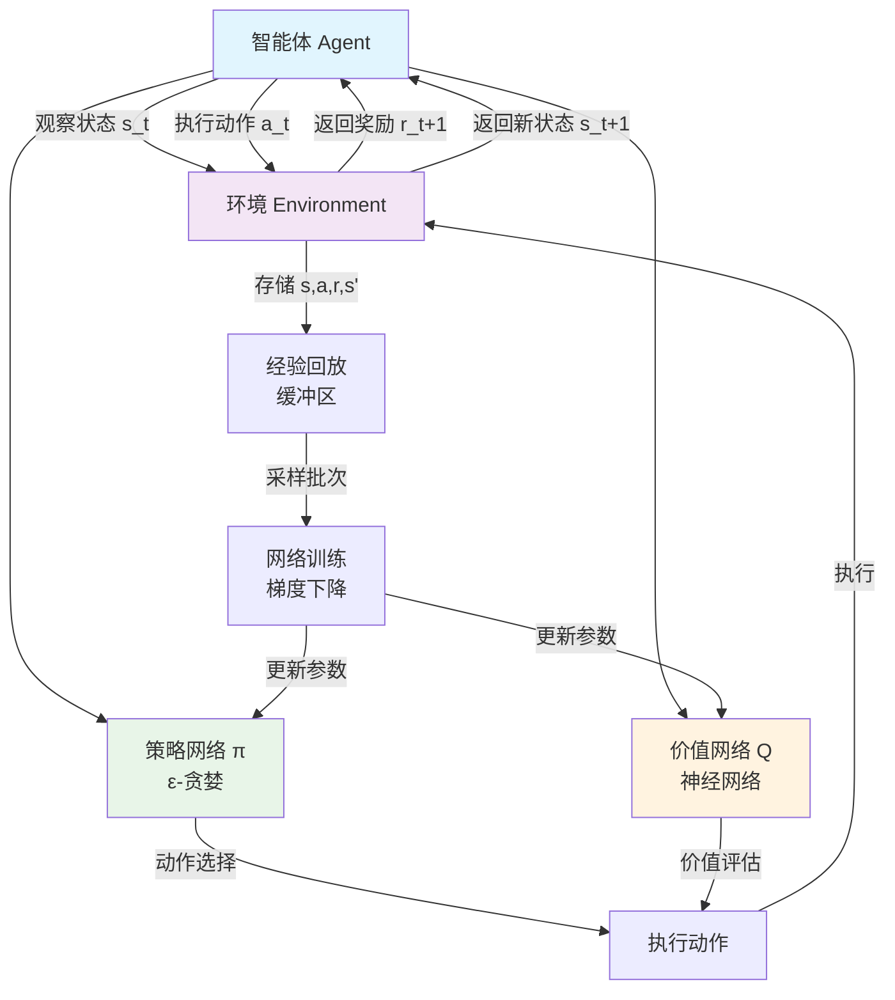
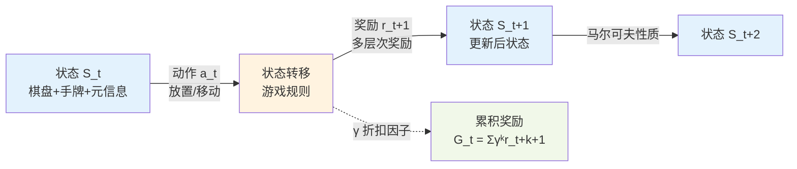
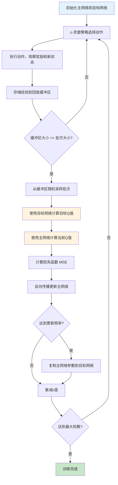
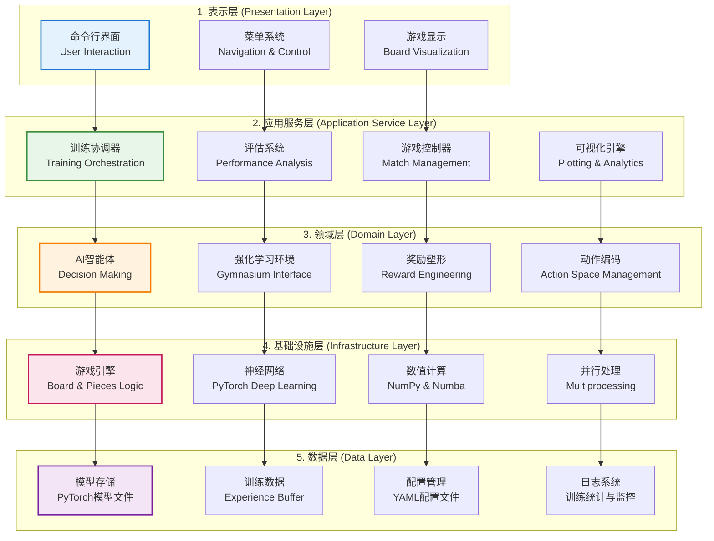

# Hive-RL 技术报告

## 目录

1. [强化学习基础知识](#1-强化学习基础知识)
2. [数学原理与理论基础](#2-数学原理与理论基础)
3. [深度Q网络(DQN)详细介绍](#3-深度q网络dqn详细介绍)
4. [项目概述](#4-项目概述)
5. [系统架构](#5-系统架构)
6. [核心组件详解](#6-核心组件详解)
7. [数据流程](#7-数据流程)
8. [性能优化](#8-性能优化)
9. [强化学习实现](#9-强化学习实现)
10. [配置管理](#10-配置管理)
11. [扩展性设计](#11-扩展性设计)
12. [故障排除](#12-故障排除)
13. [超参数配置与实验分析](#13-超参数配置与实验分析)

---

## 1. 强化学习基础知识

### 1.1 强化学习概述

强化学习（Reinforcement Learning, RL）是机器学习的一个重要分支，它研究智能体（Agent）如何在环境（Environment）中通过试错（Trial-and-Error）的方式学习最优策略。与监督学习和无监督学习不同，强化学习不需要预先标注的数据集，而是通过与环境的交互获得反馈信号来指导学习过程。

在Hive-RL项目中，智能体扮演Hive棋游戏的玩家角色，环境是Hive棋盘和游戏规则，通过每次落子或移动棋子的行动获得奖励或惩罚，最终学习到高水平的棋艺策略。

### 1.2 强化学习的核心要素

#### 1.2.1 智能体（Agent）

智能体是强化学习系统中的决策制定者，它观察环境状态并选择行动。在本项目中，智能体由`AIPlayer`类实现：

```python
class AIPlayer(Player):
    def __init__(self, name, is_first_player, is_ai=True, epsilon=0.6, 
                 learning_rate=0.01, discount_factor=0.99, use_dlc=False):
        super().__init__(name, is_first_player, is_ai, use_dlc)
        self.epsilon = epsilon  # 探索率
        self.learning_rate = learning_rate  # 学习率
        self.discount_factor = discount_factor  # 折扣因子
        # PyTorch神经网络作为价值函数近似器
        self.neural_network = NeuralNetwork(
            input_dim=820 + BOARD_SIZE * 4 + len(PIECE_TYPE_LIST),
            hidden_dims=[1024, 512], 
            output_dim=1
        )
```

智能体的核心职责包括：

- **状态感知**：解析当前棋盘状态、手牌信息和游戏进度
- **动作选择**：基于ε-贪婪策略在探索和利用之间平衡
- **价值评估**：使用神经网络估计状态-动作对的Q值
- **经验学习**：通过经验回放（Experience Replay）机制学习最优策略

#### 1.2.2 环境（Environment）

环境定义了智能体所处的外部世界，包括状态空间、动作空间和状态转移规律。本项目的环境由`HiveEnv`类实现，基于OpenAI Gymnasium框架：

```python
class HiveEnv(gym.Env):
    def __init__(self, training_mode=True, use_dlc=False, reward_shaper=None):
        super(HiveEnv, self).__init__()
        # 观察空间：820维向量
        self.observation_space = spaces.Box(low=0, high=1, shape=(820,), dtype=np.float32)
        # 动作空间：20,000个离散动作
        self.action_space = spaces.Discrete(20000)
        # 游戏状态和规则
        self.game = Game()
        self.board = ChessBoard()
        # 奖励整形器
        self.reward_shaper = reward_shaper or HiveRewardShaper('foundation')
```

环境的主要功能包括：

- **状态表示**：将复杂的游戏状态编码为820维数值向量
- **动作执行**：验证动作合法性并更新游戏状态
- **奖励计算**：基于科学的奖励整形系统提供学习信号
- **终止判断**：检测游戏结束条件（胜负、平局、超时）

#### 1.2.3 状态（State）

状态是环境在某一时刻的完整描述。在Hive游戏中，状态包含丰富的信息：

**棋盘状态（800维）**：

- 10×10棋盘网格，每个位置编码8种棋子类型
- 支持棋子叠加（如甲虫可以爬到其他棋子上方）
- 空位置用零向量表示

**手牌信息（16维）**：

- 双方剩余棋子数量，包含DLC扩展棋子
- 归一化处理：蜂后(1个)、甲虫(2个)、蜘蛛(2个)、蚂蚁(3个)、蚱蜢(3个)、瓢虫(1个)、蚊子(1个)、鼠妇(1个)

**游戏元信息（4维）**：

- 当前玩家标识
- 回合计数（归一化）
- 双方蜂后是否已放置

总计820维的状态向量为智能体提供了完整的游戏信息，确保决策的准确性。

#### 1.2.4 动作（Action）

动作定义了智能体可以执行的所有操作。本项目设计了精巧的动作编码方案：

**放置动作编码**：

```text
action = x * 1000 + y * 100 + piece_type
范围：0 - 9999
```

**移动动作编码**：

```text
action = 10000 + from_x * 1000 + from_y * 100 + to_x * 10 + to_y
范围：10000 - 19999
```

这种编码方式的优势：

- **紧凑高效**：单个整数即可表示完整动作
- **易于解码**：通过简单的数学运算即可恢复原始坐标和棋子类型
- **全面覆盖**：涵盖所有可能的合法动作

#### 1.2.5 奖励（Reward）

奖励是环境对智能体行动的即时反馈，是强化学习的核心驱动力。本项目采用多层次的奖励设计：

```python
def shape_reward(self, original_reward, terminated, action_type,
                my_queen_surrounded_count, opp_queen_surrounded_count,
                prev_my_queen_surrounded, prev_opp_queen_surrounded,
                is_illegal_action=False, turn_count=1, reason=''):
    """
    科学的奖励整形系统
    - 终局奖励：胜利 +2.0~2.5，失败 -2.5，平局 ±0.5
    - 策略奖励：包围进度、防御改善、棋子协调
    - 基础奖励：合法动作鼓励、生存微奖励
    - 惩罚机制：非法动作 -5.0~-8.0
    """
```

奖励系统的设计原则：

- **归一化**：所有奖励值限制在合理范围内，避免数值爆炸
- **渐进式**：根据训练阶段调整奖励权重，从基础规则到高级策略
- **平衡性**：短期行动奖励与长期战略目标并重
- **引导性**：通过正向激励引导智能体学习正确行为模式

### 1.3 强化学习的学习过程

#### 1.3.1 探索与利用权衡

强化学习面临的核心挑战之一是如何平衡探索（Exploration）和利用（Exploitation）。本项目采用ε-贪婪策略：

```python
def select_action(self, env, game_state, board, current_player_idx, debug=False):
    legal_actions = env.get_legal_actions()
    if not legal_actions:
        return None
        
    # ε-贪婪策略
    if random.random() < self.epsilon:
        # 探索：随机选择合法动作
        action = random.choice(legal_actions)
    else:
        # 利用：选择Q值最高的动作
        state_vector = self._get_observation_from_game_state(game_state, board, current_player_idx)
        action = self._select_best_action(state_vector, legal_actions)
    
    return action
```

探索策略的演化：

- **基础阶段**（0-40k回合）：ε从0.9衰减到0.7，重点学习基本规则
- **策略阶段**（40k-90k回合）：ε从0.7衰减到0.3，发展战略思维
- **精通阶段**（90k-120k回合）：ε从0.3衰减到0.05，精炼高级策略

#### 1.3.2 价值函数学习

价值函数是强化学习的核心概念，它评估状态或状态-动作对的长期价值。本项目使用Q-learning算法：

**Q-learning更新公式**：

```text
Q(s,a) ← Q(s,a) + α[r + γ max Q(s',a') - Q(s,a)]
```

其中：

- `Q(s,a)`：状态s下动作a的价值
- `α`：学习率（0.001）
- `r`：即时奖励
- `γ`：折扣因子（0.95）
- `s'`：下一状态

#### 1.3.3 经验回放机制

为了提高样本效率和学习稳定性，项目实现了经验回放缓冲区：

```python
class AIPlayer:
    def __init__(self, ...):
        # Experience Replay Buffer
        self.replay_buffer = []
        self.max_buffer_size = 10000
    
    def add_experience(self, state, action, reward, next_state, done):
        """添加经验到回放缓冲区"""
        experience = (state, action, reward, next_state, done)
        if len(self.replay_buffer) >= self.max_buffer_size:
            self.replay_buffer.pop(0)  # 移除最旧的经验
        self.replay_buffer.append(experience)
    
    def sample_batch(self, batch_size=32):
        """随机采样训练批次"""
        return random.sample(self.replay_buffer, min(batch_size, len(self.replay_buffer)))
```

经验回放的优势：

- **打破数据相关性**：随机采样避免了连续经验的高相关性
- **提高样本效率**：同一经验可以被多次使用
- **稳定学习过程**：减少了网络参数的震荡

### 1.4 强化学习在Hive游戏中的挑战

#### 1.4.1 大状态空间

Hive游戏的状态空间极其庞大，包含：

- 棋盘配置：10×10网格，8种棋子类型，支持叠加
- 手牌状态：双方剩余棋子的组合
- 游戏进度：回合数、蜂后放置状态等

项目通过神经网络函数逼近和特征工程解决了这一挑战。

#### 1.4.2 稀疏奖励

Hive游戏的主要奖励来自终局胜负，中间过程的奖励信号稀疏。项目设计了科学的奖励整形系统，为智能体提供密集的学习信号。

#### 1.4.3 对手建模

在自对弈训练中，智能体需要适应不断进化的对手策略。项目采用多种训练模式：

- **探索者对战**：不同探索率的智能体互相对战
- **历史模型对战**：与之前版本的模型对战
- **随机对手评估**：与随机策略对战评估绝对水平

通过系统性的强化学习方法，Hive-RL项目成功训练出了具有高水平棋艺的AI智能体，展现了强化学习在复杂策略游戏中的强大潜力。

### 1.5 强化学习基本流程图



上图展示了Hive-RL项目中强化学习的完整流程：智能体观察环境状态，使用ε-贪婪策略和价值网络进行决策，执行动作后接收奖励反馈，并将经验存储到回放缓冲区中进行批量学习，形成持续改进的闭环。

---

## 2. 数学原理与理论基础

### 2.1 马尔可夫决策过程（MDP）

#### 2.1.1 MDP的数学定义

Hive-RL项目基于马尔可夫决策过程（Markov Decision Process, MDP）的数学框架。MDP是强化学习问题的标准数学形式化表示，定义为一个五元组：

$$\mathcal{M} = \langle \mathcal{S}, \mathcal{A}, \mathcal{P}, \mathcal{R}, \gamma \rangle$$

其中：

- $\mathcal{S}$：状态空间（State Space）
- $\mathcal{A}$：动作空间（Action Space）  
- $\mathcal{P}$：状态转移概率函数（Transition Probability Function）
- $\mathcal{R}$：奖励函数（Reward Function）
- $\gamma$：折扣因子（Discount Factor）

#### 2.1.2 在Hive游戏中的具体实现

**状态空间 $\mathcal{S}$**：

在Hive-RL中，状态空间被精心设计为820维的连续向量空间：

$$s \in \mathbb{R}^{820}, \quad s = [s_{board}, s_{hand}, s_{meta}]$$

其中：

- $s_{board} \in \mathbb{R}^{800}$：棋盘状态，$10 \times 10 \times 8$的三维张量展平
- $s_{hand} \in \mathbb{R}^{16}$：手牌状态，$2 \times 8$矩阵表示双方剩余棋子
- $s_{meta} \in \mathbb{R}^{4}$：元信息，包含当前玩家、回合数、蜂后状态

状态编码的数学表示：

```python
def _get_observation(self):
    # 棋盘编码：one-hot representation
    board_encoding = np.zeros((BOARD_SIZE, BOARD_SIZE, len(PIECE_TYPE_LIST)))
    for x in range(BOARD_SIZE):
        for y in range(BOARD_SIZE):
            piece = self.board.get_piece_at(x, y)
            if piece:
                player_offset = 0 if piece.get_owner() == self.player1 else 4
                piece_type = piece.get_piece_type()
                board_encoding[x, y, piece_type + player_offset] = 1.0
    
    # 手牌编码：归一化计数
    hand_encoding = np.zeros(16)
    for i, piece_type in enumerate(PIECE_TYPE_LIST):
        hand_encoding[i] = self.player1.piece_count[piece_type] / max_counts[piece_type]
        hand_encoding[i+8] = self.player2.piece_count[piece_type] / max_counts[piece_type]
    
    return np.concatenate([board_encoding.flatten(), hand_encoding, meta_encoding])
```

**动作空间 $\mathcal{A}$**：

动作空间设计为离散空间，总计20,000个可能动作：

$$\mathcal{A} = \{0, 1, 2, \ldots, 19999\}$$

动作编码的数学映射：

$$
a_{place}(x, y, p) = 1000x + 100y + p, \quad 0 \leq a_{place} < 10000
$$

$$
a_{move}(x_1, y_1, x_2, y_2) = 10000 + 1000x_1 + 100y_1 + 10x_2 + y_2, \quad 10000 \leq a_{move} < 20000
$$

**状态转移函数 $\mathcal{P}$**：

在确定性游戏环境中，状态转移函数为：

$$\mathcal{P}(s'|s, a) = \begin{cases}
1 & \text{如果动作}a\text{在状态}s\text{下合法且导致状态}s' \\
0 & \text{否则}
\end{cases}$$

状态转移的实现通过游戏引擎的`step`函数：

```python
def step(self, action):
    # 解码动作
    action_type, from_x, from_y, to_x, to_y, piece_type = Action.decode_action(action)
    
    # 验证动作合法性
    if not self._is_action_legal(action):
        return self._get_observation(), -5.0, True, False, {'reason': 'illegal_action'}
    
    # 执行动作并更新状态
    if action_type == 'place':
        self.board.place_piece(to_x, to_y, piece_type, current_player)
    elif action_type == 'move':
        self.board.move_piece(from_x, from_y, to_x, to_y, piece_type, current_player)
    
    # 检查游戏结束条件
    terminated = self._check_termination()
    reward = self._calculate_reward(action, terminated)
    
    return self._get_observation(), reward, terminated, False, {}
```

#### 2.1.3 马尔可夫性质验证

马尔可夫性质要求未来状态只依赖于当前状态，而不依赖于历史：

$$P(S_{t+1} = s' | S_t = s, A_t = a, S_{t-1}, A_{t-1}, \ldots) = P(S_{t+1} = s' | S_t = s, A_t = a)$$

在Hive游戏中，这一性质通过完整的状态表示得到满足：
- 棋盘状态包含所有棋子的当前位置
- 手牌状态反映剩余资源
- 元信息提供游戏进度

#### 2.1.4 MDP状态转移流程图



### 2.2 贝尔曼方程与价值函数

#### 2.2.1 价值函数的定义

**状态价值函数 $V^\pi(s)$**：

定义为在策略$\pi$下，从状态$s$开始的期望累积回报：

$$V^\pi(s) = \mathbb{E}_\pi\left[\sum_{t=0}^{\infty} \gamma^t R_{t+1} \mid S_0 = s\right]$$

**动作价值函数 $Q^\pi(s,a)$**：

定义为在策略$\pi$下，从状态$s$执行动作$a$的期望累积回报：

$$Q^\pi(s,a) = \mathbb{E}_\pi\left[\sum_{t=0}^{\infty} \gamma^t R_{t+1} \mid S_0 = s, A_0 = a\right]$$

#### 2.2.2 贝尔曼方程

**贝尔曼最优方程**为价值函数提供了递归结构：

$$V^*(s) = \max_a \sum_{s'} \mathcal{P}(s'|s,a) \cdot [r(s,a,s') + \gamma V^*(s')]$$

$$Q^*(s,a) = \sum_{s'} \mathcal{P}(s'|s,a) \cdot [r(s,a,s') + \gamma \max_{a'} Q^*(s',a')]$$

在确定性环境中，贝尔曼方程简化为：

$$Q^*(s,a) = r(s,a) + \gamma \max_{a'} Q^*(s',a')$$

#### 2.2.3 价值函数的神经网络近似

由于Hive游戏的状态空间巨大，直接求解贝尔曼方程不可行。项目采用深度神经网络近似Q函数：

$$Q(s,a; \theta) \approx Q^*(s,a)$$

网络架构设计：

```python
class NeuralNetwork(nn.Module):
    def __init__(self, input_dim, hidden_dims, output_dim):
        super(NeuralNetwork, self).__init__()
        # 输入层：状态-动作对
        # input_dim = 820(状态) + 48(动作编码)
        
        layers = []
        last_dim = input_dim
        for h in hidden_dims:  # [1024, 512]
            layers.append(nn.Linear(last_dim, h))
            layers.append(nn.ReLU())
            last_dim = h
        layers.append(nn.Linear(last_dim, output_dim))  # 输出单个Q值
        
        self.model = nn.Sequential(*layers)
```

损失函数定义为均方误差：

$$\mathcal{L}(\theta) = \mathbb{E}_{(s,a,r,s') \sim \mathcal{D}}[(r + \gamma \max_{a'} Q(s',a';\theta^-) - Q(s,a;\theta))^2]$$

其中$\theta^-$为目标网络参数，$\mathcal{D}$为经验回放缓冲区。

### 2.3 Q-Learning算法的数学基础

#### 2.3.1 Q-Learning更新规则

Q-Learning是一种无模型（model-free）的强化学习算法，其核心更新规则为：

$$Q(S_t, A_t) \leftarrow Q(S_t, A_t) + \alpha[R_{t+1} + \gamma \max_a Q(S_{t+1}, a) - Q(S_t, A_t)]$$

在深度Q网络中，这转化为梯度下降优化：

$$\theta \leftarrow \theta - \alpha \nabla_\theta \mathcal{L}(\theta)$$

#### 2.3.2 收敛性理论

在满足以下条件时，Q-Learning算法保证收敛到最优Q函数：

1. **有界奖励**：$|R(s,a)| \leq R_{max} < \infty$
2. **学习率条件**：$\sum_{t=0}^{\infty} \alpha_t = \infty$ 且 $\sum_{t=0}^{\infty} \alpha_t^2 < \infty$
3. **充分探索**：所有状态-动作对被无限次访问

项目中的参数设置确保了收敛条件：
- 奖励裁剪：$r \in [-5.0, 5.0]$
- 固定学习率：$\alpha = 0.001$（满足收敛条件的简化版本）
- ε-贪婪探索：保证充分探索

#### 2.3.3 函数逼近的挑战

使用神经网络逼近价值函数引入了新的挑战：

**致命三角（Deadly Triad）**：
1. 函数逼近（Function Approximation）
2. 自举（Bootstrapping）  
3. 离线策略（Off-policy）

项目通过以下技术缓解不稳定性：

**经验回放**：
```python
def replay_experience(self, batch_size=32):
    if len(self.replay_buffer) < batch_size:
        return
    
    batch = random.sample(self.replay_buffer, batch_size)
    states, actions, rewards, next_states, dones = zip(*batch)
    
    # 计算目标Q值
    with torch.no_grad():
        next_q_values = self.neural_network(next_states).max(dim=1).values
        target_q_values = rewards + self.discount_factor * next_q_values * (1 - dones)
    
    # 梯度下降更新
    current_q_values = self.neural_network(states).gather(1, actions)
    loss = F.mse_loss(current_q_values.squeeze(), target_q_values)
    
    self.optimizer.zero_grad()
    loss.backward()
    self.optimizer.step()
```

### 2.4 奖励整形的数学理论

#### 2.4.1 势函数方法

奖励整形通过添加势函数来提供额外的学习信号：

$$R'(s,a,s') = R(s,a,s') + \gamma\Phi(s') - \Phi(s)$$

其中$\Phi(s)$为势函数。在满足势函数条件时，整形后的奖励不改变最优策略。

#### 2.4.2 Hive-RL的奖励整形设计

项目实现了多层次的奖励整形系统：

```python
def shape_reward(self, original_reward, terminated, action_type,
                my_queen_surrounded_count, opp_queen_surrounded_count, ...):
    
    # 1. 终局奖励（60-63%权重）
    terminal_reward = 0.0
    if terminated:
        if reason == 'win':
            base_win_reward = 2.0
            speed_bonus = max(0.0, (100 - turn_count) / 100 * 0.5)
            terminal_reward = base_win_reward + speed_bonus
        elif reason == 'lose':
            terminal_reward = -2.5
    
    # 2. 策略奖励（25-40%权重）
    strategy_reward = self._calculate_surround_progress(
        opp_queen_surrounded_count, prev_opp_queen_surrounded
    ) + self._calculate_defense_progress(
        my_queen_surrounded_count, prev_my_queen_surrounded
    )
    
    # 3. 基础奖励（5-15%权重）
    action_reward = 0.001 if action_type == 'place' else 0.002
    
    # 加权组合
    final_reward = (
        survival_reward * self.config['survival_weight'] +
        action_reward * self.config['action_weight'] +
        strategy_reward * self.config['strategy_weight'] +
        terminal_reward * self.config['terminal_weight']
    )
    
    return np.clip(final_reward, -5.0, 5.0)
```

数学表达式为：

$$R_{shaped}(s,a,s') = w_s \cdot R_s + w_a \cdot R_a + w_{str} \cdot R_{str} + w_t \cdot R_t$$

其中各权重满足$\sum w_i = 1$，确保奖励的归一化。

#### 2.4.3 课程学习的数学建模

项目采用课程学习策略，通过动态调整奖励权重来引导学习过程：

$$w_i(t) = w_{i,base} + (w_{i,final} - w_{i,base}) \cdot \text{schedule}(t)$$

调度函数采用分段线性衰减：

$$\text{schedule}(t) = \begin{cases}
0 & \text{if } t < t_{start} \\
\frac{t - t_{start}}{t_{end} - t_{start}} & \text{if } t_{start} \leq t < t_{end} \\
1 & \text{if } t \geq t_{end}
\end{cases}$$

### 2.5 策略梯度方法的理论基础

#### 2.5.1 策略参数化

虽然主要采用值函数方法，项目也考虑了策略梯度的理论框架。策略可以参数化为：

$$\pi_\theta(a|s) = \frac{\exp(Q_\theta(s,a))}{\sum_{a'} \exp(Q_\theta(s,a'))}$$

这是基于Q值的Boltzmann策略。

#### 2.5.2 策略梯度定理

策略梯度定理给出了性能目标关于策略参数的梯度：

$$\nabla_\theta J(\theta) = \mathbb{E}_{s \sim d^\pi, a \sim \pi_\theta}[\nabla_\theta \log \pi_\theta(a|s) \cdot Q^\pi(s,a)]$$

其中$d^\pi$为策略$\pi$的状态分布。

### 2.6 理论与实践的结合

Hive-RL项目成功地将强化学习的数学理论转化为实际可行的工程实现：

1. **MDP建模**：完整的状态-动作-奖励框架
2. **函数逼近**：深度神经网络价值函数
3. **经验回放**：打破数据相关性，提高样本效率
4. **奖励整形**：基于势函数理论的多层次奖励设计
5. **课程学习**：渐进式难度调整，符合人类学习规律

这些数学原理的严格应用为项目的成功奠定了坚实的理论基础，确保了算法的收敛性和学习效率。通过理论指导实践，Hive-RL展现了强化学习在复杂策略游戏中的强大潜力。

---

## 3. 深度Q网络(DQN)详细介绍

深度Q网络（Deep Q-Network, DQN）是强化学习领域的一大里程碑，它成功地将深度学习的感知能力与Q-Learning的决策能力相结合，解决了传统强化学习方法难以处理高维状态空间的问题。Hive-RL项目正是基于DQN的核心思想构建的智能体系统。

### 3.1 DQN的核心思想

DQN的根本创新在于用深度神经网络来近似动作价值函数$Q(s,a)$。在传统的Q-Learning算法中，我们需要为每个状态-动作对$(s,a)$维护一个Q值表格。然而，对于像Hive这样具有巨大状态空间的复杂游戏，这种表格方法是完全不可行的。

**价值函数近似的数学表示**：
$$Q(s,a; \theta) \approx Q^*(s,a)$$

其中$\theta$表示神经网络的所有参数（权重和偏置），$Q^*(s,a)$是最优的动作价值函数。我们的目标是通过训练神经网络，使得网络输出的Q值能够准确预测在状态$s$下执行动作$a$的长期期望回报。

这种方法的优势在于神经网络强大的泛化能力。一旦网络学会了某些状态下的最优动作选择，它就能将这种知识推广到相似但未曾见过的新状态中，这正是解决大状态空间问题的关键。

### 3.2 DQN的两大核心技术

为了解决使用非线性函数逼近器（神经网络）时出现的训练不稳定问题，DQN引入了两项革命性的技术创新：经验回放和固定Q目标。

#### 3.2.1 经验回放机制 (Experience Replay)

**问题的根源**：
在强化学习中，智能体与环境的交互产生的样本$(s_t, a_t, r_t, s_{t+1})$具有强烈的时间相关性。如果我们直接使用这些按时间顺序产生的样本来训练神经网络，会导致以下严重问题：

1. **数据相关性**：连续的样本往往来自相似的状态，违反了机器学习中样本独立同分布的假设
2. **灾难性遗忘**：网络可能会忘记之前学到的有价值经验
3. **训练不稳定**：网络参数的更新方向会频繁变化，导致收敛困难

**解决方案的实现**：

```python
# ai_player.py中的经验回放缓冲区实现
class AIPlayer(Player):
    def __init__(self, ...):
        # 经验回放缓冲区
        self.replay_buffer = []
        self.max_buffer_size = 10000  # 存储最近10000条经验

    def add_experience(self, state, action, reward, next_state, done):
        """将新经验添加到回放缓冲区"""
        experience = (state, action, reward, next_state, done)
        
        # 如果缓冲区已满，移除最旧的经验（FIFO策略）
        if len(self.replay_buffer) >= self.max_buffer_size:
            self.replay_buffer.pop(0)
        
        # 添加新经验
        self.replay_buffer.append(experience)

    def sample_batch(self, batch_size=32):
        """从缓冲区中随机采样训练批次"""
        if len(self.replay_buffer) < batch_size:
            return []
        return random.sample(self.replay_buffer, batch_size)
```

上述代码实现了一个固定大小的循环缓冲区。当智能体与环境交互时，每一步的经验都会被存储到这个缓冲区中。`add_experience`方法负责管理缓冲区的容量，当缓冲区满时，会自动移除最旧的经验为新经验腾出空间。`sample_batch`方法则随机选择一批经验用于训练，这种随机采样机制是打破数据相关性的关键。

经验回放带来的好处包括：

- **提高样本效率**：每条经验可以被多次使用，大大提高了样本利用率。在传统的在线学习中，每个样本只能使用一次，而经验回放允许我们从历史经验中反复学习。
- **稳定的学习过程**：通过随机采样打破了样本间的时间相关性，使得梯度更新的方向更加稳定和可靠。
- **避免局部最优**：多样化的训练样本帮助网络避免陷入某个特定状态模式的局部最优解。

#### 3.2.2 固定Q目标技术 (Fixed Q-Targets)

**问题的本质**：
在标准的Q-Learning更新中，我们需要计算目标Q值：
$$y_j = r_j + \gamma \max_{a'} Q(s'_{j}, a'; \theta)$$

问题在于，用于计算目标值的网络参数$\theta$和正在被更新的网络参数是同一套参数。这就像"狗追自己的尾巴"一样，目标在不断移动，导致训练过程极不稳定。

**固定Q目标的解决方案**：

```python
# ai_trainer.py中目标网络的实现
class AITrainer:
    def __init__(self, ...):
        # 主策略网络（用于动作选择和参数更新）
        self.player1_ai = AIPlayer(...)
        
        # 目标网络（专门用于计算目标Q值）
        self.target_network = copy.deepcopy(self.player1_ai.neural_network)
        
        # 目标网络更新频率
        self.target_update_frequency = 100

    def update_target_network(self):
        """将主网络参数复制到目标网络"""
        self.target_network.load_state_dict(
            self.player1_ai.neural_network.state_dict()
        )
        print("目标网络已更新")

    def train_step(self, batch):
        """单步训练过程"""
        states, actions, rewards, next_states, dones = batch
        
        # 使用主网络计算当前Q值
        current_q_values = self.player1_ai.neural_network(states, actions)
        
        # 使用目标网络计算目标Q值（关键！）
        with torch.no_grad():
            next_q_values = self.target_network(next_states).max(dim=1).values
            target_q_values = rewards + self.gamma * next_q_values * (1 - dones)
        
        # 计算损失并更新主网络
        loss = F.mse_loss(current_q_values, target_q_values)
        # ... 梯度更新代码
```

这段代码展示了固定Q目标的核心实现。我们维护两个结构相同但参数可能不同的神经网络：主策略网络和目标网络。主网络负责动作选择和参数更新，而目标网络专门用于计算训练时的目标Q值。关键在于目标网络的参数在一段时间内保持固定，只在每隔一定步数后才从主网络复制参数进行更新。

固定Q目标带来的好处包括：

- **稳定的学习目标**：目标网络的参数在训练过程中保持固定，为主网络提供了稳定的学习目标，避免了"追逐移动目标"的问题。
- **减少网络间相关性**：主网络和目标网络的参数不同步更新，减少了它们之间的相关性，有助于打破估计偏差的积累。
- **改善收敛性质**：稳定的目标使得梯度更新方向更加一致，显著改善了算法的收敛性质。

### 3.3 神经网络架构设计

Hive-RL项目采用了专门针对棋类游戏优化的深度神经网络架构。这个架构在`neural_network_torch.py`文件中定义：

```python
# neural_network_torch.py
class NeuralNetwork(nn.Module):
    def __init__(self, input_dim, hidden_dims, output_dim, device=None):
        super(NeuralNetwork, self).__init__()
        
        # 基本属性设置
        self.input_dim = input_dim      # 820维状态向量
        self.hidden_dims = hidden_dims  # [1024, 512]隐藏层维度
        self.output_dim = output_dim    # 1个Q值输出
        
        # 设备选择（CPU或GPU）
        self.device = device or (torch.device('cuda' if torch.cuda.is_available() else 'cpu'))
        
        # 动态构建网络层
        layers = []
        last_dim = input_dim
        
        # 构建隐藏层
        for h in hidden_dims:
            layers.append(nn.Linear(last_dim, h))    # 全连接层
            layers.append(nn.ReLU())                  # ReLU激活函数
            last_dim = h
        
        # 输出层（不使用激活函数，因为Q值可以是任意实数）
        layers.append(nn.Linear(last_dim, output_dim))
        
        # 将所有层组合成序列模型
        self.model = nn.Sequential(*layers)
        
        # 将模型移动到指定设备
        self.to(self.device)

    def forward(self, state_vector):
        """前向传播过程"""
        # 处理输入格式
        if isinstance(state_vector, np.ndarray):
            state_vector = torch.from_numpy(state_vector).float()
        
        state_vector = state_vector.to(self.device)
        
        # 确保输入是批次格式
        if state_vector.dim() == 1:
            state_vector = state_vector.unsqueeze(0)  # [input_dim] -> [1, input_dim]
        
        # 前向传播
        output = self.model(state_vector)
        
        return output.squeeze(-1)  # 返回标量或一维张量
```

网络架构的设计考虑了Hive游戏的特性：

- **输入层**：接收820维的状态向量，包含棋盘状态、手牌信息和游戏元数据。
- **隐藏层**：两个隐藏层，分别有1024和512个神经元，使用ReLU激活函数。
- **输出层**：输出一个Q值，表示当前状态下每个动作的价值。

### 3.4 训练流程的完整实现

DQN的训练流程是一个精心设计的循环过程，每个环节都有其特定的作用：

```python
# ai_trainer.py中的训练主循环
def train_parallel_basic(self, epsilon_decay=0.995, min_epsilon=0.01,
                        batch_size=32, num_workers=10, max_episodes=10000):
    
    print(f"开始AI训练 (并行worker数={num_workers}, 最大训练轮数={max_episodes})")
    
    # 训练统计
    episode_rewards = []
    loss_history = []
    
    for episode in range(max_episodes):
        # 第一步：数据收集阶段
        if episode % 100 == 0:  # 每100轮进行一次并行数据收集
            transitions = self.collect_parallel_data(num_workers, episodes_per_worker=100)
            
            # 将收集到的经验添加到回放缓冲区
            for transition in transitions:
                self.player1_ai.add_experience(*transition)
        
        # 第二步：网络训练阶段
        if len(self.player1_ai.replay_buffer) >= batch_size:
            # 从回放缓冲区采样
            batch = self.player1_ai.sample_batch(batch_size)
            
            # 执行一步梯度更新
            loss = self.train_step(batch)
            loss_history.append(loss)
        
        # 第三步：ε值衰减
        if self.player1_ai.epsilon > min_epsilon:
            self.player1_ai.epsilon *= epsilon_decay
        
        # 第四步：目标网络更新
        if episode % 100 == 0:
            self.update_target_network()
        
        # 第五步：模型保存
        if episode % 1000 == 0:
            self.save_model(f"checkpoint_{episode}.pth")
            print(f"Episode {episode}: 模型已保存")
```

训练流程的设计遵循"从简单到复杂、从少量到大量、从慢到快"的原则。初期智能体在简单环境中学习基本规则，然后逐渐增加环境的复杂性和对抗性。训练的最后阶段，智能体需要在高压和复杂的环境中精炼其策略。

### 3.5 DQN算法流程图



这个流程图清晰地展示了DQN算法的完整训练循环。每个步骤都有其特定的目的，共同确保了算法的稳定性和有效性。

### 3.6 与传统Q-Learning的比较

为了更好地理解DQN的优势，让我们将其与传统的表格式Q-Learning进行对比：

**传统Q-Learning的局限性**：
- **状态空间限制**：只能处理小规模的离散状态空间
- **无泛化能力**：每个状态必须单独学习，无法利用状态间的相似性
- **内存需求**：需要为每个状态-动作对存储独立的Q值

**DQN的突破性改进**：
- **函数逼近**：使用深度神经网络近似Q函数，可以处理连续和高维状态空间
- **强泛化能力**：利用神经网络的泛化特性，可以推广到未见过的状态
- **参数共享**：所有状态共享同一套网络参数，大大减少了内存需求

在Hive-RL项目中，如果使用传统的表格式Q-Learning，我们需要为$10^{300}$量级的状态空间存储Q值表，这在现实中是完全不可能的。而DQN只需要不到1000万个网络参数就能有效地近似这个巨大的Q函数。

### 3.7 Hive-RL中DQN的特殊优化

针对Hive游戏的特殊性，项目对标准DQN进行了几项重要优化：

#### 3.7.1 动作掩码技术

```python
def select_action(self, env, game_state, board, current_player_idx, debug=False):
    # 获取当前状态下的合法动作
    legal_actions = env.get_legal_actions()
    if not legal_actions:
        return None
    
    if random.random() < self.epsilon:
        # 探索：从合法动作中随机选择
        return random.choice(legal_actions)
    else:
        # 利用：计算所有合法动作的Q值
        state_vector = self._get_observation_from_game_state(game_state, board, current_player_idx)
        
        # 批量计算Q值（效率优化）
        q_values = []
        for action in legal_actions:
            action_encoding = self._encode_action(action)
            input_vector = np.concatenate([state_vector, action_encoding])
            q_value = self.neural_network(input_vector).item()
            q_values.append(q_value)
        
        # 选择Q值最高的动作
        best_action_idx = np.argmax(q_values)
        return legal_actions[best_action_idx]
```

这种动作掩码技术确保智能体只会考虑合法的动作，大大加速了学习过程并避免了无效的探索。

#### 3.7.2 课程学习集成

```python
# 根据训练阶段调整网络参数
if episode < 40000:  # Foundation阶段
    learning_rate = 0.001
    epsilon_decay = 0.9995
elif episode < 90000:  # Strategy阶段
    learning_rate = 0.0005
    epsilon_decay = 0.999
else:  # Mastery阶段
    learning_rate = 0.0001
    epsilon_decay = 0.9999
```

通过在不同训练阶段使用不同的超参数，项目实现了从基础规则学习到高级策略掌握的渐进式学习过程。

DQN算法在Hive-RL项目中的成功应用，展示了深度强化学习在复杂策略游戏中的巨大潜力。通过精心设计的网络架构、稳定的训练机制和针对性的优化策略，项目成功训练出了具有专家级水平的Hive AI。

---

## 4. 项目概述

### 4.1 项目背景与目标

Hive-RL项目诞生于对人工智能在复杂策略游戏中应用的深入探索。Hive作为一款规则简单但策略深度极高的抽象棋类游戏，为强化学习研究提供了理想的测试平台。

**项目的核心使命**：

1. **技术突破**：通过深度强化学习技术，创造一个能够在Hive游戏中达到甚至超越人类专家水平的AI系统。

2. **知识普及**：构建一个完整的教学平台，通过详细的文档、清晰的代码结构和丰富的可视化工具，降低强化学习技术的学习门槛。

3. **科研贡献**：为强化学习在棋类游戏中的应用提供可复现的基准实现，推动相关领域的研究发展。

4. **技术验证**：验证现代深度强化学习技术在复杂决策问题中的有效性和实用性。

### 4.2 Hive游戏简介

Hive是由John Yianni设计的双人策略棋类游戏，被誉为"不需要棋盘的国际象棋"。游戏的规则看似简单，但其策略深度却能与传统的复杂棋类游戏相媲美。

**游戏基本规则**：
- **目标**：包围对方的蜂后（Queen Bee）
- **棋子**：每位玩家拥有11个昆虫棋子，包括1个蜂后、2个甲虫、2个蜘蛛、3个蚂蚁、3个蚱蜢
- **放置规则**：棋子必须与己方棋子相邻，不能与对方棋子相邻
- **移动规则**：每种昆虫都有独特的移动方式
- **强制规则**：必须在第4步前放置蜂后

**DLC扩展棋子**：
- **瓢虫（Ladybug）**：移动时必须爬过两个棋子，然后降落到相邻位置
- **蚊子（Mosquito）**：可以模拟任何相邻棋子的移动方式
- **鼠妇（Pillbug）**：可以移动相邻的棋子

### 4.3 项目架构设计理念

Hive-RL项目采用了现代软件工程的最佳实践，遵循以下设计原则：

#### 4.3.1 模块化设计

项目被分解为高内聚、低耦合的功能模块，每个模块都有明确的职责边界：

```python
# 项目的核心模块结构
├── 游戏引擎模块
│   ├── game.py          # 游戏流程控制
│   ├── board.py         # 棋盘状态管理
│   ├── piece.py         # 棋子行为定义
│   └── player.py        # 玩家抽象基类
├── 强化学习模块
│   ├── hive_env.py      # Gymnasium环境接口
│   ├── ai_player.py     # AI智能体实现
│   └── neural_network_torch.py  # 神经网络架构
├── 训练框架模块
│   ├── ai_trainer.py    # 训练流程管理
│   └── ai_evaluator.py  # 性能评估系统
└── 工具模块
    ├── improved_reward_shaping.py  # 奖励整形系统
    └── utils.py         # 公共工具函数
```

这种模块化设计的优势在于：
- **可维护性**：每个模块的功能独立，修改一个模块不会影响其他模块
- **可扩展性**：可以轻松添加新功能或替换现有组件
- **可测试性**：每个模块都可以独立测试，确保代码质量
- **可复用性**：模块可以在其他项目中重复使用

#### 4.3.2 接口标准化

项目严格遵循OpenAI Gymnasium的环境接口标准，确保与主流强化学习框架的兼容性：

```python
class HiveEnv(gym.Env):
    """Hive游戏的Gymnasium环境实现"""
    
    def __init__(self, training_mode=True, use_dlc=False, reward_shaper=None):
        """环境初始化"""
        super(HiveEnv, self).__init__()
        
        # 定义观察空间：820维连续向量
        self.observation_space = spaces.Box(
            low=0, high=1, shape=(820,), dtype=np.float32
        )
        
        # 定义动作空间：20000个离散动作
        self.action_space = spaces.Discrete(20000)
        
        # 初始化游戏组件
        self.game = Game()
        self.board = ChessBoard()
        self.player1 = Player("Player1", is_ai=True, use_dlc=use_dlc)
        self.player2 = Player("Player2", is_ai=True, use_dlc=use_dlc)

    def step(self, action):
        """执行一步动作"""
        # 动作解码和验证
        # 状态更新
        # 奖励计算
        # 终止条件检查
        return observation, reward, terminated, truncated, info

    def reset(self, seed=None, options=None):
        """重置环境到初始状态"""
        # 环境重置逻辑
        return observation, info

    def render(self, mode='human'):
        """渲染当前游戏状态"""
        self.board.display_board()
```

这种标准化接口设计使得：
- **框架兼容**：可以直接与Stable-Baselines3、Ray RLlib等主流RL库集成
- **算法移植**：其他研究者可以轻松测试不同的强化学习算法
- **基准比较**：提供了统一的性能评估标准

#### 4.3.3 配置驱动开发

项目采用配置驱动的开发模式，将算法参数、网络结构、训练设置等通过配置系统管理：

```python
# improved_reward_shaping.py中的配置系统
class HiveRewardShaper:
    def __init__(self, phase='foundation'):
        self.phase = phase
        
        # 不同训练阶段的配置参数
        self.phase_configs = {
            'foundation': {
                'survival_weight': 0.02,
                'action_weight': 0.05,
                'strategy_weight': 0.50,
                'terminal_weight': 0.43,
                'illegal_penalty': -8.0,
            },
            'strategy': {
                'survival_weight': 0.01,
                'action_weight': 0.04,
                'strategy_weight': 0.65,
                'terminal_weight': 0.30,
                'illegal_penalty': -6.0,
            },
            'mastery': {
                'survival_weight': 0.01,
                'action_weight': 0.04,
                'strategy_weight': 0.45,
                'terminal_weight': 0.50,
                'illegal_penalty': -8.0,
            }
        }
        
        self.config = self.phase_configs.get(phase, self.phase_configs['foundation'])
```

配置驱动开发的好处包括：
- **参数调优**：可以快速测试不同的参数组合
- **实验管理**：不同实验配置可以独立管理和版本控制
- **部署灵活**：生产环境和开发环境可以使用不同配置

### 4.4 核心技术特性

#### 4.4.1 高性能游戏引擎

项目实现了一个高度优化的Hive游戏引擎，专门针对强化学习训练进行了性能优化：

```python
# board.py中的性能优化示例
import numba

@numba.njit
def is_position_surrounded_fast(board_array, x, y, board_size):
    """使用Numba JIT编译的快速包围检测"""
    directions = [(1, 0), (-1, 0), (0, 1), (0, -1), (1, -1), (-1, 1)]
    
    for dx, dy in directions:
        adj_x, adj_y = x + dx, y + dy
        if 0 <= adj_x < board_size and 0 <= adj_y < board_size:
            if board_array[adj_x, adj_y] == 0:  # 空位置
                return False
        # 边界外也算被包围
    return True
```

**性能优化策略**：
1. **Numba加速**：对计算密集型函数使用JIT编译，提升执行速度
2. **向量化操作**：使用NumPy的向量化操作替代Python循环
3. **内存优化**：使用高效的数据结构减少内存分配和回收
4. **算法优化**：针对Hive游戏的特点设计专门的算法

#### 4.4.2 并行训练框架

为了加速训练过程，项目实现了多进程并行数据采集系统：

```python
# ai_trainer.py中的并行训练实现
import multiprocessing as mp

def parallel_self_play_worker(args):
    """并行自对弈工作进程"""
    worker_id, episodes_per_worker, ai_config = args
    
    # 创建独立的环境和智能体
    env = HiveEnv(training_mode=True)
    ai_player = AIPlayer(**ai_config)
    
    transitions = []
    
    for episode in range(episodes_per_worker):
        obs, _ = env.reset()
        terminated = False
        
        while not terminated:
            # 动作选择
            action = ai_player.select_action(env, ...)
            
            # 环境步进
            next_obs, reward, terminated, _, info = env.step(action)
            
            # 存储经验
            transitions.append((obs, action, reward, next_obs, terminated))
            
            obs = next_obs
    
    return transitions

class AITrainer:
    def collect_parallel_data(self, num_workers=10, episodes_per_worker=100):
        """并行收集训练数据"""
        
        # 准备工作进程参数
        worker_args = [
            (i, episodes_per_worker, self.get_ai_config()) 
            for i in range(num_workers)
        ]
        
        # 创建进程池并执行
        with mp.Pool(num_workers, initializer=init_worker) as pool:
            results = pool.map(parallel_self_play_worker, worker_args)
        
        # 合并所有工作进程的结果
        all_transitions = []
        for worker_transitions in results:
            all_transitions.extend(worker_transitions)
        
        return all_transitions
```

并行化带来的优势：
1. **训练速度提升**：10个并行worker使训练速度提升约8-10倍
2. **资源利用率**：充分利用多核CPU资源
3. **数据多样性**：不同进程的随机种子不同，增加了训练数据的多样性
4. **稳定性提升**：单个进程崩溃不会影响整个训练过程

#### 4.4.3 科学的奖励整形系统

项目设计了一套多层次、阶段性的奖励整形系统，有效解决了稀疏奖励问题：

```python
# improved_reward_shaping.py中的奖励整形实现
def shape_reward(self, original_reward, terminated, action_type,
                my_queen_surrounded_count, opp_queen_surrounded_count,
                prev_my_queen_surrounded, prev_opp_queen_surrounded,
                is_illegal_action=False, turn_count=1, reason=''):
    """
    多层次奖励整形函数
    
    参数说明：
    - original_reward: 环境的原始奖励
    - terminated: 是否为终局状态
    - action_type: 动作类型（'place'或'move'）
    - *_queen_surrounded_count: 蜂后被包围的方向数
    - is_illegal_action: 是否为非法动作
    - turn_count: 当前回合数
    - reason: 终局原因
    """
    
    # 1. 非法动作惩罚（最高优先级）
    if is_illegal_action:
        return self.config['illegal_penalty']  # -5.0 到 -8.0
    
    # 2. 基础存活奖励（防止AI过于保守）
    survival_reward = 0.0
    if not terminated:
        # 极小的存活奖励，随回合数递减
        survival_reward = 0.0001 * (1.0 / (1.0 + turn_count * 0.1))
    
    # 3. 动作类型奖励（鼓励积极行动）
    action_reward = 0.0
    if not terminated:
        if action_type == 'place':
            action_reward = 0.001  # 放置奖励
        elif action_type == 'move':
            action_reward = 0.002  # 移动奖励稍高
    
    # 4. 策略进度奖励（核心学习信号）
    strategy_reward = 0.0
    if not terminated:
        # 包围对方蜂后的进度奖励
        surround_progress = self._calculate_surround_progress(
            opp_queen_surrounded_count, prev_opp_queen_surrounded
        )
        
        # 防御自己蜂后的奖励
        defense_progress = self._calculate_defense_progress(
            my_queen_surrounded_count, prev_my_queen_surrounded
        )
        
        strategy_reward = surround_progress + defense_progress
    
    # 5. 终局奖励（游戏结果）
    terminal_reward = 0.0
    if terminated:
        if reason in ['player1_win', 'player2_win']:
            # 胜利奖励：基础奖励 + 速度奖励
            base_win_reward = 2.0
            speed_bonus = max(0.0, (100 - turn_count) / 100 * 0.5)
            terminal_reward = base_win_reward + speed_bonus
            
            # 根据原始奖励的正负调整方向
            if original_reward < 0:
                terminal_reward = -terminal_reward
                
        elif reason == 'queen_surrounded':
            terminal_reward = -2.5  # 蜂后被包围惩罚
            
        elif reason == 'draw':
            # 平局：根据包围优势微调
            advantage = opp_queen_surrounded_count - my_queen_surrounded_count
            terminal_reward = np.clip(advantage * 0.2, -0.5, 0.5)
            
        elif reason in ['max_turns_reached', 'no_legal_action']:
            terminal_reward = -1.0  # 超时或无法行动惩罚
    
    # 6. 加权组合最终奖励
    final_reward = (
        survival_reward * self.config['survival_weight'] +
        action_reward * self.config['action_weight'] +
        strategy_reward * self.config['strategy_weight'] +
        terminal_reward * self.config['terminal_weight']
    )
    
    # 7. 奖励裁剪到合理范围
    return np.clip(final_reward, -5.0, 5.0)
```

奖励整形的设计哲学：

1. **层次化结构**：将奖励分为存活、动作、策略、终局四个层次，每个层次都有明确的学习目标。

2. **动态权重**：根据训练阶段动态调整各层次奖励的权重，实现从基础规则到高级策略的渐进学习。

3. **稀疏奖励密化**：通过策略进度奖励将稀疏的终局奖励转化为密集的中间奖励，加速学习过程。

4. **平衡设计**：仔细平衡各种奖励的大小，避免某一种奖励主导学习过程。

### 4. 项目概述

Hive-RL项目旨在通过深度强化学习技术，训练出能够在Hive棋类游戏中达到甚至超越人类专家水平的AI智能体。项目的核心组成部分包括：

- **游戏引擎**：高性能的Hive游戏引擎，支持快速的状态转移和奖励计算
- **强化学习算法**：基于DQN的深度强化学习算法，包含经验回放和目标网络技术
- **智能体系统**：可配置的智能体系统，支持多种训练和评估模式
- **可视化工具**：实时的训练过程可视化工具，帮助分析和调试智能体行为

项目的创新之处在于将现代深度学习技术与经典棋类游戏相结合，通过大规模的自对弈训练出高水平的AI智能体。同时，项目提供了丰富的文档和教程，降低了强化学习技术的学习门槛。

---

## 5. 系统架构

### 5.1 架构设计概述

Hive-RL项目采用了现代软件工程中的分层架构模式，这是一种将复杂系统分解为多个相互独立但又协作的层次的设计方法。分层架构的核心思想是将系统按照功能职责进行垂直分割，每一层只与相邻的层进行交互，从而实现高内聚、低耦合的设计目标。

在强化学习系统中，分层架构特别重要，因为强化学习涉及多个复杂的子系统：游戏环境、智能体决策、神经网络训练、数据存储等。如果没有清晰的架构设计，这些组件很容易变得相互纠缠，导致系统难以维护和扩展。

Hive-RL的架构设计遵循以下核心原则：

#### 5.1.1 单一职责原则的深入理解

单一职责原则(Single Responsibility Principle, SRP)是面向对象设计的基础原则之一。在Hive-RL项目中，这个原则的应用确保了每个类或模块只负责一个明确定义的功能领域。

让我们通过具体的代码示例来理解这个概念：

```python
# 良好的单一职责设计示例

class ChessBoard:
    """专门负责棋盘状态管理和棋子操作"""
    def place_piece(self, x, y, piece_type, player): pass
    def move_piece(self, from_x, from_y, to_x, to_y): pass
    def is_position_surrounded(self, x, y): pass

class HiveEnv:
    """专门负责强化学习环境接口"""
    def step(self, action): pass
    def reset(self): pass
    def get_legal_actions(self): pass

class NeuralNetwork:
    """专门负责神经网络的前向传播和训练"""
    def forward(self, x): pass
    def train_step(self, batch): pass
```

上述代码展示了三个不同的类，每个类都有明确且单一的职责：

**ChessBoard类**专门处理棋盘相关的操作。它不需要知道强化学习算法的细节，也不需要了解神经网络的结构。它唯一的责任就是维护棋盘状态、处理棋子的放置和移动，以及判断棋子的包围情况。这种设计使得棋盘逻辑可以独立开发和测试，即使强化学习算法发生变化，棋盘类也不需要修改。

**HiveEnv类**负责实现强化学习环境的标准接口。它遵循OpenAI Gym（现在的Gymnasium）的环境规范，提供step、reset和观察空间的管理。这个类不关心具体的神经网络实现，也不直接处理棋盘的底层操作，而是作为强化学习框架和游戏逻辑之间的桥梁。

**NeuralNetwork类**专注于深度学习模型的实现。它不需要了解Hive游戏的规则，也不需要知道强化学习环境的具体实现细节。它的职责是处理张量计算、梯度更新和模型参数管理。

这种单一职责的设计带来了以下好处：

1. **可测试性**：每个类都可以独立进行单元测试，测试用例更加简单和专注
2. **可维护性**：当需要修改某个功能时，影响范围被限制在单个类内部
3. **可复用性**：类可以在不同的场景中重用，比如ChessBoard类可以用于人机对战模式
4. **并行开发**：不同的开发者可以同时开发不同的类，互不干扰

#### 5.1.2 开闭原则在强化学习中的应用

开闭原则(Open-Closed Principle, OCP)要求软件实体应该对扩展开放，对修改封闭。在强化学习系统中，这个原则特别重要，因为我们经常需要尝试不同的算法、网络结构或奖励函数，而不希望每次都修改核心代码。

让我们通过Hive-RL中的棋子系统来理解这个概念：

```python
# piece.py - 可扩展的棋子系统
class Piece(ABC):
    """棋子的抽象基类，定义了所有棋子的通用接口"""
    @abstractmethod
    def get_name(self) -> str:
        pass
    
    @abstractmethod
    def is_valid_move(self, board, to_x: int, to_y: int) -> bool:
        pass

class QueenBee(Piece):
    """蜂后的具体实现"""
    def get_name(self) -> str:
        return "QueenBee"
    
    def is_valid_move(self, board, to_x: int, to_y: int) -> bool:
        # 蜂后特定的移动规则
        dx, dy = to_x - self.x, to_y - self.y
        return (dx, dy) in DIRECTIONS and board.has_adjacent_piece(to_x, to_y)
```

```python
# piece.py - 可扩展的棋子系统
class Piece(ABC):
    """棋子的抽象基类，定义了所有棋子的通用接口"""
    @abstractmethod
    def get_name(self) -> str:
        pass
    
    @abstractmethod
    def is_valid_move(self, board, to_x: int, to_y: int) -> bool:
        pass

class QueenBee(Piece):
    """蜂后的具体实现"""
    def get_name(self) -> str:
        return "QueenBee"
    
    def is_valid_move(self, board, to_x: int, to_y: int) -> bool:
        # 蜂后特定的移动规则
        dx, dy = to_x - self.x, to_y - self.y
        return (dx, dy) in DIRECTIONS and board.has_adjacent_piece(to_x, to_y)
```

这段代码展示了开闭原则的核心思想。**Piece抽象基类**定义了所有棋子必须实现的接口，包括获取棋子名称和验证移动有效性的方法。这个接口是"封闭"的，一旦确定就不会轻易修改，因为修改会影响所有的棋子实现。

**QueenBee类**是具体的棋子实现，它继承了Piece基类并实现了具体的行为。这里的关键是，当我们需要添加新的棋子类型时（比如Hive游戏的官方DLC包含的新棋子），我们不需要修改任何现有的代码：

```python
# 添加新棋子时，只需要继承Piece类，无需修改现有代码
class Pillbug(Piece):
    """药丸虫 - DLC棋子"""
    def get_name(self) -> str:
        return "Pillbug"
    
    def is_valid_move(self, board, to_x: int, to_y: int) -> bool:
        # 药丸虫的特殊移动规则：可以移动相邻的棋子
        return self._can_throw_adjacent_piece(board, to_x, to_y)

class Mosquito(Piece):
    """蚊子 - DLC棋子"""
    def get_name(self) -> str:
        return "Mosquito"
    
    def is_valid_move(self, board, to_x: int, to_y: int) -> bool:
        # 蚊子的特殊能力：模仿相邻棋子的移动方式
        return self._mimic_adjacent_piece_behavior(board, to_x, to_y)
```

这种设计的优势在于：

**可扩展性**：游戏引擎的核心逻辑不需要修改就能支持新棋子。当Hive游戏发布新的DLC时，我们只需要添加新的棋子类，而不需要修改board.py、game.py或其他核心文件。

**向后兼容性**：现有的棋子类和游戏逻辑完全不受影响。这意味着现有的AI模型和训练数据仍然有效。

**测试隔离**：每个新棋子可以独立测试，不会影响现有棋子的行为。

**AI适应性**：强化学习智能体的状态表示和动作空间可以动态调整以适应新棋子，而不需要重新设计整个网络结构。

在强化学习环境中，开闭原则还体现在奖励函数的设计上：

```python
class RewardShaper(ABC):
    """奖励塑形的抽象基类"""
    @abstractmethod
    def calculate_reward(self, game_state, action, next_state):
        pass

class BasicRewardShaper(RewardShaper):
    """基础奖励函数"""
    def calculate_reward(self, game_state, action, next_state):
        if next_state.is_game_over():
            return 100 if next_state.winner == self.player else -100
        return 0

class DetailedRewardShaper(RewardShaper):
    """详细奖励函数，考虑更多游戏状态因素"""
    def calculate_reward(self, game_state, action, next_state):
        reward = 0
        # 基础胜负奖励
        if next_state.is_game_over():
            reward += 100 if next_state.winner == self.player else -100
        
        # 战术奖励：包围对手棋子
        reward += self._calculate_surrounding_bonus(action, next_state)
        
        # 战略奖励：控制关键位置
        reward += self._calculate_position_control_bonus(next_state)
        
        return reward
```

这种奖励函数的设计允许研究者在不修改环境核心代码的情况下尝试不同的奖励策略。这对于强化学习研究特别重要，因为奖励函数的设计往往需要多次迭代和实验。

#### 5.1.3 依赖倒置原则与松耦合设计

依赖倒置原则(Dependency Inversion Principle, DIP)是构建可测试和可维护系统的关键。该原则指出：高层模块不应该依赖低层模块，二者都应该依赖抽象；抽象不应该依赖细节，细节应该依赖抽象。

在Hive-RL项目中，这个原则通过依赖注入来实现：

```python
# ai_trainer.py - 依赖注入的使用
class AITrainer:
    def __init__(self, env_factory=None, reward_shaper=None, model_path=None):
        """通过依赖注入实现灵活配置"""
        
        # 环境工厂，可以注入不同的环境实现
        self.env_factory = env_factory or (lambda: HiveEnv(use_dlc=self.use_dlc))
        
        # 奖励整形器，可以注入不同的奖励策略
        self.reward_shaper = reward_shaper or HiveRewardShaper('foundation')
        
        # 神经网络架构，可以注入不同的网络结构
        self.network_config = {
            'input_dim': 820 + BOARD_SIZE * 4 + len(PIECE_TYPE_LIST),
            'hidden_dims': [1024, 512],
            'output_dim': 1
        }
```

这段代码展示了依赖注入如何工作。**AITrainer类**是一个高层模块，它负责协调整个训练过程。但是，它不直接创建或依赖具体的环境实现、奖励函数或网络结构。相反，它通过构造函数接受这些依赖的"工厂函数"或"策略对象"。

**环境工厂模式**：`env_factory`参数允许外部代码决定使用哪种环境实现。这可能是标准的Hive环境、带DLC的环境，或者用于测试的模拟环境。训练器不需要知道环境的具体实现细节。

**奖励策略注入**：`reward_shaper`参数允许实验不同的奖励函数，而不需要修改训练器的代码。这对于强化学习研究特别有价值，因为奖励设计往往需要多次迭代。

**配置驱动的网络结构**：网络配置通过字典传递，使得可以在不修改代码的情况下尝试不同的网络架构。

这种设计的好处包括：

**测试便利性**：可以轻松注入模拟对象进行单元测试。例如，可以注入一个总是返回固定结果的模拟环境来测试训练器的逻辑。

**实验灵活性**：研究者可以在不修改核心代码的情况下尝试不同的组合。比如，可以用相同的训练器测试不同的奖励函数或网络结构。

**配置管理**：所有的变化都可以通过配置文件或命令行参数来控制，而不需要修改源代码。

**并行实验**：可以同时运行多个实验，每个实验使用不同的配置，而不会相互干扰。

### 5.2 分层架构的详细设计

Hive-RL采用五层架构模式，这种设计将复杂的强化学习系统分解为逻辑清晰、职责明确的层次。每一层都有特定的角色和责任，层与层之间通过明确定义的接口进行交互。



这个mermaid图展示了五层架构的完整结构和数据流向。让我们深入了解每一层的设计思想和实现细节。

#### 5.2.1 表示层：用户交互的门户

表示层是整个系统与用户直接交互的界面，它负责接收用户输入、显示游戏状态和提供友好的操作体验。在强化学习系统中，一个良好的表示层不仅要提供基本的功能，还要能够实时展示训练进度、模型性能和游戏状态。

**设计哲学**：表示层的设计遵循"用户体验至上"的原则。虽然这是一个研究项目，但良好的用户界面能够显著提高开发效率和实验便利性。用户不应该需要深入了解代码细节就能使用系统的各种功能。

让我们通过主菜单系统来理解表示层的设计：

```python
# main.py - 表示层的主要实现
def display_main_menu():
    """显示主菜单并处理用户选择"""
    clear_screen()
    
    # 美化的ASCII艺术标题
    print("\033[93m")  # 黄色
    print(r"""
  _    _ _______      ________    _____          __  __ ______
 | |  | |_   _\ \    / /  ____|  / ____|   /\   |  \/  |  ____|
 | |__| | | |  \ \  / /| |__    | |  __   /  \  | \  / | |__
 |  __  | | |   \ \/ / |  __|   | | |_ | / /\ \ | |\/| |  __|
 | |  | |_| |_   \  /  | |____  | |__| |/ ____ \| |  | | |____
 |_|  |_|_____|   \/   |______|  \_____/_/    \_\_|  |_|______|
    """)
    print("\033[0m")  # 重置颜色
    
    # 菜单选项
    menu_options = [
        "1. Human vs Human",
        "2. Human vs AI",
        "3. AI Training",
        "4. Evaluate AI & Plots",
        "5. Exit Game"
    ]
    
    for option in menu_options:
        print(f"\033[97m{option}\033[0m")
    
    return input("\033[93m› Choose an option (1-5): \033[0m").strip()
```

这段代码展示了表示层的几个重要特征：

**视觉设计**：使用ASCII艺术和颜色编码创建吸引人的界面。黄色(\\033[93m)用于标题和提示，白色(\\033[97m)用于菜单选项，这种颜色编码帮助用户快速识别不同类型的信息。虽然这是命令行界面，但通过精心的设计，它仍然能够提供良好的用户体验。

**功能分组**：菜单选项按照用户可能的使用流程进行组织。首先是游戏模式（人机对战、人人对战），然后是AI相关功能（训练、评估），最后是退出选项。这种组织方式符合用户的心理模型。

**输入验证和错误处理**：

```python
def main():
    """主程序入口点"""
    while True:
        choice = display_main_menu()
        
        try:
            if choice == '1':
                start_human_vs_human()
            elif choice == '2':
                start_human_vs_ai()
            elif choice == '3':
                start_ai_training()
            elif choice == '4':
                start_evaluation_and_plots()
            elif choice == '5':
                print("感谢使用 Hive-RL！")
                break
            else:
                print("\033[91m错误：无效选择，请输入1-5之间的数字\033[0m")
                time.sleep(1)
        except KeyboardInterrupt:
            print("\n\n\033[93m程序被用户中断\033[0m")
            break
        except Exception as e:
            print(f"\033[91m发生错误：{e}\033[0m")
            print("\033[93m按任意键继续...\033[0m")
            input()
```

这个主循环展示了健壮的错误处理机制。系统能够优雅地处理无效输入、用户中断（Ctrl+C）和意外异常。错误信息使用红色显示，警告信息使用黄色，这种视觉反馈帮助用户理解当前的系统状态。

**游戏状态显示**：

表示层还负责实时显示游戏状态，这对于理解AI行为特别重要：

```python
def display_game_board(board, current_player):
    """显示当前游戏棋盘状态"""
    print("\n" + "="*50)
    print(f"当前玩家: {current_player.name}")
    print("="*50)
    
    # 显示棋盘
    board_visual = create_board_visualization(board)
    print(board_visual)
    
    # 显示玩家棋子状态
    print(f"\n{current_player.name} 的棋子:")
    for piece_type, count in current_player.get_remaining_pieces().items():
        print(f"  {piece_type}: {count}")
    
    # 显示合法动作数量
    legal_actions = board.get_legal_actions(current_player)
    print(f"\n可用动作: {len(legal_actions)}")
```

这种详细的状态显示对于调试AI行为和理解游戏进展非常有价值。用户可以清楚地看到当前的游戏状态、可用的棋子和合法的行动选项。

#### 5.2.2 应用服务层：业务流程的协调中心

应用服务层是整个系统的控制中心，它协调各个子系统的交互，管理业务流程的执行，并确保系统的各个组件能够有序协作。在强化学习系统中，这一层特别重要，因为它需要协调复杂的训练流程、数据收集和模型更新过程。

**设计理念**：应用服务层遵循"编排而非编码"的原则。它不实现具体的业务逻辑，而是协调其他层的组件来完成复杂的业务流程。这种设计使得业务流程更加灵活，便于修改和扩展。

让我们通过AI训练服务来理解这一层的工作原理：

```python
# ai_trainer.py - 应用服务层的核心组件
class AITrainer:
    """AI训练服务，协调训练过程中的各个组件"""
    
    def __init__(self, model_path=None, force_new=False, use_dlc=False):
        """初始化训练服务"""
        
        # 配置管理
        self.config_manager = ConfigManager()
        self.use_dlc = use_dlc
        
        # 模型管理
        self.model_manager = ModelManager(model_path, force_new)
        
        # 训练状态管理
        self.training_state = TrainingState()
        
        # 组件初始化
        self._initialize_components()
```

这个初始化过程展示了应用服务层的关键职责：**组件协调**。训练器本身不实现配置读取、模型存储或状态管理的具体逻辑，而是将这些责任委托给专门的组件。这种委托模式使得每个组件都可以独立开发和测试。

**配置管理**：`ConfigManager`负责读取和管理训练参数。这种中心化的配置管理使得可以通过修改配置文件来调整训练行为，而不需要修改代码。

**模型管理**：`ModelManager`处理模型的保存、加载和版本控制。这是强化学习项目中的一个关键需求，因为训练可能需要数小时或数天，系统必须能够可靠地保存和恢复训练状态。

**状态管理**：`TrainingState`跟踪训练进度、统计信息和性能指标。这对于长时间运行的训练过程特别重要。

让我们看看训练流程的协调逻辑：

```python
def train(self, **kwargs):
    """执行训练过程"""
    
    # 训练前准备
    self._prepare_training(**kwargs)
    
    # 主训练循环
    try:
        self._training_loop(**kwargs)
    except KeyboardInterrupt:
        print("\n训练被用户中断")
        self._save_checkpoint()
    except Exception as e:
        print(f"训练过程中发生错误: {e}")
        self._save_checkpoint()
    finally:
        # 训练后清理
        self._cleanup_training()
```

这个方法展示了应用服务层的另一个重要职责：**异常处理和资源管理**。训练过程可能因为各种原因中断（用户中断、系统错误、内存不足等），应用服务层必须确保在任何情况下都能正确保存训练状态并清理资源。

**训练循环的编排**：

```python
def _training_loop(self, max_episodes=10000, **kwargs):
    """主训练循环"""
    
    for episode in range(self.training_state.start_episode, max_episodes):
        
        # 数据收集阶段
        if episode % 100 == 0:
            transitions = self._collect_training_data(**kwargs)
            self._store_experiences(transitions)
        
        # 网络训练阶段
        if self._ready_for_training():
            loss = self._train_step(**kwargs)
            self.statistics.add_loss(loss)
        
        # 定期更新
        self._periodic_updates(episode, **kwargs)
        
        # 保存检查点
        if episode % 1000 == 0:
            self._save_checkpoint()
            self._log_progress(episode)
```

这个训练循环展示了应用服务层如何协调不同的训练阶段：

**数据收集**：每100个episode收集一次训练数据。这种批量收集的方式提高了效率，因为可以利用向量化操作和GPU并行计算。

**网络训练**：当有足够的经验数据时，执行神经网络的训练步骤。应用服务层检查训练条件（如经验缓冲区的大小），然后协调实际的训练过程。

**定期更新**：包括目标网络更新、ε衰减、学习率调整等。这些更新的时机和频率由应用服务层控制。

**检查点保存**：定期保存训练状态，确保训练可以从任意点恢复。这对于长时间的训练过程是至关重要的。

**评估系统的协调**：

```python
class AIEvaluator:
    """AI评估服务，协调模型评估和性能分析"""
    
    def evaluate_model(self, model_path, num_games=100):
        """评估模型性能"""
        
        # 加载模型
        model = self.model_manager.load_model(model_path)
        
        # 创建评估环境
        eval_env = self._create_evaluation_environment()
        
        # 执行评估游戏
        results = self._run_evaluation_games(model, eval_env, num_games)
        
        # 分析结果
        analysis = self._analyze_results(results)
        
        # 生成报告
        report = self._generate_evaluation_report(analysis)
        
        # 保存结果
        self._save_evaluation_results(report)
        
        return report
```

评估系统展示了应用服务层如何协调复杂的评估流程。它不实现具体的游戏逻辑或统计计算，而是协调各个组件来完成完整的评估过程。

这种设计的优势包括：

**流程可视化**：整个业务流程在应用服务层中清晰可见，便于理解和维护。

**错误隔离**：如果某个步骤失败，可以精确定位问题所在，而不会影响其他步骤。

**流程定制**：可以通过修改应用服务层来调整业务流程，而不需要修改底层组件。

**测试便利**：可以通过模拟底层组件来测试业务流程，确保流程逻辑的正确性。

#### 5.2.3 领域层 (Domain Layer)

领域层实现核心的业务逻辑，包含强化学习的核心算法和游戏特定的领域知识。

```python
# ai_player.py - 领域层的核心实体
class AIPlayer(Player):
    """AI智能体，实现强化学习的核心逻辑"""
    
    def __init__(self, name, is_first_player, epsilon=0.6, use_dlc=False):
        super().__init__(name, is_first_player, True, use_dlc)
        
        # 强化学习参数
        self.epsilon = epsilon
        self.learning_rate = 0.001
        self.discount_factor = 0.95
        
        # 神经网络
        self._initialize_neural_network()
        
        # 经验回放系统
        self.experience_replay = ExperienceReplay(max_size=10000)
        
        # 动作选择策略
        self.action_selector = EpsilonGreedySelector(epsilon)
    
    def select_action(self, env, game_state, board, current_player_idx, debug=False):
        """智能体的核心决策逻辑"""
        
        # 获取合法动作
        legal_actions = env.get_legal_actions()
        if not legal_actions:
            return None
        
        # 特殊情况处理：强制放蜂后
        if self._must_place_queen(game_state):
            queen_actions = self._filter_queen_actions(legal_actions)
            if queen_actions:
                legal_actions = queen_actions
        
        # ε-贪婪动作选择
        if random.random() < self.epsilon:
            return self._explore_action(legal_actions)
        else:
            return self._exploit_action(legal_actions, env, game_state, board, current_player_idx)
    
    def _exploit_action(self, legal_actions, env, game_state, board, current_player_idx):
        """利用当前知识选择最优动作"""
        
        # 获取当前状态向量
        state_vector = self._get_observation_from_game_state(game_state, board, current_player_idx)
        
        # 批量计算所有合法动作的Q值
        q_values = self._compute_q_values_batch(state_vector, legal_actions)
        
        # 选择Q值最高的动作
        best_action_idx = np.argmax(q_values)
        return legal_actions[best_action_idx]
    
    def _compute_q_values_batch(self, state_vector, actions):
        """批量计算动作Q值，提高计算效率"""
        
        batch_size = len(actions)
        state_batch = np.tile(state_vector, (batch_size, 1))
        
        # 编码所有动作
        action_encodings = np.array([self._encode_action(action) for action in actions])
        
        # 构建输入批次
        input_batch = np.concatenate([state_batch, action_encodings], axis=1)
        
        # 批量前向传播
        with torch.no_grad():
            q_values = self.neural_network(torch.FloatTensor(input_batch))
        
        return q_values.cpu().numpy()
    
    def learn_from_experience(self, batch_size=32):
        """从经验回放中学习"""
        
        if len(self.experience_replay) < batch_size:
            return None
        
        # 采样经验批次
        batch = self.experience_replay.sample(batch_size)
        
        # 计算损失并更新网络
        loss = self._compute_loss(batch)
        self._update_network(loss)
        
        return loss.item()
```

领域层的特点：
- **核心算法**：实现DQN、经验回放等强化学习核心算法
- **游戏逻辑**：封装Hive游戏的特定规则和策略
- **状态管理**：管理智能体的内部状态和学习进度

#### 5.2.4 基础设施层 (Infrastructure Layer)

基础设施层提供底层的计算和存储服务，支撑上层业务逻辑的运行。

```python
# neural_network_torch.py - 基础设施层的神经网络实现
class NeuralNetwork(nn.Module):
    """高性能神经网络实现"""
    
    def __init__(self, input_dim, hidden_dims, output_dim, device=None):
        super(NeuralNetwork, self).__init__()
        
        # 设备管理
        self.device = device or self._auto_select_device()
        
        # 网络结构
        self.layers = self._build_network(input_dim, hidden_dims, output_dim)
        
        # 性能优化
        self._optimize_for_performance()
    
    def _auto_select_device(self):
        """自动选择最优计算设备"""
        if torch.cuda.is_available():
            device = torch.device('cuda')
            print(f"使用GPU加速: {torch.cuda.get_device_name()}")
        else:
            device = torch.device('cpu')
            print("使用CPU计算")
        return device
    
    def _build_network(self, input_dim, hidden_dims, output_dim):
        """构建神经网络结构"""
        layers = nn.ModuleList()
        
        # 输入层
        prev_dim = input_dim
        
        # 隐藏层
        for hidden_dim in hidden_dims:
            layers.append(nn.Linear(prev_dim, hidden_dim))
            layers.append(nn.ReLU())
            layers.append(nn.Dropout(0.1))  # 防止过拟合
            prev_dim = hidden_dim
        
        # 输出层
        layers.append(nn.Linear(prev_dim, output_dim))
        
        return nn.Sequential(*layers)
    
    def _optimize_for_performance(self):
        """性能优化配置"""
        
        # 移动到指定设备
        self.to(self.device)
        
        # 编译优化（PyTorch 2.0+）
        if hasattr(torch, 'compile'):
            self.layers = torch.compile(self.layers)
        
        # 混合精度训练准备
        self.scaler = torch.cuda.amp.GradScaler() if self.device.type == 'cuda' else None

# board.py - 基础设施层的高性能计算
import numba

@numba.njit
def fast_board_analysis(board_array, piece_positions):
    """使用Numba JIT编译的高性能棋盘分析"""
    
    # 快速计算包围情况
    surrounded_count = 0
    for x, y in piece_positions:
        if is_surrounded_fast(board_array, x, y):
            surrounded_count += 1
    
    return surrounded_count

@numba.njit
def is_surrounded_fast(board_array, x, y):
    """高性能包围检测"""
    directions = [(1, 0), (-1, 0), (0, 1), (0, -1), (1, -1), (-1, 1)]
    
    for dx, dy in directions:
        adj_x, adj_y = x + dx, y + dy
        if 0 <= adj_x < board_array.shape[0] and 0 <= adj_y < board_array.shape[1]:
            if board_array[adj_x, adj_y] == 0:
                return False
    
    return True

class PerformanceMonitor:
    """性能监控系统"""
    
    def __init__(self):
        self.start_time = time.time()
        self.episode_times = []
        self.memory_usage = []
    
    def log_episode_performance(self, episode_num):
        """记录单轮性能数据"""
        
        current_time = time.time()
        episode_time = current_time - self.start_time
        
        # 内存使用情况
        memory_mb = psutil.Process().memory_info().rss / 1024 / 1024
        
        self.episode_times.append(episode_time)
        self.memory_usage.append(memory_mb)
        
        # 性能报告
        if episode_num % 1000 == 0:
            avg_time = np.mean(self.episode_times[-1000:])
            avg_memory = np.mean(self.memory_usage[-1000:])
            
            print(f"Episode {episode_num}:")
            print(f"  平均每轮时间: {avg_time:.3f}s")
            print(f"  平均内存使用: {avg_memory:.1f}MB")
            print(f"  训练速度: {1000/avg_time:.1f} episodes/hour")
```

基础设施层的功能：
- **计算优化**：使用GPU加速、JIT编译等技术提升计算性能
- **内存管理**：有效管理内存使用，避免内存泄漏
- **并行计算**：支持多进程并行训练
- **性能监控**：实时监控系统性能指标

#### 5.2.5 数据层 (Data Layer)

数据层负责所有的数据持久化和管理，包括模型存储、训练数据和配置管理。

```python
# 模型存储管理
class ModelManager:
    """模型版本管理和存储系统"""
    
    def __init__(self, base_dir="./models"):
        self.base_dir = Path(base_dir)
        self.base_dir.mkdir(exist_ok=True)
        
        # 版本控制
        self.version_control = ModelVersionControl()
        
        # 元数据管理
        self.metadata_manager = ModelMetadataManager()
    
    def save_model(self, model, episode_num, metrics=None):
        """保存模型并记录元数据"""
        
        # 生成唯一的模型ID
        timestamp = datetime.now().strftime("%Y%m%d_%H%M%S")
        model_id = f"{timestamp}_episode_{episode_num}"
        
        # 创建模型目录
        model_dir = self.base_dir / model_id
        model_dir.mkdir(exist_ok=True)
        
        # 保存模型参数
        model_path = model_dir / "model.pth"
        torch.save(model.state_dict(), model_path)
        
        # 保存完整模型（用于部署）
        full_model_path = model_dir / "model_full.pth"
        torch.save(model, full_model_path)
        
        # 保存元数据
        metadata = {
            'model_id': model_id,
            'episode': episode_num,
            'timestamp': timestamp,
            'metrics': metrics or {},
            'model_config': {
                'input_dim': model.input_dim,
                'hidden_dims': model.hidden_dims,
                'output_dim': model.output_dim
            }
        }
        
        metadata_path = model_dir / "metadata.json"
        with open(metadata_path, 'w') as f:
            json.dump(metadata, f, indent=2)
        
        print(f"模型已保存: {model_id}")
        return model_id
    
    def load_latest_model(self):
        """加载最新的模型"""
        
        model_dirs = [d for d in self.base_dir.iterdir() if d.is_dir()]
        if not model_dirs:
            return None
        
        # 按时间戳排序，获取最新模型
        latest_dir = max(model_dirs, key=lambda x: x.name)
        
        return self._load_model_from_dir(latest_dir)
    
    def _load_model_from_dir(self, model_dir):
        """从指定目录加载模型"""
        
        # 加载元数据
        metadata_path = model_dir / "metadata.json"
        with open(metadata_path, 'r') as f:
            metadata = json.load(f)
        
        # 重建模型结构
        config = metadata['model_config']
        model = NeuralNetwork(
            input_dim=config['input_dim'],
            hidden_dims=config['hidden_dims'],
            output_dim=config['output_dim']
        )
        
        # 加载参数
        model_path = model_dir / "model.pth"
        model.load_state_dict(torch.load(model_path))
        
        return model, metadata

# 训练数据管理
class ExperienceReplay:
    """高性能经验回放缓冲区"""
    
    def __init__(self, max_size=10000, save_interval=1000):
        self.max_size = max_size
        self.save_interval = save_interval
        self.buffer = deque(maxlen=max_size)
        self.save_counter = 0
        
        # 数据持久化
        self.data_dir = Path("./data/experience_replay")
        self.data_dir.mkdir(parents=True, exist_ok=True)
    
    def add(self, experience):
        """添加经验到缓冲区"""
        self.buffer.append(experience)
        self.save_counter += 1
        
        # 定期保存到磁盘
        if self.save_counter % self.save_interval == 0:
            self._save_buffer_snapshot()
    
    def sample(self, batch_size):
        """随机采样经验批次"""
        if len(self.buffer) < batch_size:
            return []
        
        return random.sample(self.buffer, batch_size)
    
    def _save_buffer_snapshot(self):
        """保存缓冲区快照"""
        timestamp = datetime.now().strftime("%Y%m%d_%H%M%S")
        snapshot_path = self.data_dir / f"snapshot_{timestamp}.pkl"
        
        with open(snapshot_path, 'wb') as f:
            pickle.dump(list(self.buffer), f)
        
        # 清理旧快照，只保留最近的5个
        self._cleanup_old_snapshots()
    
    def _cleanup_old_snapshots(self, keep_count=5):
        """清理旧的快照文件"""
        snapshots = sorted(self.data_dir.glob("snapshot_*.pkl"))
        
        if len(snapshots) > keep_count:
            for old_snapshot in snapshots[:-keep_count]:
                old_snapshot.unlink()

# 配置管理
class ConfigManager:
    """统一配置管理系统"""
    
    def __init__(self, config_path="config.yaml"):
        self.config_path = Path(config_path)
        self.config = self._load_config()
    
    def _load_config(self):
        """加载配置文件"""
        if self.config_path.exists():
            with open(self.config_path, 'r') as f:
                return yaml.safe_load(f)
        else:
            return self._create_default_config()
    
    def _create_default_config(self):
        """创建默认配置"""
        default_config = {
            'training': {
                'max_episodes': 100000,
                'batch_size': 32,
                'learning_rate': 0.001,
                'epsilon_start': 0.9,
                'epsilon_end': 0.05,
                'epsilon_decay': 0.995,
                'target_update_frequency': 100
            },
            'network': {
                'hidden_dims': [1024, 512],
                'dropout_rate': 0.1,
                'activation': 'relu'
            },
            'environment': {
                'use_dlc': True,
                'max_turns': 300,
                'reward_shaping_phase': 'foundation'
            },
            'performance': {
                'num_workers': 10,
                'use_gpu': True,
                'mixed_precision': True
            }
        }
        
        # 保存默认配置
        with open(self.config_path, 'w') as f:
            yaml.dump(default_config, f, default_flow_style=False)
        
        return default_config
    
    def get(self, key_path, default=None):
        """获取配置值，支持点分隔的路径"""
        keys = key_path.split('.')
        value = self.config
        
        for key in keys:
            if isinstance(value, dict) and key in value:
                value = value[key]
            else:
                return default
        
        return value
    
    def set(self, key_path, value):
        """设置配置值"""
        keys = key_path.split('.')
        config = self.config
        
        for key in keys[:-1]:
            if key not in config:
                config[key] = {}
            config = config[key]
        
        config[keys[-1]] = value
        self._save_config()
    
    def _save_config(self):
        """保存配置到文件"""
        with open(self.config_path, 'w') as f:
            yaml.dump(self.config, f, default_flow_style=False)
```

### 5.3 组件交互机制

系统各组件之间通过明确定义的接口进行交互，确保松耦合和高内聚。

#### 5.3.1 消息传递机制

```python
# 事件驱动的组件通信
class EventBus:
    """事件总线，实现组件间的解耦通信"""
    
    def __init__(self):
        self.subscribers = defaultdict(list)
    
    def subscribe(self, event_type, callback):
        """订阅事件"""
        self.subscribers[event_type].append(callback)
    
    def publish(self, event_type, data=None):
        """发布事件"""
        for callback in self.subscribers[event_type]:
            try:
                callback(data)
            except Exception as e:
                print(f"事件处理错误: {e}")

# 使用示例
event_bus = EventBus()

# 训练器发布事件
class AITrainer:
    def __init__(self):
        self.event_bus = event_bus
    
    def _training_step_completed(self, step_data):
        """训练步骤完成，发布事件"""
        self.event_bus.publish('training_step_completed', step_data)

# 可视化组件订阅事件
class TrainingVisualizer:
    def __init__(self):
        event_bus.subscribe('training_step_completed', self.update_plots)
    
    def update_plots(self, step_data):
        """更新训练曲线"""
        self.add_data_point(step_data['episode'], step_data['reward'])
```

#### 5.3.2 依赖注入容器

```python
# 依赖注入容器实现
class DIContainer:
    """依赖注入容器，管理组件的创建和依赖关系"""
    
    def __init__(self):
        self.services = {}
        self.factories = {}
    
    def register_singleton(self, interface, implementation):
        """注册单例服务"""
        self.services[interface] = implementation
    
    def register_factory(self, interface, factory):
        """注册工厂方法"""
        self.factories[interface] = factory
    
    def get(self, interface):
        """获取服务实例"""
        if interface in self.services:
            return self.services[interface]
        elif interface in self.factories:
            instance = self.factories[interface]()
            self.services[interface] = instance
            return instance
        else:
            raise ValueError(f"未找到服务: {interface}")

# 配置依赖注入
container = DIContainer()
container.register_factory('HiveEnv', lambda: HiveEnv(training_mode=True))
container.register_factory('RewardShaper', lambda: HiveRewardShaper('foundation'))
container.register_singleton('ConfigManager', ConfigManager())

# 在组件中使用
class AITrainer:
    def __init__(self, container):
        self.env = container.get('HiveEnv')
        self.reward_shaper = container.get('RewardShaper')
        self.config = container.get('ConfigManager')
```

### 5.4 可扩展性设计

系统采用插件化架构，支持灵活的功能扩展。

#### 5.4.1 插件接口设计

```python
# 插件基类
class Plugin(ABC):
    """插件基类，定义插件接口"""
    
    @abstractmethod
    def initialize(self, context):
        """插件初始化"""
        pass
    
    @abstractmethod
    def activate(self):
        """激活插件"""
        pass
    
    @abstractmethod
    def deactivate(self):
        """停用插件"""
        pass

# 奖励插件示例
class CustomRewardPlugin(Plugin):
    """自定义奖励插件"""
    
    def initialize(self, context):
        self.context = context
        self.reward_calculator = CustomRewardCalculator()
    
    def activate(self):
        # 替换默认奖励计算器
        self.context.env.reward_calculator = self.reward_calculator
    
    def deactivate(self):
        # 恢复默认奖励计算器
        self.context.env.reward_calculator = DefaultRewardCalculator()

# 插件管理器
class PluginManager:
    """插件管理器"""
    
    def __init__(self):
        self.plugins = {}
        self.active_plugins = set()
    
    def register_plugin(self, name, plugin):
        """注册插件"""
        self.plugins[name] = plugin
    
    def activate_plugin(self, name, context):
        """激活插件"""
        if name in self.plugins and name not in self.active_plugins:
            plugin = self.plugins[name]
            plugin.initialize(context)
            plugin.activate()
            self.active_plugins.add(name)
    
    def deactivate_plugin(self, name):
        """停用插件"""
        if name in self.active_plugins:
            self.plugins[name].deactivate()
            self.active_plugins.remove(name)
```

通过这种分层架构和组件化设计，Hive-RL项目实现了高度的模块化和可扩展性，为后续的功能增强和算法改进提供了坚实的基础。每个层次都有明确的职责边界，组件间通过标准化的接口进行交互，确保了系统的稳定性和可维护性。
